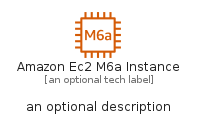
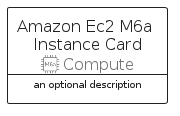
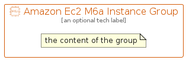

# AmazonEc2M6AInstance


```text
aws-q1-2022/Resource/Compute/AmazonEc2M6AInstance
```

```text
include('aws-q1-2022/Resource/Compute/AmazonEc2M6AInstance')
```


| Illustration | AmazonEc2M6AInstance | AmazonEc2M6AInstanceCard | AmazonEc2M6AInstanceGroup |
| :---: | :---: | :---: | :---: |
|  |  |  |  |


## AmazonEc2M6AInstance

### Load remotely
```plantuml
@startuml
' configures the library
!global $LIB_BASE_LOCATION="https://raw.githubusercontent.com/tmorin/plantuml-libs/master/distribution"

' loads the library's bootstrap
!include $LIB_BASE_LOCATION/bootstrap.puml

' loads the package bootstrap
include('aws-q1-2022/bootstrap')

' loads the Item which embeds the element AmazonEc2M6AInstance
include('aws-q1-2022/Resource/Compute/AmazonEc2M6AInstance')

' renders the element
AmazonEc2M6AInstance('AmazonEc2M6aInstance', 'Amazon Ec2 M6a Instance', 'an optional tech label')
@enduml
```

### Load locally
```plantuml
@startuml
' configures the library
!global $INCLUSION_MODE="local"
!global $LIB_BASE_LOCATION="../../.."

' loads the library's bootstrap
!include $LIB_BASE_LOCATION/bootstrap.puml

' loads the package bootstrap
include('aws-q1-2022/bootstrap')

' loads the Item which embeds the element AmazonEc2M6AInstance
include('aws-q1-2022/Resource/Compute/AmazonEc2M6AInstance')

' renders the element
AmazonEc2M6AInstance('AmazonEc2M6aInstance', 'Amazon Ec2 M6a Instance', 'an optional tech label')
@enduml
```

## AmazonEc2M6AInstanceCard

### Load remotely
```plantuml
@startuml
' configures the library
!global $LIB_BASE_LOCATION="https://raw.githubusercontent.com/tmorin/plantuml-libs/master/distribution"

' loads the library's bootstrap
!include $LIB_BASE_LOCATION/bootstrap.puml

' loads the package bootstrap
include('aws-q1-2022/bootstrap')

' loads the Item which embeds the element AmazonEc2M6AInstanceCard
include('aws-q1-2022/Resource/Compute/AmazonEc2M6AInstance')

' renders the element
AmazonEc2M6AInstanceCard('AmazonEc2M6aInstanceCard', 'Amazon Ec2 M6a Instance Card', 'an optional description')
@enduml
```

### Load locally
```plantuml
@startuml
' configures the library
!global $INCLUSION_MODE="local"
!global $LIB_BASE_LOCATION="../../.."

' loads the library's bootstrap
!include $LIB_BASE_LOCATION/bootstrap.puml

' loads the package bootstrap
include('aws-q1-2022/bootstrap')

' loads the Item which embeds the element AmazonEc2M6AInstanceCard
include('aws-q1-2022/Resource/Compute/AmazonEc2M6AInstance')

' renders the element
AmazonEc2M6AInstanceCard('AmazonEc2M6aInstanceCard', 'Amazon Ec2 M6a Instance Card', 'an optional description')
@enduml
```

## AmazonEc2M6AInstanceGroup

### Load remotely
```plantuml
@startuml
' configures the library
!global $LIB_BASE_LOCATION="https://raw.githubusercontent.com/tmorin/plantuml-libs/master/distribution"

' loads the library's bootstrap
!include $LIB_BASE_LOCATION/bootstrap.puml

' loads the package bootstrap
include('aws-q1-2022/bootstrap')

' loads the Item which embeds the element AmazonEc2M6AInstanceGroup
include('aws-q1-2022/Resource/Compute/AmazonEc2M6AInstance')

' renders the element
AmazonEc2M6AInstanceGroup('AmazonEc2M6aInstanceGroup', 'Amazon Ec2 M6a Instance Group', 'an optional tech label') {
    note as note
        the content of the group
    end note
}
@enduml
```

### Load locally
```plantuml
@startuml
' configures the library
!global $INCLUSION_MODE="local"
!global $LIB_BASE_LOCATION="../../.."

' loads the library's bootstrap
!include $LIB_BASE_LOCATION/bootstrap.puml

' loads the package bootstrap
include('aws-q1-2022/bootstrap')

' loads the Item which embeds the element AmazonEc2M6AInstanceGroup
include('aws-q1-2022/Resource/Compute/AmazonEc2M6AInstance')

' renders the element
AmazonEc2M6AInstanceGroup('AmazonEc2M6aInstanceGroup', 'Amazon Ec2 M6a Instance Group', 'an optional tech label') {
    note as note
        the content of the group
    end note
}
@enduml
```

