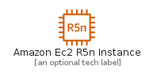
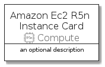
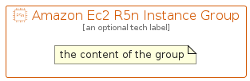

# AmazonEc2R5NInstance


```text
aws-q1-2022/Resource/Compute/AmazonEc2R5NInstance
```

```text
include('aws-q1-2022/Resource/Compute/AmazonEc2R5NInstance')
```


| Illustration | AmazonEc2R5NInstance | AmazonEc2R5NInstanceCard | AmazonEc2R5NInstanceGroup |
| :---: | :---: | :---: | :---: |
|  |  |  |  |


## AmazonEc2R5NInstance

### Load remotely
```plantuml
@startuml
' configures the library
!global $LIB_BASE_LOCATION="https://raw.githubusercontent.com/tmorin/plantuml-libs/master/distribution"

' loads the library's bootstrap
!include $LIB_BASE_LOCATION/bootstrap.puml

' loads the package bootstrap
include('aws-q1-2022/bootstrap')

' loads the Item which embeds the element AmazonEc2R5NInstance
include('aws-q1-2022/Resource/Compute/AmazonEc2R5NInstance')

' renders the element
AmazonEc2R5NInstance('AmazonEc2R5nInstance', 'Amazon Ec2 R5n Instance', 'an optional tech label')
@enduml
```

### Load locally
```plantuml
@startuml
' configures the library
!global $INCLUSION_MODE="local"
!global $LIB_BASE_LOCATION="../../.."

' loads the library's bootstrap
!include $LIB_BASE_LOCATION/bootstrap.puml

' loads the package bootstrap
include('aws-q1-2022/bootstrap')

' loads the Item which embeds the element AmazonEc2R5NInstance
include('aws-q1-2022/Resource/Compute/AmazonEc2R5NInstance')

' renders the element
AmazonEc2R5NInstance('AmazonEc2R5nInstance', 'Amazon Ec2 R5n Instance', 'an optional tech label')
@enduml
```

## AmazonEc2R5NInstanceCard

### Load remotely
```plantuml
@startuml
' configures the library
!global $LIB_BASE_LOCATION="https://raw.githubusercontent.com/tmorin/plantuml-libs/master/distribution"

' loads the library's bootstrap
!include $LIB_BASE_LOCATION/bootstrap.puml

' loads the package bootstrap
include('aws-q1-2022/bootstrap')

' loads the Item which embeds the element AmazonEc2R5NInstanceCard
include('aws-q1-2022/Resource/Compute/AmazonEc2R5NInstance')

' renders the element
AmazonEc2R5NInstanceCard('AmazonEc2R5nInstanceCard', 'Amazon Ec2 R5n Instance Card', 'an optional description')
@enduml
```

### Load locally
```plantuml
@startuml
' configures the library
!global $INCLUSION_MODE="local"
!global $LIB_BASE_LOCATION="../../.."

' loads the library's bootstrap
!include $LIB_BASE_LOCATION/bootstrap.puml

' loads the package bootstrap
include('aws-q1-2022/bootstrap')

' loads the Item which embeds the element AmazonEc2R5NInstanceCard
include('aws-q1-2022/Resource/Compute/AmazonEc2R5NInstance')

' renders the element
AmazonEc2R5NInstanceCard('AmazonEc2R5nInstanceCard', 'Amazon Ec2 R5n Instance Card', 'an optional description')
@enduml
```

## AmazonEc2R5NInstanceGroup

### Load remotely
```plantuml
@startuml
' configures the library
!global $LIB_BASE_LOCATION="https://raw.githubusercontent.com/tmorin/plantuml-libs/master/distribution"

' loads the library's bootstrap
!include $LIB_BASE_LOCATION/bootstrap.puml

' loads the package bootstrap
include('aws-q1-2022/bootstrap')

' loads the Item which embeds the element AmazonEc2R5NInstanceGroup
include('aws-q1-2022/Resource/Compute/AmazonEc2R5NInstance')

' renders the element
AmazonEc2R5NInstanceGroup('AmazonEc2R5nInstanceGroup', 'Amazon Ec2 R5n Instance Group', 'an optional tech label') {
    note as note
        the content of the group
    end note
}
@enduml
```

### Load locally
```plantuml
@startuml
' configures the library
!global $INCLUSION_MODE="local"
!global $LIB_BASE_LOCATION="../../.."

' loads the library's bootstrap
!include $LIB_BASE_LOCATION/bootstrap.puml

' loads the package bootstrap
include('aws-q1-2022/bootstrap')

' loads the Item which embeds the element AmazonEc2R5NInstanceGroup
include('aws-q1-2022/Resource/Compute/AmazonEc2R5NInstance')

' renders the element
AmazonEc2R5NInstanceGroup('AmazonEc2R5nInstanceGroup', 'Amazon Ec2 R5n Instance Group', 'an optional tech label') {
    note as note
        the content of the group
    end note
}
@enduml
```

