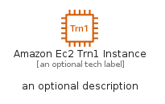
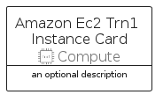
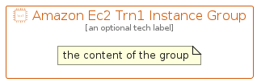

# AmazonEc2Trn1Instance


```text
aws-q1-2022/Resource/Compute/AmazonEc2Trn1Instance
```

```text
include('aws-q1-2022/Resource/Compute/AmazonEc2Trn1Instance')
```


| Illustration | AmazonEc2Trn1Instance | AmazonEc2Trn1InstanceCard | AmazonEc2Trn1InstanceGroup |
| :---: | :---: | :---: | :---: |
|  |  |  |  |


## AmazonEc2Trn1Instance

### Load remotely
```plantuml
@startuml
' configures the library
!global $LIB_BASE_LOCATION="https://raw.githubusercontent.com/tmorin/plantuml-libs/master/distribution"

' loads the library's bootstrap
!include $LIB_BASE_LOCATION/bootstrap.puml

' loads the package bootstrap
include('aws-q1-2022/bootstrap')

' loads the Item which embeds the element AmazonEc2Trn1Instance
include('aws-q1-2022/Resource/Compute/AmazonEc2Trn1Instance')

' renders the element
AmazonEc2Trn1Instance('AmazonEc2Trn1Instance', 'Amazon Ec2 Trn1 Instance', 'an optional tech label', 'an optional description')
@enduml
```

### Load locally
```plantuml
@startuml
' configures the library
!global $INCLUSION_MODE="local"
!global $LIB_BASE_LOCATION="../../.."

' loads the library's bootstrap
!include $LIB_BASE_LOCATION/bootstrap.puml

' loads the package bootstrap
include('aws-q1-2022/bootstrap')

' loads the Item which embeds the element AmazonEc2Trn1Instance
include('aws-q1-2022/Resource/Compute/AmazonEc2Trn1Instance')

' renders the element
AmazonEc2Trn1Instance('AmazonEc2Trn1Instance', 'Amazon Ec2 Trn1 Instance', 'an optional tech label', 'an optional description')
@enduml
```

## AmazonEc2Trn1InstanceCard

### Load remotely
```plantuml
@startuml
' configures the library
!global $LIB_BASE_LOCATION="https://raw.githubusercontent.com/tmorin/plantuml-libs/master/distribution"

' loads the library's bootstrap
!include $LIB_BASE_LOCATION/bootstrap.puml

' loads the package bootstrap
include('aws-q1-2022/bootstrap')

' loads the Item which embeds the element AmazonEc2Trn1InstanceCard
include('aws-q1-2022/Resource/Compute/AmazonEc2Trn1Instance')

' renders the element
AmazonEc2Trn1InstanceCard('AmazonEc2Trn1InstanceCard', 'Amazon Ec2 Trn1 Instance Card', 'an optional description')
@enduml
```

### Load locally
```plantuml
@startuml
' configures the library
!global $INCLUSION_MODE="local"
!global $LIB_BASE_LOCATION="../../.."

' loads the library's bootstrap
!include $LIB_BASE_LOCATION/bootstrap.puml

' loads the package bootstrap
include('aws-q1-2022/bootstrap')

' loads the Item which embeds the element AmazonEc2Trn1InstanceCard
include('aws-q1-2022/Resource/Compute/AmazonEc2Trn1Instance')

' renders the element
AmazonEc2Trn1InstanceCard('AmazonEc2Trn1InstanceCard', 'Amazon Ec2 Trn1 Instance Card', 'an optional description')
@enduml
```

## AmazonEc2Trn1InstanceGroup

### Load remotely
```plantuml
@startuml
' configures the library
!global $LIB_BASE_LOCATION="https://raw.githubusercontent.com/tmorin/plantuml-libs/master/distribution"

' loads the library's bootstrap
!include $LIB_BASE_LOCATION/bootstrap.puml

' loads the package bootstrap
include('aws-q1-2022/bootstrap')

' loads the Item which embeds the element AmazonEc2Trn1InstanceGroup
include('aws-q1-2022/Resource/Compute/AmazonEc2Trn1Instance')

' renders the element
AmazonEc2Trn1InstanceGroup('AmazonEc2Trn1InstanceGroup', 'Amazon Ec2 Trn1 Instance Group', 'an optional tech label') {
    note as note
        the content of the group
    end note
}
@enduml
```

### Load locally
```plantuml
@startuml
' configures the library
!global $INCLUSION_MODE="local"
!global $LIB_BASE_LOCATION="../../.."

' loads the library's bootstrap
!include $LIB_BASE_LOCATION/bootstrap.puml

' loads the package bootstrap
include('aws-q1-2022/bootstrap')

' loads the Item which embeds the element AmazonEc2Trn1InstanceGroup
include('aws-q1-2022/Resource/Compute/AmazonEc2Trn1Instance')

' renders the element
AmazonEc2Trn1InstanceGroup('AmazonEc2Trn1InstanceGroup', 'Amazon Ec2 Trn1 Instance Group', 'an optional tech label') {
    note as note
        the content of the group
    end note
}
@enduml
```

