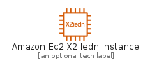
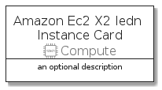
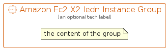

# AmazonEc2X2IednInstance


```text
aws-q1-2022/Resource/Compute/AmazonEc2X2IednInstance
```

```text
include('aws-q1-2022/Resource/Compute/AmazonEc2X2IednInstance')
```


| Illustration | AmazonEc2X2IednInstance | AmazonEc2X2IednInstanceCard | AmazonEc2X2IednInstanceGroup |
| :---: | :---: | :---: | :---: |
|  |  |  |  |


## AmazonEc2X2IednInstance

### Load remotely
```plantuml
@startuml
' configures the library
!global $LIB_BASE_LOCATION="https://raw.githubusercontent.com/tmorin/plantuml-libs/master/distribution"

' loads the library's bootstrap
!include $LIB_BASE_LOCATION/bootstrap.puml

' loads the package bootstrap
include('aws-q1-2022/bootstrap')

' loads the Item which embeds the element AmazonEc2X2IednInstance
include('aws-q1-2022/Resource/Compute/AmazonEc2X2IednInstance')

' renders the element
AmazonEc2X2IednInstance('AmazonEc2X2IednInstance', 'Amazon Ec2 X2 Iedn Instance', 'an optional tech label', 'an optional description')
@enduml
```

### Load locally
```plantuml
@startuml
' configures the library
!global $INCLUSION_MODE="local"
!global $LIB_BASE_LOCATION="../../.."

' loads the library's bootstrap
!include $LIB_BASE_LOCATION/bootstrap.puml

' loads the package bootstrap
include('aws-q1-2022/bootstrap')

' loads the Item which embeds the element AmazonEc2X2IednInstance
include('aws-q1-2022/Resource/Compute/AmazonEc2X2IednInstance')

' renders the element
AmazonEc2X2IednInstance('AmazonEc2X2IednInstance', 'Amazon Ec2 X2 Iedn Instance', 'an optional tech label', 'an optional description')
@enduml
```

## AmazonEc2X2IednInstanceCard

### Load remotely
```plantuml
@startuml
' configures the library
!global $LIB_BASE_LOCATION="https://raw.githubusercontent.com/tmorin/plantuml-libs/master/distribution"

' loads the library's bootstrap
!include $LIB_BASE_LOCATION/bootstrap.puml

' loads the package bootstrap
include('aws-q1-2022/bootstrap')

' loads the Item which embeds the element AmazonEc2X2IednInstanceCard
include('aws-q1-2022/Resource/Compute/AmazonEc2X2IednInstance')

' renders the element
AmazonEc2X2IednInstanceCard('AmazonEc2X2IednInstanceCard', 'Amazon Ec2 X2 Iedn Instance Card', 'an optional description')
@enduml
```

### Load locally
```plantuml
@startuml
' configures the library
!global $INCLUSION_MODE="local"
!global $LIB_BASE_LOCATION="../../.."

' loads the library's bootstrap
!include $LIB_BASE_LOCATION/bootstrap.puml

' loads the package bootstrap
include('aws-q1-2022/bootstrap')

' loads the Item which embeds the element AmazonEc2X2IednInstanceCard
include('aws-q1-2022/Resource/Compute/AmazonEc2X2IednInstance')

' renders the element
AmazonEc2X2IednInstanceCard('AmazonEc2X2IednInstanceCard', 'Amazon Ec2 X2 Iedn Instance Card', 'an optional description')
@enduml
```

## AmazonEc2X2IednInstanceGroup

### Load remotely
```plantuml
@startuml
' configures the library
!global $LIB_BASE_LOCATION="https://raw.githubusercontent.com/tmorin/plantuml-libs/master/distribution"

' loads the library's bootstrap
!include $LIB_BASE_LOCATION/bootstrap.puml

' loads the package bootstrap
include('aws-q1-2022/bootstrap')

' loads the Item which embeds the element AmazonEc2X2IednInstanceGroup
include('aws-q1-2022/Resource/Compute/AmazonEc2X2IednInstance')

' renders the element
AmazonEc2X2IednInstanceGroup('AmazonEc2X2IednInstanceGroup', 'Amazon Ec2 X2 Iedn Instance Group', 'an optional tech label') {
    note as note
        the content of the group
    end note
}
@enduml
```

### Load locally
```plantuml
@startuml
' configures the library
!global $INCLUSION_MODE="local"
!global $LIB_BASE_LOCATION="../../.."

' loads the library's bootstrap
!include $LIB_BASE_LOCATION/bootstrap.puml

' loads the package bootstrap
include('aws-q1-2022/bootstrap')

' loads the Item which embeds the element AmazonEc2X2IednInstanceGroup
include('aws-q1-2022/Resource/Compute/AmazonEc2X2IednInstance')

' renders the element
AmazonEc2X2IednInstanceGroup('AmazonEc2X2IednInstanceGroup', 'Amazon Ec2 X2 Iedn Instance Group', 'an optional tech label') {
    note as note
        the content of the group
    end note
}
@enduml
```

