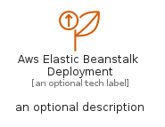
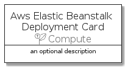

# AwsElasticBeanstalkDeployment


```text
aws-q1-2022/Resource/Compute/AwsElasticBeanstalkDeployment
```

```text
include('aws-q1-2022/Resource/Compute/AwsElasticBeanstalkDeployment')
```


| Illustration | AwsElasticBeanstalkDeployment | AwsElasticBeanstalkDeploymentCard | AwsElasticBeanstalkDeploymentGroup |
| :---: | :---: | :---: | :---: |
|  |  |  |  |


## AwsElasticBeanstalkDeployment

### Load remotely
```plantuml
@startuml
' configures the library
!global $LIB_BASE_LOCATION="https://raw.githubusercontent.com/tmorin/plantuml-libs/master/distribution"

' loads the library's bootstrap
!include $LIB_BASE_LOCATION/bootstrap.puml

' loads the package bootstrap
include('aws-q1-2022/bootstrap')

' loads the Item which embeds the element AwsElasticBeanstalkDeployment
include('aws-q1-2022/Resource/Compute/AwsElasticBeanstalkDeployment')

' renders the element
AwsElasticBeanstalkDeployment('AwsElasticBeanstalkDeployment', 'Aws Elastic Beanstalk Deployment', 'an optional tech label')
@enduml
```

### Load locally
```plantuml
@startuml
' configures the library
!global $INCLUSION_MODE="local"
!global $LIB_BASE_LOCATION="../../.."

' loads the library's bootstrap
!include $LIB_BASE_LOCATION/bootstrap.puml

' loads the package bootstrap
include('aws-q1-2022/bootstrap')

' loads the Item which embeds the element AwsElasticBeanstalkDeployment
include('aws-q1-2022/Resource/Compute/AwsElasticBeanstalkDeployment')

' renders the element
AwsElasticBeanstalkDeployment('AwsElasticBeanstalkDeployment', 'Aws Elastic Beanstalk Deployment', 'an optional tech label')
@enduml
```

## AwsElasticBeanstalkDeploymentCard

### Load remotely
```plantuml
@startuml
' configures the library
!global $LIB_BASE_LOCATION="https://raw.githubusercontent.com/tmorin/plantuml-libs/master/distribution"

' loads the library's bootstrap
!include $LIB_BASE_LOCATION/bootstrap.puml

' loads the package bootstrap
include('aws-q1-2022/bootstrap')

' loads the Item which embeds the element AwsElasticBeanstalkDeploymentCard
include('aws-q1-2022/Resource/Compute/AwsElasticBeanstalkDeployment')

' renders the element
AwsElasticBeanstalkDeploymentCard('AwsElasticBeanstalkDeploymentCard', 'Aws Elastic Beanstalk Deployment Card', 'an optional description')
@enduml
```

### Load locally
```plantuml
@startuml
' configures the library
!global $INCLUSION_MODE="local"
!global $LIB_BASE_LOCATION="../../.."

' loads the library's bootstrap
!include $LIB_BASE_LOCATION/bootstrap.puml

' loads the package bootstrap
include('aws-q1-2022/bootstrap')

' loads the Item which embeds the element AwsElasticBeanstalkDeploymentCard
include('aws-q1-2022/Resource/Compute/AwsElasticBeanstalkDeployment')

' renders the element
AwsElasticBeanstalkDeploymentCard('AwsElasticBeanstalkDeploymentCard', 'Aws Elastic Beanstalk Deployment Card', 'an optional description')
@enduml
```

## AwsElasticBeanstalkDeploymentGroup

### Load remotely
```plantuml
@startuml
' configures the library
!global $LIB_BASE_LOCATION="https://raw.githubusercontent.com/tmorin/plantuml-libs/master/distribution"

' loads the library's bootstrap
!include $LIB_BASE_LOCATION/bootstrap.puml

' loads the package bootstrap
include('aws-q1-2022/bootstrap')

' loads the Item which embeds the element AwsElasticBeanstalkDeploymentGroup
include('aws-q1-2022/Resource/Compute/AwsElasticBeanstalkDeployment')

' renders the element
AwsElasticBeanstalkDeploymentGroup('AwsElasticBeanstalkDeploymentGroup', 'Aws Elastic Beanstalk Deployment Group', 'an optional tech label') {
    note as note
        the content of the group
    end note
}
@enduml
```

### Load locally
```plantuml
@startuml
' configures the library
!global $INCLUSION_MODE="local"
!global $LIB_BASE_LOCATION="../../.."

' loads the library's bootstrap
!include $LIB_BASE_LOCATION/bootstrap.puml

' loads the package bootstrap
include('aws-q1-2022/bootstrap')

' loads the Item which embeds the element AwsElasticBeanstalkDeploymentGroup
include('aws-q1-2022/Resource/Compute/AwsElasticBeanstalkDeployment')

' renders the element
AwsElasticBeanstalkDeploymentGroup('AwsElasticBeanstalkDeploymentGroup', 'Aws Elastic Beanstalk Deployment Group', 'an optional tech label') {
    note as note
        the content of the group
    end note
}
@enduml
```

