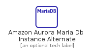
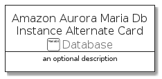

# AmazonAuroraMariaDbInstanceAlternate


```text
aws-q1-2022/Resource/Database/AmazonAuroraMariaDbInstanceAlternate
```

```text
include('aws-q1-2022/Resource/Database/AmazonAuroraMariaDbInstanceAlternate')
```


| Illustration | AmazonAuroraMariaDbInstanceAlternate | AmazonAuroraMariaDbInstanceAlternateCard | AmazonAuroraMariaDbInstanceAlternateGroup |
| :---: | :---: | :---: | :---: |
|  |  |  |  |


## AmazonAuroraMariaDbInstanceAlternate

### Load remotely
```plantuml
@startuml
' configures the library
!global $LIB_BASE_LOCATION="https://raw.githubusercontent.com/tmorin/plantuml-libs/master/distribution"

' loads the library's bootstrap
!include $LIB_BASE_LOCATION/bootstrap.puml

' loads the package bootstrap
include('aws-q1-2022/bootstrap')

' loads the Item which embeds the element AmazonAuroraMariaDbInstanceAlternate
include('aws-q1-2022/Resource/Database/AmazonAuroraMariaDbInstanceAlternate')

' renders the element
AmazonAuroraMariaDbInstanceAlternate('AmazonAuroraMariaDbInstanceAlternate', 'Amazon Aurora Maria Db Instance Alternate', 'an optional tech label')
@enduml
```

### Load locally
```plantuml
@startuml
' configures the library
!global $INCLUSION_MODE="local"
!global $LIB_BASE_LOCATION="../../.."

' loads the library's bootstrap
!include $LIB_BASE_LOCATION/bootstrap.puml

' loads the package bootstrap
include('aws-q1-2022/bootstrap')

' loads the Item which embeds the element AmazonAuroraMariaDbInstanceAlternate
include('aws-q1-2022/Resource/Database/AmazonAuroraMariaDbInstanceAlternate')

' renders the element
AmazonAuroraMariaDbInstanceAlternate('AmazonAuroraMariaDbInstanceAlternate', 'Amazon Aurora Maria Db Instance Alternate', 'an optional tech label')
@enduml
```

## AmazonAuroraMariaDbInstanceAlternateCard

### Load remotely
```plantuml
@startuml
' configures the library
!global $LIB_BASE_LOCATION="https://raw.githubusercontent.com/tmorin/plantuml-libs/master/distribution"

' loads the library's bootstrap
!include $LIB_BASE_LOCATION/bootstrap.puml

' loads the package bootstrap
include('aws-q1-2022/bootstrap')

' loads the Item which embeds the element AmazonAuroraMariaDbInstanceAlternateCard
include('aws-q1-2022/Resource/Database/AmazonAuroraMariaDbInstanceAlternate')

' renders the element
AmazonAuroraMariaDbInstanceAlternateCard('AmazonAuroraMariaDbInstanceAlternateCard', 'Amazon Aurora Maria Db Instance Alternate Card', 'an optional description')
@enduml
```

### Load locally
```plantuml
@startuml
' configures the library
!global $INCLUSION_MODE="local"
!global $LIB_BASE_LOCATION="../../.."

' loads the library's bootstrap
!include $LIB_BASE_LOCATION/bootstrap.puml

' loads the package bootstrap
include('aws-q1-2022/bootstrap')

' loads the Item which embeds the element AmazonAuroraMariaDbInstanceAlternateCard
include('aws-q1-2022/Resource/Database/AmazonAuroraMariaDbInstanceAlternate')

' renders the element
AmazonAuroraMariaDbInstanceAlternateCard('AmazonAuroraMariaDbInstanceAlternateCard', 'Amazon Aurora Maria Db Instance Alternate Card', 'an optional description')
@enduml
```

## AmazonAuroraMariaDbInstanceAlternateGroup

### Load remotely
```plantuml
@startuml
' configures the library
!global $LIB_BASE_LOCATION="https://raw.githubusercontent.com/tmorin/plantuml-libs/master/distribution"

' loads the library's bootstrap
!include $LIB_BASE_LOCATION/bootstrap.puml

' loads the package bootstrap
include('aws-q1-2022/bootstrap')

' loads the Item which embeds the element AmazonAuroraMariaDbInstanceAlternateGroup
include('aws-q1-2022/Resource/Database/AmazonAuroraMariaDbInstanceAlternate')

' renders the element
AmazonAuroraMariaDbInstanceAlternateGroup('AmazonAuroraMariaDbInstanceAlternateGroup', 'Amazon Aurora Maria Db Instance Alternate Group', 'an optional tech label') {
    note as note
        the content of the group
    end note
}
@enduml
```

### Load locally
```plantuml
@startuml
' configures the library
!global $INCLUSION_MODE="local"
!global $LIB_BASE_LOCATION="../../.."

' loads the library's bootstrap
!include $LIB_BASE_LOCATION/bootstrap.puml

' loads the package bootstrap
include('aws-q1-2022/bootstrap')

' loads the Item which embeds the element AmazonAuroraMariaDbInstanceAlternateGroup
include('aws-q1-2022/Resource/Database/AmazonAuroraMariaDbInstanceAlternate')

' renders the element
AmazonAuroraMariaDbInstanceAlternateGroup('AmazonAuroraMariaDbInstanceAlternateGroup', 'Amazon Aurora Maria Db Instance Alternate Group', 'an optional tech label') {
    note as note
        the content of the group
    end note
}
@enduml
```

