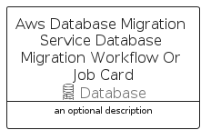

# AwsDatabaseMigrationServiceDatabaseMigrationWorkflowOrJob


```text
aws-q1-2022/Resource/Database/AwsDatabaseMigrationServiceDatabaseMigrationWorkflowOrJob
```

```text
include('aws-q1-2022/Resource/Database/AwsDatabaseMigrationServiceDatabaseMigrationWorkflowOrJob')
```


| Illustration | AwsDatabaseMigrationServiceDatabaseMigrationWorkflowOrJob | AwsDatabaseMigrationServiceDatabaseMigrationWorkflowOrJobCard | AwsDatabaseMigrationServiceDatabaseMigrationWorkflowOrJobGroup |
| :---: | :---: | :---: | :---: |
|  |  |  |  |


## AwsDatabaseMigrationServiceDatabaseMigrationWorkflowOrJob

### Load remotely
```plantuml
@startuml
' configures the library
!global $LIB_BASE_LOCATION="https://raw.githubusercontent.com/tmorin/plantuml-libs/master/distribution"

' loads the library's bootstrap
!include $LIB_BASE_LOCATION/bootstrap.puml

' loads the package bootstrap
include('aws-q1-2022/bootstrap')

' loads the Item which embeds the element AwsDatabaseMigrationServiceDatabaseMigrationWorkflowOrJob
include('aws-q1-2022/Resource/Database/AwsDatabaseMigrationServiceDatabaseMigrationWorkflowOrJob')

' renders the element
AwsDatabaseMigrationServiceDatabaseMigrationWorkflowOrJob('AwsDatabaseMigrationServiceDatabaseMigrationWorkflowOrJob', 'Aws Database Migration Service Database Migration Workflow Or Job', 'an optional tech label')
@enduml
```

### Load locally
```plantuml
@startuml
' configures the library
!global $INCLUSION_MODE="local"
!global $LIB_BASE_LOCATION="../../.."

' loads the library's bootstrap
!include $LIB_BASE_LOCATION/bootstrap.puml

' loads the package bootstrap
include('aws-q1-2022/bootstrap')

' loads the Item which embeds the element AwsDatabaseMigrationServiceDatabaseMigrationWorkflowOrJob
include('aws-q1-2022/Resource/Database/AwsDatabaseMigrationServiceDatabaseMigrationWorkflowOrJob')

' renders the element
AwsDatabaseMigrationServiceDatabaseMigrationWorkflowOrJob('AwsDatabaseMigrationServiceDatabaseMigrationWorkflowOrJob', 'Aws Database Migration Service Database Migration Workflow Or Job', 'an optional tech label')
@enduml
```

## AwsDatabaseMigrationServiceDatabaseMigrationWorkflowOrJobCard

### Load remotely
```plantuml
@startuml
' configures the library
!global $LIB_BASE_LOCATION="https://raw.githubusercontent.com/tmorin/plantuml-libs/master/distribution"

' loads the library's bootstrap
!include $LIB_BASE_LOCATION/bootstrap.puml

' loads the package bootstrap
include('aws-q1-2022/bootstrap')

' loads the Item which embeds the element AwsDatabaseMigrationServiceDatabaseMigrationWorkflowOrJobCard
include('aws-q1-2022/Resource/Database/AwsDatabaseMigrationServiceDatabaseMigrationWorkflowOrJob')

' renders the element
AwsDatabaseMigrationServiceDatabaseMigrationWorkflowOrJobCard('AwsDatabaseMigrationServiceDatabaseMigrationWorkflowOrJobCard', 'Aws Database Migration Service Database Migration Workflow Or Job Card', 'an optional description')
@enduml
```

### Load locally
```plantuml
@startuml
' configures the library
!global $INCLUSION_MODE="local"
!global $LIB_BASE_LOCATION="../../.."

' loads the library's bootstrap
!include $LIB_BASE_LOCATION/bootstrap.puml

' loads the package bootstrap
include('aws-q1-2022/bootstrap')

' loads the Item which embeds the element AwsDatabaseMigrationServiceDatabaseMigrationWorkflowOrJobCard
include('aws-q1-2022/Resource/Database/AwsDatabaseMigrationServiceDatabaseMigrationWorkflowOrJob')

' renders the element
AwsDatabaseMigrationServiceDatabaseMigrationWorkflowOrJobCard('AwsDatabaseMigrationServiceDatabaseMigrationWorkflowOrJobCard', 'Aws Database Migration Service Database Migration Workflow Or Job Card', 'an optional description')
@enduml
```

## AwsDatabaseMigrationServiceDatabaseMigrationWorkflowOrJobGroup

### Load remotely
```plantuml
@startuml
' configures the library
!global $LIB_BASE_LOCATION="https://raw.githubusercontent.com/tmorin/plantuml-libs/master/distribution"

' loads the library's bootstrap
!include $LIB_BASE_LOCATION/bootstrap.puml

' loads the package bootstrap
include('aws-q1-2022/bootstrap')

' loads the Item which embeds the element AwsDatabaseMigrationServiceDatabaseMigrationWorkflowOrJobGroup
include('aws-q1-2022/Resource/Database/AwsDatabaseMigrationServiceDatabaseMigrationWorkflowOrJob')

' renders the element
AwsDatabaseMigrationServiceDatabaseMigrationWorkflowOrJobGroup('AwsDatabaseMigrationServiceDatabaseMigrationWorkflowOrJobGroup', 'Aws Database Migration Service Database Migration Workflow Or Job Group', 'an optional tech label') {
    note as note
        the content of the group
    end note
}
@enduml
```

### Load locally
```plantuml
@startuml
' configures the library
!global $INCLUSION_MODE="local"
!global $LIB_BASE_LOCATION="../../.."

' loads the library's bootstrap
!include $LIB_BASE_LOCATION/bootstrap.puml

' loads the package bootstrap
include('aws-q1-2022/bootstrap')

' loads the Item which embeds the element AwsDatabaseMigrationServiceDatabaseMigrationWorkflowOrJobGroup
include('aws-q1-2022/Resource/Database/AwsDatabaseMigrationServiceDatabaseMigrationWorkflowOrJob')

' renders the element
AwsDatabaseMigrationServiceDatabaseMigrationWorkflowOrJobGroup('AwsDatabaseMigrationServiceDatabaseMigrationWorkflowOrJobGroup', 'Aws Database Migration Service Database Migration Workflow Or Job Group', 'an optional tech label') {
    note as note
        the content of the group
    end note
}
@enduml
```

