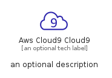
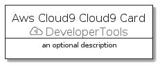
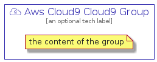

# AwsCloud9Cloud9


```text
aws-q1-2022/Resource/DeveloperTools/AwsCloud9Cloud9
```

```text
include('aws-q1-2022/Resource/DeveloperTools/AwsCloud9Cloud9')
```


| Illustration | AwsCloud9Cloud9 | AwsCloud9Cloud9Card | AwsCloud9Cloud9Group |
| :---: | :---: | :---: | :---: |
|  |  |  |  |


## AwsCloud9Cloud9

### Load remotely
```plantuml
@startuml
' configures the library
!global $LIB_BASE_LOCATION="https://raw.githubusercontent.com/tmorin/plantuml-libs/master/distribution"

' loads the library's bootstrap
!include $LIB_BASE_LOCATION/bootstrap.puml

' loads the package bootstrap
include('aws-q1-2022/bootstrap')

' loads the Item which embeds the element AwsCloud9Cloud9
include('aws-q1-2022/Resource/DeveloperTools/AwsCloud9Cloud9')

' renders the element
AwsCloud9Cloud9('AwsCloud9Cloud9', 'Aws Cloud9 Cloud9', 'an optional tech label')
@enduml
```

### Load locally
```plantuml
@startuml
' configures the library
!global $INCLUSION_MODE="local"
!global $LIB_BASE_LOCATION="../../.."

' loads the library's bootstrap
!include $LIB_BASE_LOCATION/bootstrap.puml

' loads the package bootstrap
include('aws-q1-2022/bootstrap')

' loads the Item which embeds the element AwsCloud9Cloud9
include('aws-q1-2022/Resource/DeveloperTools/AwsCloud9Cloud9')

' renders the element
AwsCloud9Cloud9('AwsCloud9Cloud9', 'Aws Cloud9 Cloud9', 'an optional tech label')
@enduml
```

## AwsCloud9Cloud9Card

### Load remotely
```plantuml
@startuml
' configures the library
!global $LIB_BASE_LOCATION="https://raw.githubusercontent.com/tmorin/plantuml-libs/master/distribution"

' loads the library's bootstrap
!include $LIB_BASE_LOCATION/bootstrap.puml

' loads the package bootstrap
include('aws-q1-2022/bootstrap')

' loads the Item which embeds the element AwsCloud9Cloud9Card
include('aws-q1-2022/Resource/DeveloperTools/AwsCloud9Cloud9')

' renders the element
AwsCloud9Cloud9Card('AwsCloud9Cloud9Card', 'Aws Cloud9 Cloud9 Card', 'an optional description')
@enduml
```

### Load locally
```plantuml
@startuml
' configures the library
!global $INCLUSION_MODE="local"
!global $LIB_BASE_LOCATION="../../.."

' loads the library's bootstrap
!include $LIB_BASE_LOCATION/bootstrap.puml

' loads the package bootstrap
include('aws-q1-2022/bootstrap')

' loads the Item which embeds the element AwsCloud9Cloud9Card
include('aws-q1-2022/Resource/DeveloperTools/AwsCloud9Cloud9')

' renders the element
AwsCloud9Cloud9Card('AwsCloud9Cloud9Card', 'Aws Cloud9 Cloud9 Card', 'an optional description')
@enduml
```

## AwsCloud9Cloud9Group

### Load remotely
```plantuml
@startuml
' configures the library
!global $LIB_BASE_LOCATION="https://raw.githubusercontent.com/tmorin/plantuml-libs/master/distribution"

' loads the library's bootstrap
!include $LIB_BASE_LOCATION/bootstrap.puml

' loads the package bootstrap
include('aws-q1-2022/bootstrap')

' loads the Item which embeds the element AwsCloud9Cloud9Group
include('aws-q1-2022/Resource/DeveloperTools/AwsCloud9Cloud9')

' renders the element
AwsCloud9Cloud9Group('AwsCloud9Cloud9Group', 'Aws Cloud9 Cloud9 Group', 'an optional tech label') {
    note as note
        the content of the group
    end note
}
@enduml
```

### Load locally
```plantuml
@startuml
' configures the library
!global $INCLUSION_MODE="local"
!global $LIB_BASE_LOCATION="../../.."

' loads the library's bootstrap
!include $LIB_BASE_LOCATION/bootstrap.puml

' loads the package bootstrap
include('aws-q1-2022/bootstrap')

' loads the Item which embeds the element AwsCloud9Cloud9Group
include('aws-q1-2022/Resource/DeveloperTools/AwsCloud9Cloud9')

' renders the element
AwsCloud9Cloud9Group('AwsCloud9Cloud9Group', 'Aws Cloud9 Cloud9 Group', 'an optional tech label') {
    note as note
        the content of the group
    end note
}
@enduml
```

