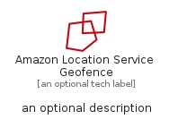
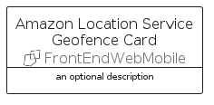

# AmazonLocationServiceGeofence


```text
aws-q1-2022/Resource/FrontEndWebMobile/AmazonLocationServiceGeofence
```

```text
include('aws-q1-2022/Resource/FrontEndWebMobile/AmazonLocationServiceGeofence')
```


| Illustration | AmazonLocationServiceGeofence | AmazonLocationServiceGeofenceCard | AmazonLocationServiceGeofenceGroup |
| :---: | :---: | :---: | :---: |
|  |  |  |  |


## AmazonLocationServiceGeofence

### Load remotely
```plantuml
@startuml
' configures the library
!global $LIB_BASE_LOCATION="https://raw.githubusercontent.com/tmorin/plantuml-libs/master/distribution"

' loads the library's bootstrap
!include $LIB_BASE_LOCATION/bootstrap.puml

' loads the package bootstrap
include('aws-q1-2022/bootstrap')

' loads the Item which embeds the element AmazonLocationServiceGeofence
include('aws-q1-2022/Resource/FrontEndWebMobile/AmazonLocationServiceGeofence')

' renders the element
AmazonLocationServiceGeofence('AmazonLocationServiceGeofence', 'Amazon Location Service Geofence', 'an optional tech label')
@enduml
```

### Load locally
```plantuml
@startuml
' configures the library
!global $INCLUSION_MODE="local"
!global $LIB_BASE_LOCATION="../../.."

' loads the library's bootstrap
!include $LIB_BASE_LOCATION/bootstrap.puml

' loads the package bootstrap
include('aws-q1-2022/bootstrap')

' loads the Item which embeds the element AmazonLocationServiceGeofence
include('aws-q1-2022/Resource/FrontEndWebMobile/AmazonLocationServiceGeofence')

' renders the element
AmazonLocationServiceGeofence('AmazonLocationServiceGeofence', 'Amazon Location Service Geofence', 'an optional tech label')
@enduml
```

## AmazonLocationServiceGeofenceCard

### Load remotely
```plantuml
@startuml
' configures the library
!global $LIB_BASE_LOCATION="https://raw.githubusercontent.com/tmorin/plantuml-libs/master/distribution"

' loads the library's bootstrap
!include $LIB_BASE_LOCATION/bootstrap.puml

' loads the package bootstrap
include('aws-q1-2022/bootstrap')

' loads the Item which embeds the element AmazonLocationServiceGeofenceCard
include('aws-q1-2022/Resource/FrontEndWebMobile/AmazonLocationServiceGeofence')

' renders the element
AmazonLocationServiceGeofenceCard('AmazonLocationServiceGeofenceCard', 'Amazon Location Service Geofence Card', 'an optional description')
@enduml
```

### Load locally
```plantuml
@startuml
' configures the library
!global $INCLUSION_MODE="local"
!global $LIB_BASE_LOCATION="../../.."

' loads the library's bootstrap
!include $LIB_BASE_LOCATION/bootstrap.puml

' loads the package bootstrap
include('aws-q1-2022/bootstrap')

' loads the Item which embeds the element AmazonLocationServiceGeofenceCard
include('aws-q1-2022/Resource/FrontEndWebMobile/AmazonLocationServiceGeofence')

' renders the element
AmazonLocationServiceGeofenceCard('AmazonLocationServiceGeofenceCard', 'Amazon Location Service Geofence Card', 'an optional description')
@enduml
```

## AmazonLocationServiceGeofenceGroup

### Load remotely
```plantuml
@startuml
' configures the library
!global $LIB_BASE_LOCATION="https://raw.githubusercontent.com/tmorin/plantuml-libs/master/distribution"

' loads the library's bootstrap
!include $LIB_BASE_LOCATION/bootstrap.puml

' loads the package bootstrap
include('aws-q1-2022/bootstrap')

' loads the Item which embeds the element AmazonLocationServiceGeofenceGroup
include('aws-q1-2022/Resource/FrontEndWebMobile/AmazonLocationServiceGeofence')

' renders the element
AmazonLocationServiceGeofenceGroup('AmazonLocationServiceGeofenceGroup', 'Amazon Location Service Geofence Group', 'an optional tech label') {
    note as note
        the content of the group
    end note
}
@enduml
```

### Load locally
```plantuml
@startuml
' configures the library
!global $INCLUSION_MODE="local"
!global $LIB_BASE_LOCATION="../../.."

' loads the library's bootstrap
!include $LIB_BASE_LOCATION/bootstrap.puml

' loads the package bootstrap
include('aws-q1-2022/bootstrap')

' loads the Item which embeds the element AmazonLocationServiceGeofenceGroup
include('aws-q1-2022/Resource/FrontEndWebMobile/AmazonLocationServiceGeofence')

' renders the element
AmazonLocationServiceGeofenceGroup('AmazonLocationServiceGeofenceGroup', 'Amazon Location Service Geofence Group', 'an optional tech label') {
    note as note
        the content of the group
    end note
}
@enduml
```

