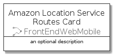

# AmazonLocationServiceRoutes


```text
aws-q1-2022/Resource/FrontEndWebMobile/AmazonLocationServiceRoutes
```

```text
include('aws-q1-2022/Resource/FrontEndWebMobile/AmazonLocationServiceRoutes')
```


| Illustration | AmazonLocationServiceRoutes | AmazonLocationServiceRoutesCard | AmazonLocationServiceRoutesGroup |
| :---: | :---: | :---: | :---: |
|  |  |  |  |


## AmazonLocationServiceRoutes

### Load remotely
```plantuml
@startuml
' configures the library
!global $LIB_BASE_LOCATION="https://raw.githubusercontent.com/tmorin/plantuml-libs/master/distribution"

' loads the library's bootstrap
!include $LIB_BASE_LOCATION/bootstrap.puml

' loads the package bootstrap
include('aws-q1-2022/bootstrap')

' loads the Item which embeds the element AmazonLocationServiceRoutes
include('aws-q1-2022/Resource/FrontEndWebMobile/AmazonLocationServiceRoutes')

' renders the element
AmazonLocationServiceRoutes('AmazonLocationServiceRoutes', 'Amazon Location Service Routes', 'an optional tech label', 'an optional description')
@enduml
```

### Load locally
```plantuml
@startuml
' configures the library
!global $INCLUSION_MODE="local"
!global $LIB_BASE_LOCATION="../../.."

' loads the library's bootstrap
!include $LIB_BASE_LOCATION/bootstrap.puml

' loads the package bootstrap
include('aws-q1-2022/bootstrap')

' loads the Item which embeds the element AmazonLocationServiceRoutes
include('aws-q1-2022/Resource/FrontEndWebMobile/AmazonLocationServiceRoutes')

' renders the element
AmazonLocationServiceRoutes('AmazonLocationServiceRoutes', 'Amazon Location Service Routes', 'an optional tech label', 'an optional description')
@enduml
```

## AmazonLocationServiceRoutesCard

### Load remotely
```plantuml
@startuml
' configures the library
!global $LIB_BASE_LOCATION="https://raw.githubusercontent.com/tmorin/plantuml-libs/master/distribution"

' loads the library's bootstrap
!include $LIB_BASE_LOCATION/bootstrap.puml

' loads the package bootstrap
include('aws-q1-2022/bootstrap')

' loads the Item which embeds the element AmazonLocationServiceRoutesCard
include('aws-q1-2022/Resource/FrontEndWebMobile/AmazonLocationServiceRoutes')

' renders the element
AmazonLocationServiceRoutesCard('AmazonLocationServiceRoutesCard', 'Amazon Location Service Routes Card', 'an optional description')
@enduml
```

### Load locally
```plantuml
@startuml
' configures the library
!global $INCLUSION_MODE="local"
!global $LIB_BASE_LOCATION="../../.."

' loads the library's bootstrap
!include $LIB_BASE_LOCATION/bootstrap.puml

' loads the package bootstrap
include('aws-q1-2022/bootstrap')

' loads the Item which embeds the element AmazonLocationServiceRoutesCard
include('aws-q1-2022/Resource/FrontEndWebMobile/AmazonLocationServiceRoutes')

' renders the element
AmazonLocationServiceRoutesCard('AmazonLocationServiceRoutesCard', 'Amazon Location Service Routes Card', 'an optional description')
@enduml
```

## AmazonLocationServiceRoutesGroup

### Load remotely
```plantuml
@startuml
' configures the library
!global $LIB_BASE_LOCATION="https://raw.githubusercontent.com/tmorin/plantuml-libs/master/distribution"

' loads the library's bootstrap
!include $LIB_BASE_LOCATION/bootstrap.puml

' loads the package bootstrap
include('aws-q1-2022/bootstrap')

' loads the Item which embeds the element AmazonLocationServiceRoutesGroup
include('aws-q1-2022/Resource/FrontEndWebMobile/AmazonLocationServiceRoutes')

' renders the element
AmazonLocationServiceRoutesGroup('AmazonLocationServiceRoutesGroup', 'Amazon Location Service Routes Group', 'an optional tech label') {
    note as note
        the content of the group
    end note
}
@enduml
```

### Load locally
```plantuml
@startuml
' configures the library
!global $INCLUSION_MODE="local"
!global $LIB_BASE_LOCATION="../../.."

' loads the library's bootstrap
!include $LIB_BASE_LOCATION/bootstrap.puml

' loads the package bootstrap
include('aws-q1-2022/bootstrap')

' loads the Item which embeds the element AmazonLocationServiceRoutesGroup
include('aws-q1-2022/Resource/FrontEndWebMobile/AmazonLocationServiceRoutes')

' renders the element
AmazonLocationServiceRoutesGroup('AmazonLocationServiceRoutesGroup', 'Amazon Location Service Routes Group', 'an optional tech label') {
    note as note
        the content of the group
    end note
}
@enduml
```

