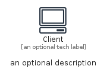
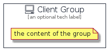

# Client


```text
aws-q1-2022/Resource/GeneralIcons/Client
```

```text
include('aws-q1-2022/Resource/GeneralIcons/Client')
```


| Illustration | Client | ClientCard | ClientGroup |
| :---: | :---: | :---: | :---: |
|  |  |  |  |


## Client

### Load remotely
```plantuml
@startuml
' configures the library
!global $LIB_BASE_LOCATION="https://raw.githubusercontent.com/tmorin/plantuml-libs/master/distribution"

' loads the library's bootstrap
!include $LIB_BASE_LOCATION/bootstrap.puml

' loads the package bootstrap
include('aws-q1-2022/bootstrap')

' loads the Item which embeds the element Client
include('aws-q1-2022/Resource/GeneralIcons/Client')

' renders the element
Client('Client', 'Client', 'an optional tech label', 'an optional description')
@enduml
```

### Load locally
```plantuml
@startuml
' configures the library
!global $INCLUSION_MODE="local"
!global $LIB_BASE_LOCATION="../../.."

' loads the library's bootstrap
!include $LIB_BASE_LOCATION/bootstrap.puml

' loads the package bootstrap
include('aws-q1-2022/bootstrap')

' loads the Item which embeds the element Client
include('aws-q1-2022/Resource/GeneralIcons/Client')

' renders the element
Client('Client', 'Client', 'an optional tech label', 'an optional description')
@enduml
```

## ClientCard

### Load remotely
```plantuml
@startuml
' configures the library
!global $LIB_BASE_LOCATION="https://raw.githubusercontent.com/tmorin/plantuml-libs/master/distribution"

' loads the library's bootstrap
!include $LIB_BASE_LOCATION/bootstrap.puml

' loads the package bootstrap
include('aws-q1-2022/bootstrap')

' loads the Item which embeds the element ClientCard
include('aws-q1-2022/Resource/GeneralIcons/Client')

' renders the element
ClientCard('ClientCard', 'Client Card', 'an optional description')
@enduml
```

### Load locally
```plantuml
@startuml
' configures the library
!global $INCLUSION_MODE="local"
!global $LIB_BASE_LOCATION="../../.."

' loads the library's bootstrap
!include $LIB_BASE_LOCATION/bootstrap.puml

' loads the package bootstrap
include('aws-q1-2022/bootstrap')

' loads the Item which embeds the element ClientCard
include('aws-q1-2022/Resource/GeneralIcons/Client')

' renders the element
ClientCard('ClientCard', 'Client Card', 'an optional description')
@enduml
```

## ClientGroup

### Load remotely
```plantuml
@startuml
' configures the library
!global $LIB_BASE_LOCATION="https://raw.githubusercontent.com/tmorin/plantuml-libs/master/distribution"

' loads the library's bootstrap
!include $LIB_BASE_LOCATION/bootstrap.puml

' loads the package bootstrap
include('aws-q1-2022/bootstrap')

' loads the Item which embeds the element ClientGroup
include('aws-q1-2022/Resource/GeneralIcons/Client')

' renders the element
ClientGroup('ClientGroup', 'Client Group', 'an optional tech label') {
    note as note
        the content of the group
    end note
}
@enduml
```

### Load locally
```plantuml
@startuml
' configures the library
!global $INCLUSION_MODE="local"
!global $LIB_BASE_LOCATION="../../.."

' loads the library's bootstrap
!include $LIB_BASE_LOCATION/bootstrap.puml

' loads the package bootstrap
include('aws-q1-2022/bootstrap')

' loads the Item which embeds the element ClientGroup
include('aws-q1-2022/Resource/GeneralIcons/Client')

' renders the element
ClientGroup('ClientGroup', 'Client Group', 'an optional tech label') {
    note as note
        the content of the group
    end note
}
@enduml
```

