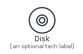
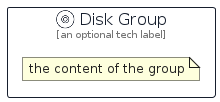

# Disk


```text
aws-q1-2022/Resource/GeneralIcons/Disk
```

```text
include('aws-q1-2022/Resource/GeneralIcons/Disk')
```


| Illustration | Disk | DiskCard | DiskGroup |
| :---: | :---: | :---: | :---: |
|  |  |  |  |


## Disk

### Load remotely
```plantuml
@startuml
' configures the library
!global $LIB_BASE_LOCATION="https://raw.githubusercontent.com/tmorin/plantuml-libs/master/distribution"

' loads the library's bootstrap
!include $LIB_BASE_LOCATION/bootstrap.puml

' loads the package bootstrap
include('aws-q1-2022/bootstrap')

' loads the Item which embeds the element Disk
include('aws-q1-2022/Resource/GeneralIcons/Disk')

' renders the element
Disk('Disk', 'Disk', 'an optional tech label', 'an optional description')
@enduml
```

### Load locally
```plantuml
@startuml
' configures the library
!global $INCLUSION_MODE="local"
!global $LIB_BASE_LOCATION="../../.."

' loads the library's bootstrap
!include $LIB_BASE_LOCATION/bootstrap.puml

' loads the package bootstrap
include('aws-q1-2022/bootstrap')

' loads the Item which embeds the element Disk
include('aws-q1-2022/Resource/GeneralIcons/Disk')

' renders the element
Disk('Disk', 'Disk', 'an optional tech label', 'an optional description')
@enduml
```

## DiskCard

### Load remotely
```plantuml
@startuml
' configures the library
!global $LIB_BASE_LOCATION="https://raw.githubusercontent.com/tmorin/plantuml-libs/master/distribution"

' loads the library's bootstrap
!include $LIB_BASE_LOCATION/bootstrap.puml

' loads the package bootstrap
include('aws-q1-2022/bootstrap')

' loads the Item which embeds the element DiskCard
include('aws-q1-2022/Resource/GeneralIcons/Disk')

' renders the element
DiskCard('DiskCard', 'Disk Card', 'an optional description')
@enduml
```

### Load locally
```plantuml
@startuml
' configures the library
!global $INCLUSION_MODE="local"
!global $LIB_BASE_LOCATION="../../.."

' loads the library's bootstrap
!include $LIB_BASE_LOCATION/bootstrap.puml

' loads the package bootstrap
include('aws-q1-2022/bootstrap')

' loads the Item which embeds the element DiskCard
include('aws-q1-2022/Resource/GeneralIcons/Disk')

' renders the element
DiskCard('DiskCard', 'Disk Card', 'an optional description')
@enduml
```

## DiskGroup

### Load remotely
```plantuml
@startuml
' configures the library
!global $LIB_BASE_LOCATION="https://raw.githubusercontent.com/tmorin/plantuml-libs/master/distribution"

' loads the library's bootstrap
!include $LIB_BASE_LOCATION/bootstrap.puml

' loads the package bootstrap
include('aws-q1-2022/bootstrap')

' loads the Item which embeds the element DiskGroup
include('aws-q1-2022/Resource/GeneralIcons/Disk')

' renders the element
DiskGroup('DiskGroup', 'Disk Group', 'an optional tech label') {
    note as note
        the content of the group
    end note
}
@enduml
```

### Load locally
```plantuml
@startuml
' configures the library
!global $INCLUSION_MODE="local"
!global $LIB_BASE_LOCATION="../../.."

' loads the library's bootstrap
!include $LIB_BASE_LOCATION/bootstrap.puml

' loads the package bootstrap
include('aws-q1-2022/bootstrap')

' loads the Item which embeds the element DiskGroup
include('aws-q1-2022/Resource/GeneralIcons/Disk')

' renders the element
DiskGroup('DiskGroup', 'Disk Group', 'an optional tech label') {
    note as note
        the content of the group
    end note
}
@enduml
```

