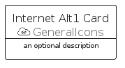
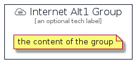

# InternetAlt1


```text
aws-q1-2022/Resource/GeneralIcons/InternetAlt1
```

```text
include('aws-q1-2022/Resource/GeneralIcons/InternetAlt1')
```


| Illustration | InternetAlt1 | InternetAlt1Card | InternetAlt1Group |
| :---: | :---: | :---: | :---: |
|  |  |  |  |


## InternetAlt1

### Load remotely
```plantuml
@startuml
' configures the library
!global $LIB_BASE_LOCATION="https://raw.githubusercontent.com/tmorin/plantuml-libs/master/distribution"

' loads the library's bootstrap
!include $LIB_BASE_LOCATION/bootstrap.puml

' loads the package bootstrap
include('aws-q1-2022/bootstrap')

' loads the Item which embeds the element InternetAlt1
include('aws-q1-2022/Resource/GeneralIcons/InternetAlt1')

' renders the element
InternetAlt1('InternetAlt1', 'Internet Alt1', 'an optional tech label')
@enduml
```

### Load locally
```plantuml
@startuml
' configures the library
!global $INCLUSION_MODE="local"
!global $LIB_BASE_LOCATION="../../.."

' loads the library's bootstrap
!include $LIB_BASE_LOCATION/bootstrap.puml

' loads the package bootstrap
include('aws-q1-2022/bootstrap')

' loads the Item which embeds the element InternetAlt1
include('aws-q1-2022/Resource/GeneralIcons/InternetAlt1')

' renders the element
InternetAlt1('InternetAlt1', 'Internet Alt1', 'an optional tech label')
@enduml
```

## InternetAlt1Card

### Load remotely
```plantuml
@startuml
' configures the library
!global $LIB_BASE_LOCATION="https://raw.githubusercontent.com/tmorin/plantuml-libs/master/distribution"

' loads the library's bootstrap
!include $LIB_BASE_LOCATION/bootstrap.puml

' loads the package bootstrap
include('aws-q1-2022/bootstrap')

' loads the Item which embeds the element InternetAlt1Card
include('aws-q1-2022/Resource/GeneralIcons/InternetAlt1')

' renders the element
InternetAlt1Card('InternetAlt1Card', 'Internet Alt1 Card', 'an optional description')
@enduml
```

### Load locally
```plantuml
@startuml
' configures the library
!global $INCLUSION_MODE="local"
!global $LIB_BASE_LOCATION="../../.."

' loads the library's bootstrap
!include $LIB_BASE_LOCATION/bootstrap.puml

' loads the package bootstrap
include('aws-q1-2022/bootstrap')

' loads the Item which embeds the element InternetAlt1Card
include('aws-q1-2022/Resource/GeneralIcons/InternetAlt1')

' renders the element
InternetAlt1Card('InternetAlt1Card', 'Internet Alt1 Card', 'an optional description')
@enduml
```

## InternetAlt1Group

### Load remotely
```plantuml
@startuml
' configures the library
!global $LIB_BASE_LOCATION="https://raw.githubusercontent.com/tmorin/plantuml-libs/master/distribution"

' loads the library's bootstrap
!include $LIB_BASE_LOCATION/bootstrap.puml

' loads the package bootstrap
include('aws-q1-2022/bootstrap')

' loads the Item which embeds the element InternetAlt1Group
include('aws-q1-2022/Resource/GeneralIcons/InternetAlt1')

' renders the element
InternetAlt1Group('InternetAlt1Group', 'Internet Alt1 Group', 'an optional tech label') {
    note as note
        the content of the group
    end note
}
@enduml
```

### Load locally
```plantuml
@startuml
' configures the library
!global $INCLUSION_MODE="local"
!global $LIB_BASE_LOCATION="../../.."

' loads the library's bootstrap
!include $LIB_BASE_LOCATION/bootstrap.puml

' loads the package bootstrap
include('aws-q1-2022/bootstrap')

' loads the Item which embeds the element InternetAlt1Group
include('aws-q1-2022/Resource/GeneralIcons/InternetAlt1')

' renders the element
InternetAlt1Group('InternetAlt1Group', 'Internet Alt1 Group', 'an optional tech label') {
    note as note
        the content of the group
    end note
}
@enduml
```

