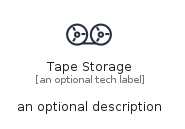
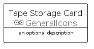
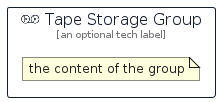

# TapeStorage


```text
aws-q1-2022/Resource/GeneralIcons/TapeStorage
```

```text
include('aws-q1-2022/Resource/GeneralIcons/TapeStorage')
```


| Illustration | TapeStorage | TapeStorageCard | TapeStorageGroup |
| :---: | :---: | :---: | :---: |
|  |  |  |  |


## TapeStorage

### Load remotely
```plantuml
@startuml
' configures the library
!global $LIB_BASE_LOCATION="https://raw.githubusercontent.com/tmorin/plantuml-libs/master/distribution"

' loads the library's bootstrap
!include $LIB_BASE_LOCATION/bootstrap.puml

' loads the package bootstrap
include('aws-q1-2022/bootstrap')

' loads the Item which embeds the element TapeStorage
include('aws-q1-2022/Resource/GeneralIcons/TapeStorage')

' renders the element
TapeStorage('TapeStorage', 'Tape Storage', 'an optional tech label', 'an optional description')
@enduml
```

### Load locally
```plantuml
@startuml
' configures the library
!global $INCLUSION_MODE="local"
!global $LIB_BASE_LOCATION="../../.."

' loads the library's bootstrap
!include $LIB_BASE_LOCATION/bootstrap.puml

' loads the package bootstrap
include('aws-q1-2022/bootstrap')

' loads the Item which embeds the element TapeStorage
include('aws-q1-2022/Resource/GeneralIcons/TapeStorage')

' renders the element
TapeStorage('TapeStorage', 'Tape Storage', 'an optional tech label', 'an optional description')
@enduml
```

## TapeStorageCard

### Load remotely
```plantuml
@startuml
' configures the library
!global $LIB_BASE_LOCATION="https://raw.githubusercontent.com/tmorin/plantuml-libs/master/distribution"

' loads the library's bootstrap
!include $LIB_BASE_LOCATION/bootstrap.puml

' loads the package bootstrap
include('aws-q1-2022/bootstrap')

' loads the Item which embeds the element TapeStorageCard
include('aws-q1-2022/Resource/GeneralIcons/TapeStorage')

' renders the element
TapeStorageCard('TapeStorageCard', 'Tape Storage Card', 'an optional description')
@enduml
```

### Load locally
```plantuml
@startuml
' configures the library
!global $INCLUSION_MODE="local"
!global $LIB_BASE_LOCATION="../../.."

' loads the library's bootstrap
!include $LIB_BASE_LOCATION/bootstrap.puml

' loads the package bootstrap
include('aws-q1-2022/bootstrap')

' loads the Item which embeds the element TapeStorageCard
include('aws-q1-2022/Resource/GeneralIcons/TapeStorage')

' renders the element
TapeStorageCard('TapeStorageCard', 'Tape Storage Card', 'an optional description')
@enduml
```

## TapeStorageGroup

### Load remotely
```plantuml
@startuml
' configures the library
!global $LIB_BASE_LOCATION="https://raw.githubusercontent.com/tmorin/plantuml-libs/master/distribution"

' loads the library's bootstrap
!include $LIB_BASE_LOCATION/bootstrap.puml

' loads the package bootstrap
include('aws-q1-2022/bootstrap')

' loads the Item which embeds the element TapeStorageGroup
include('aws-q1-2022/Resource/GeneralIcons/TapeStorage')

' renders the element
TapeStorageGroup('TapeStorageGroup', 'Tape Storage Group', 'an optional tech label') {
    note as note
        the content of the group
    end note
}
@enduml
```

### Load locally
```plantuml
@startuml
' configures the library
!global $INCLUSION_MODE="local"
!global $LIB_BASE_LOCATION="../../.."

' loads the library's bootstrap
!include $LIB_BASE_LOCATION/bootstrap.puml

' loads the package bootstrap
include('aws-q1-2022/bootstrap')

' loads the Item which embeds the element TapeStorageGroup
include('aws-q1-2022/Resource/GeneralIcons/TapeStorage')

' renders the element
TapeStorageGroup('TapeStorageGroup', 'Tape Storage Group', 'an optional tech label') {
    note as note
        the content of the group
    end note
}
@enduml
```

