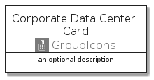
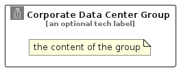

# CorporateDataCenter


```text
aws-q1-2022/Resource/GroupIcons/CorporateDataCenter
```

```text
include('aws-q1-2022/Resource/GroupIcons/CorporateDataCenter')
```


| Illustration | CorporateDataCenter | CorporateDataCenterCard | CorporateDataCenterGroup |
| :---: | :---: | :---: | :---: |
|  |  |  |  |


## CorporateDataCenter

### Load remotely
```plantuml
@startuml
' configures the library
!global $LIB_BASE_LOCATION="https://raw.githubusercontent.com/tmorin/plantuml-libs/master/distribution"

' loads the library's bootstrap
!include $LIB_BASE_LOCATION/bootstrap.puml

' loads the package bootstrap
include('aws-q1-2022/bootstrap')

' loads the Item which embeds the element CorporateDataCenter
include('aws-q1-2022/Resource/GroupIcons/CorporateDataCenter')

' renders the element
CorporateDataCenter('CorporateDataCenter', 'Corporate Data Center', 'an optional tech label', 'an optional description')
@enduml
```

### Load locally
```plantuml
@startuml
' configures the library
!global $INCLUSION_MODE="local"
!global $LIB_BASE_LOCATION="../../.."

' loads the library's bootstrap
!include $LIB_BASE_LOCATION/bootstrap.puml

' loads the package bootstrap
include('aws-q1-2022/bootstrap')

' loads the Item which embeds the element CorporateDataCenter
include('aws-q1-2022/Resource/GroupIcons/CorporateDataCenter')

' renders the element
CorporateDataCenter('CorporateDataCenter', 'Corporate Data Center', 'an optional tech label', 'an optional description')
@enduml
```

## CorporateDataCenterCard

### Load remotely
```plantuml
@startuml
' configures the library
!global $LIB_BASE_LOCATION="https://raw.githubusercontent.com/tmorin/plantuml-libs/master/distribution"

' loads the library's bootstrap
!include $LIB_BASE_LOCATION/bootstrap.puml

' loads the package bootstrap
include('aws-q1-2022/bootstrap')

' loads the Item which embeds the element CorporateDataCenterCard
include('aws-q1-2022/Resource/GroupIcons/CorporateDataCenter')

' renders the element
CorporateDataCenterCard('CorporateDataCenterCard', 'Corporate Data Center Card', 'an optional description')
@enduml
```

### Load locally
```plantuml
@startuml
' configures the library
!global $INCLUSION_MODE="local"
!global $LIB_BASE_LOCATION="../../.."

' loads the library's bootstrap
!include $LIB_BASE_LOCATION/bootstrap.puml

' loads the package bootstrap
include('aws-q1-2022/bootstrap')

' loads the Item which embeds the element CorporateDataCenterCard
include('aws-q1-2022/Resource/GroupIcons/CorporateDataCenter')

' renders the element
CorporateDataCenterCard('CorporateDataCenterCard', 'Corporate Data Center Card', 'an optional description')
@enduml
```

## CorporateDataCenterGroup

### Load remotely
```plantuml
@startuml
' configures the library
!global $LIB_BASE_LOCATION="https://raw.githubusercontent.com/tmorin/plantuml-libs/master/distribution"

' loads the library's bootstrap
!include $LIB_BASE_LOCATION/bootstrap.puml

' loads the package bootstrap
include('aws-q1-2022/bootstrap')

' loads the Item which embeds the element CorporateDataCenterGroup
include('aws-q1-2022/Resource/GroupIcons/CorporateDataCenter')

' renders the element
CorporateDataCenterGroup('CorporateDataCenterGroup', 'Corporate Data Center Group', 'an optional tech label') {
    note as note
        the content of the group
    end note
}
@enduml
```

### Load locally
```plantuml
@startuml
' configures the library
!global $INCLUSION_MODE="local"
!global $LIB_BASE_LOCATION="../../.."

' loads the library's bootstrap
!include $LIB_BASE_LOCATION/bootstrap.puml

' loads the package bootstrap
include('aws-q1-2022/bootstrap')

' loads the Item which embeds the element CorporateDataCenterGroup
include('aws-q1-2022/Resource/GroupIcons/CorporateDataCenter')

' renders the element
CorporateDataCenterGroup('CorporateDataCenterGroup', 'Corporate Data Center Group', 'an optional tech label') {
    note as note
        the content of the group
    end note
}
@enduml
```

