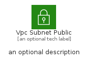
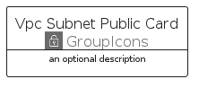
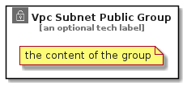

# VpcSubnetPublic


```text
aws-q1-2022/Resource/GroupIcons/VpcSubnetPublic
```

```text
include('aws-q1-2022/Resource/GroupIcons/VpcSubnetPublic')
```


| Illustration | VpcSubnetPublic | VpcSubnetPublicCard | VpcSubnetPublicGroup |
| :---: | :---: | :---: | :---: |
|  |  |  |  |


## VpcSubnetPublic

### Load remotely
```plantuml
@startuml
' configures the library
!global $LIB_BASE_LOCATION="https://raw.githubusercontent.com/tmorin/plantuml-libs/master/distribution"

' loads the library's bootstrap
!include $LIB_BASE_LOCATION/bootstrap.puml

' loads the package bootstrap
include('aws-q1-2022/bootstrap')

' loads the Item which embeds the element VpcSubnetPublic
include('aws-q1-2022/Resource/GroupIcons/VpcSubnetPublic')

' renders the element
VpcSubnetPublic('VpcSubnetPublic', 'Vpc Subnet Public', 'an optional tech label')
@enduml
```

### Load locally
```plantuml
@startuml
' configures the library
!global $INCLUSION_MODE="local"
!global $LIB_BASE_LOCATION="../../.."

' loads the library's bootstrap
!include $LIB_BASE_LOCATION/bootstrap.puml

' loads the package bootstrap
include('aws-q1-2022/bootstrap')

' loads the Item which embeds the element VpcSubnetPublic
include('aws-q1-2022/Resource/GroupIcons/VpcSubnetPublic')

' renders the element
VpcSubnetPublic('VpcSubnetPublic', 'Vpc Subnet Public', 'an optional tech label')
@enduml
```

## VpcSubnetPublicCard

### Load remotely
```plantuml
@startuml
' configures the library
!global $LIB_BASE_LOCATION="https://raw.githubusercontent.com/tmorin/plantuml-libs/master/distribution"

' loads the library's bootstrap
!include $LIB_BASE_LOCATION/bootstrap.puml

' loads the package bootstrap
include('aws-q1-2022/bootstrap')

' loads the Item which embeds the element VpcSubnetPublicCard
include('aws-q1-2022/Resource/GroupIcons/VpcSubnetPublic')

' renders the element
VpcSubnetPublicCard('VpcSubnetPublicCard', 'Vpc Subnet Public Card', 'an optional description')
@enduml
```

### Load locally
```plantuml
@startuml
' configures the library
!global $INCLUSION_MODE="local"
!global $LIB_BASE_LOCATION="../../.."

' loads the library's bootstrap
!include $LIB_BASE_LOCATION/bootstrap.puml

' loads the package bootstrap
include('aws-q1-2022/bootstrap')

' loads the Item which embeds the element VpcSubnetPublicCard
include('aws-q1-2022/Resource/GroupIcons/VpcSubnetPublic')

' renders the element
VpcSubnetPublicCard('VpcSubnetPublicCard', 'Vpc Subnet Public Card', 'an optional description')
@enduml
```

## VpcSubnetPublicGroup

### Load remotely
```plantuml
@startuml
' configures the library
!global $LIB_BASE_LOCATION="https://raw.githubusercontent.com/tmorin/plantuml-libs/master/distribution"

' loads the library's bootstrap
!include $LIB_BASE_LOCATION/bootstrap.puml

' loads the package bootstrap
include('aws-q1-2022/bootstrap')

' loads the Item which embeds the element VpcSubnetPublicGroup
include('aws-q1-2022/Resource/GroupIcons/VpcSubnetPublic')

' renders the element
VpcSubnetPublicGroup('VpcSubnetPublicGroup', 'Vpc Subnet Public Group', 'an optional tech label') {
    note as note
        the content of the group
    end note
}
@enduml
```

### Load locally
```plantuml
@startuml
' configures the library
!global $INCLUSION_MODE="local"
!global $LIB_BASE_LOCATION="../../.."

' loads the library's bootstrap
!include $LIB_BASE_LOCATION/bootstrap.puml

' loads the package bootstrap
include('aws-q1-2022/bootstrap')

' loads the Item which embeds the element VpcSubnetPublicGroup
include('aws-q1-2022/Resource/GroupIcons/VpcSubnetPublic')

' renders the element
VpcSubnetPublicGroup('VpcSubnetPublicGroup', 'Vpc Subnet Public Group', 'an optional tech label') {
    note as note
        the content of the group
    end note
}
@enduml
```

