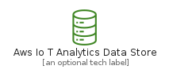
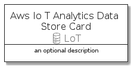
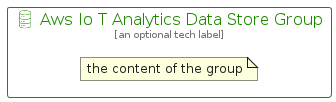

# AwsIoTAnalyticsDataStore


```text
aws-q1-2022/Resource/LoT/AwsIoTAnalyticsDataStore
```

```text
include('aws-q1-2022/Resource/LoT/AwsIoTAnalyticsDataStore')
```


| Illustration | AwsIoTAnalyticsDataStore | AwsIoTAnalyticsDataStoreCard | AwsIoTAnalyticsDataStoreGroup |
| :---: | :---: | :---: | :---: |
|  |  |  |  |


## AwsIoTAnalyticsDataStore

### Load remotely
```plantuml
@startuml
' configures the library
!global $LIB_BASE_LOCATION="https://raw.githubusercontent.com/tmorin/plantuml-libs/master/distribution"

' loads the library's bootstrap
!include $LIB_BASE_LOCATION/bootstrap.puml

' loads the package bootstrap
include('aws-q1-2022/bootstrap')

' loads the Item which embeds the element AwsIoTAnalyticsDataStore
include('aws-q1-2022/Resource/LoT/AwsIoTAnalyticsDataStore')

' renders the element
AwsIoTAnalyticsDataStore('AwsIoTAnalyticsDataStore', 'Aws Io T Analytics Data Store', 'an optional tech label')
@enduml
```

### Load locally
```plantuml
@startuml
' configures the library
!global $INCLUSION_MODE="local"
!global $LIB_BASE_LOCATION="../../.."

' loads the library's bootstrap
!include $LIB_BASE_LOCATION/bootstrap.puml

' loads the package bootstrap
include('aws-q1-2022/bootstrap')

' loads the Item which embeds the element AwsIoTAnalyticsDataStore
include('aws-q1-2022/Resource/LoT/AwsIoTAnalyticsDataStore')

' renders the element
AwsIoTAnalyticsDataStore('AwsIoTAnalyticsDataStore', 'Aws Io T Analytics Data Store', 'an optional tech label')
@enduml
```

## AwsIoTAnalyticsDataStoreCard

### Load remotely
```plantuml
@startuml
' configures the library
!global $LIB_BASE_LOCATION="https://raw.githubusercontent.com/tmorin/plantuml-libs/master/distribution"

' loads the library's bootstrap
!include $LIB_BASE_LOCATION/bootstrap.puml

' loads the package bootstrap
include('aws-q1-2022/bootstrap')

' loads the Item which embeds the element AwsIoTAnalyticsDataStoreCard
include('aws-q1-2022/Resource/LoT/AwsIoTAnalyticsDataStore')

' renders the element
AwsIoTAnalyticsDataStoreCard('AwsIoTAnalyticsDataStoreCard', 'Aws Io T Analytics Data Store Card', 'an optional description')
@enduml
```

### Load locally
```plantuml
@startuml
' configures the library
!global $INCLUSION_MODE="local"
!global $LIB_BASE_LOCATION="../../.."

' loads the library's bootstrap
!include $LIB_BASE_LOCATION/bootstrap.puml

' loads the package bootstrap
include('aws-q1-2022/bootstrap')

' loads the Item which embeds the element AwsIoTAnalyticsDataStoreCard
include('aws-q1-2022/Resource/LoT/AwsIoTAnalyticsDataStore')

' renders the element
AwsIoTAnalyticsDataStoreCard('AwsIoTAnalyticsDataStoreCard', 'Aws Io T Analytics Data Store Card', 'an optional description')
@enduml
```

## AwsIoTAnalyticsDataStoreGroup

### Load remotely
```plantuml
@startuml
' configures the library
!global $LIB_BASE_LOCATION="https://raw.githubusercontent.com/tmorin/plantuml-libs/master/distribution"

' loads the library's bootstrap
!include $LIB_BASE_LOCATION/bootstrap.puml

' loads the package bootstrap
include('aws-q1-2022/bootstrap')

' loads the Item which embeds the element AwsIoTAnalyticsDataStoreGroup
include('aws-q1-2022/Resource/LoT/AwsIoTAnalyticsDataStore')

' renders the element
AwsIoTAnalyticsDataStoreGroup('AwsIoTAnalyticsDataStoreGroup', 'Aws Io T Analytics Data Store Group', 'an optional tech label') {
    note as note
        the content of the group
    end note
}
@enduml
```

### Load locally
```plantuml
@startuml
' configures the library
!global $INCLUSION_MODE="local"
!global $LIB_BASE_LOCATION="../../.."

' loads the library's bootstrap
!include $LIB_BASE_LOCATION/bootstrap.puml

' loads the package bootstrap
include('aws-q1-2022/bootstrap')

' loads the Item which embeds the element AwsIoTAnalyticsDataStoreGroup
include('aws-q1-2022/Resource/LoT/AwsIoTAnalyticsDataStore')

' renders the element
AwsIoTAnalyticsDataStoreGroup('AwsIoTAnalyticsDataStoreGroup', 'Aws Io T Analytics Data Store Group', 'an optional tech label') {
    note as note
        the content of the group
    end note
}
@enduml
```

