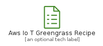
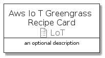
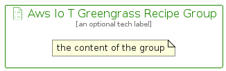

# AwsIoTGreengrassRecipe


```text
aws-q1-2022/Resource/LoT/AwsIoTGreengrassRecipe
```

```text
include('aws-q1-2022/Resource/LoT/AwsIoTGreengrassRecipe')
```


| Illustration | AwsIoTGreengrassRecipe | AwsIoTGreengrassRecipeCard | AwsIoTGreengrassRecipeGroup |
| :---: | :---: | :---: | :---: |
|  |  |  |  |


## AwsIoTGreengrassRecipe

### Load remotely
```plantuml
@startuml
' configures the library
!global $LIB_BASE_LOCATION="https://raw.githubusercontent.com/tmorin/plantuml-libs/master/distribution"

' loads the library's bootstrap
!include $LIB_BASE_LOCATION/bootstrap.puml

' loads the package bootstrap
include('aws-q1-2022/bootstrap')

' loads the Item which embeds the element AwsIoTGreengrassRecipe
include('aws-q1-2022/Resource/LoT/AwsIoTGreengrassRecipe')

' renders the element
AwsIoTGreengrassRecipe('AwsIoTGreengrassRecipe', 'Aws Io T Greengrass Recipe', 'an optional tech label')
@enduml
```

### Load locally
```plantuml
@startuml
' configures the library
!global $INCLUSION_MODE="local"
!global $LIB_BASE_LOCATION="../../.."

' loads the library's bootstrap
!include $LIB_BASE_LOCATION/bootstrap.puml

' loads the package bootstrap
include('aws-q1-2022/bootstrap')

' loads the Item which embeds the element AwsIoTGreengrassRecipe
include('aws-q1-2022/Resource/LoT/AwsIoTGreengrassRecipe')

' renders the element
AwsIoTGreengrassRecipe('AwsIoTGreengrassRecipe', 'Aws Io T Greengrass Recipe', 'an optional tech label')
@enduml
```

## AwsIoTGreengrassRecipeCard

### Load remotely
```plantuml
@startuml
' configures the library
!global $LIB_BASE_LOCATION="https://raw.githubusercontent.com/tmorin/plantuml-libs/master/distribution"

' loads the library's bootstrap
!include $LIB_BASE_LOCATION/bootstrap.puml

' loads the package bootstrap
include('aws-q1-2022/bootstrap')

' loads the Item which embeds the element AwsIoTGreengrassRecipeCard
include('aws-q1-2022/Resource/LoT/AwsIoTGreengrassRecipe')

' renders the element
AwsIoTGreengrassRecipeCard('AwsIoTGreengrassRecipeCard', 'Aws Io T Greengrass Recipe Card', 'an optional description')
@enduml
```

### Load locally
```plantuml
@startuml
' configures the library
!global $INCLUSION_MODE="local"
!global $LIB_BASE_LOCATION="../../.."

' loads the library's bootstrap
!include $LIB_BASE_LOCATION/bootstrap.puml

' loads the package bootstrap
include('aws-q1-2022/bootstrap')

' loads the Item which embeds the element AwsIoTGreengrassRecipeCard
include('aws-q1-2022/Resource/LoT/AwsIoTGreengrassRecipe')

' renders the element
AwsIoTGreengrassRecipeCard('AwsIoTGreengrassRecipeCard', 'Aws Io T Greengrass Recipe Card', 'an optional description')
@enduml
```

## AwsIoTGreengrassRecipeGroup

### Load remotely
```plantuml
@startuml
' configures the library
!global $LIB_BASE_LOCATION="https://raw.githubusercontent.com/tmorin/plantuml-libs/master/distribution"

' loads the library's bootstrap
!include $LIB_BASE_LOCATION/bootstrap.puml

' loads the package bootstrap
include('aws-q1-2022/bootstrap')

' loads the Item which embeds the element AwsIoTGreengrassRecipeGroup
include('aws-q1-2022/Resource/LoT/AwsIoTGreengrassRecipe')

' renders the element
AwsIoTGreengrassRecipeGroup('AwsIoTGreengrassRecipeGroup', 'Aws Io T Greengrass Recipe Group', 'an optional tech label') {
    note as note
        the content of the group
    end note
}
@enduml
```

### Load locally
```plantuml
@startuml
' configures the library
!global $INCLUSION_MODE="local"
!global $LIB_BASE_LOCATION="../../.."

' loads the library's bootstrap
!include $LIB_BASE_LOCATION/bootstrap.puml

' loads the package bootstrap
include('aws-q1-2022/bootstrap')

' loads the Item which embeds the element AwsIoTGreengrassRecipeGroup
include('aws-q1-2022/Resource/LoT/AwsIoTGreengrassRecipe')

' renders the element
AwsIoTGreengrassRecipeGroup('AwsIoTGreengrassRecipeGroup', 'Aws Io T Greengrass Recipe Group', 'an optional tech label') {
    note as note
        the content of the group
    end note
}
@enduml
```

