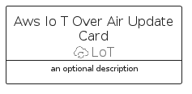
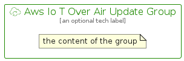

# AwsIoTOverAirUpdate


```text
aws-q1-2022/Resource/LoT/AwsIoTOverAirUpdate
```

```text
include('aws-q1-2022/Resource/LoT/AwsIoTOverAirUpdate')
```


| Illustration | AwsIoTOverAirUpdate | AwsIoTOverAirUpdateCard | AwsIoTOverAirUpdateGroup |
| :---: | :---: | :---: | :---: |
|  |  |  |  |


## AwsIoTOverAirUpdate

### Load remotely
```plantuml
@startuml
' configures the library
!global $LIB_BASE_LOCATION="https://raw.githubusercontent.com/tmorin/plantuml-libs/master/distribution"

' loads the library's bootstrap
!include $LIB_BASE_LOCATION/bootstrap.puml

' loads the package bootstrap
include('aws-q1-2022/bootstrap')

' loads the Item which embeds the element AwsIoTOverAirUpdate
include('aws-q1-2022/Resource/LoT/AwsIoTOverAirUpdate')

' renders the element
AwsIoTOverAirUpdate('AwsIoTOverAirUpdate', 'Aws Io T Over Air Update', 'an optional tech label')
@enduml
```

### Load locally
```plantuml
@startuml
' configures the library
!global $INCLUSION_MODE="local"
!global $LIB_BASE_LOCATION="../../.."

' loads the library's bootstrap
!include $LIB_BASE_LOCATION/bootstrap.puml

' loads the package bootstrap
include('aws-q1-2022/bootstrap')

' loads the Item which embeds the element AwsIoTOverAirUpdate
include('aws-q1-2022/Resource/LoT/AwsIoTOverAirUpdate')

' renders the element
AwsIoTOverAirUpdate('AwsIoTOverAirUpdate', 'Aws Io T Over Air Update', 'an optional tech label')
@enduml
```

## AwsIoTOverAirUpdateCard

### Load remotely
```plantuml
@startuml
' configures the library
!global $LIB_BASE_LOCATION="https://raw.githubusercontent.com/tmorin/plantuml-libs/master/distribution"

' loads the library's bootstrap
!include $LIB_BASE_LOCATION/bootstrap.puml

' loads the package bootstrap
include('aws-q1-2022/bootstrap')

' loads the Item which embeds the element AwsIoTOverAirUpdateCard
include('aws-q1-2022/Resource/LoT/AwsIoTOverAirUpdate')

' renders the element
AwsIoTOverAirUpdateCard('AwsIoTOverAirUpdateCard', 'Aws Io T Over Air Update Card', 'an optional description')
@enduml
```

### Load locally
```plantuml
@startuml
' configures the library
!global $INCLUSION_MODE="local"
!global $LIB_BASE_LOCATION="../../.."

' loads the library's bootstrap
!include $LIB_BASE_LOCATION/bootstrap.puml

' loads the package bootstrap
include('aws-q1-2022/bootstrap')

' loads the Item which embeds the element AwsIoTOverAirUpdateCard
include('aws-q1-2022/Resource/LoT/AwsIoTOverAirUpdate')

' renders the element
AwsIoTOverAirUpdateCard('AwsIoTOverAirUpdateCard', 'Aws Io T Over Air Update Card', 'an optional description')
@enduml
```

## AwsIoTOverAirUpdateGroup

### Load remotely
```plantuml
@startuml
' configures the library
!global $LIB_BASE_LOCATION="https://raw.githubusercontent.com/tmorin/plantuml-libs/master/distribution"

' loads the library's bootstrap
!include $LIB_BASE_LOCATION/bootstrap.puml

' loads the package bootstrap
include('aws-q1-2022/bootstrap')

' loads the Item which embeds the element AwsIoTOverAirUpdateGroup
include('aws-q1-2022/Resource/LoT/AwsIoTOverAirUpdate')

' renders the element
AwsIoTOverAirUpdateGroup('AwsIoTOverAirUpdateGroup', 'Aws Io T Over Air Update Group', 'an optional tech label') {
    note as note
        the content of the group
    end note
}
@enduml
```

### Load locally
```plantuml
@startuml
' configures the library
!global $INCLUSION_MODE="local"
!global $LIB_BASE_LOCATION="../../.."

' loads the library's bootstrap
!include $LIB_BASE_LOCATION/bootstrap.puml

' loads the package bootstrap
include('aws-q1-2022/bootstrap')

' loads the Item which embeds the element AwsIoTOverAirUpdateGroup
include('aws-q1-2022/Resource/LoT/AwsIoTOverAirUpdate')

' renders the element
AwsIoTOverAirUpdateGroup('AwsIoTOverAirUpdateGroup', 'Aws Io T Over Air Update Group', 'an optional tech label') {
    note as note
        the content of the group
    end note
}
@enduml
```

