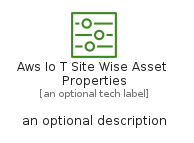
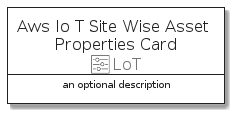

# AwsIoTSiteWiseAssetProperties


```text
aws-q1-2022/Resource/LoT/AwsIoTSiteWiseAssetProperties
```

```text
include('aws-q1-2022/Resource/LoT/AwsIoTSiteWiseAssetProperties')
```


| Illustration | AwsIoTSiteWiseAssetProperties | AwsIoTSiteWiseAssetPropertiesCard | AwsIoTSiteWiseAssetPropertiesGroup |
| :---: | :---: | :---: | :---: |
|  |  |  |  |


## AwsIoTSiteWiseAssetProperties

### Load remotely
```plantuml
@startuml
' configures the library
!global $LIB_BASE_LOCATION="https://raw.githubusercontent.com/tmorin/plantuml-libs/master/distribution"

' loads the library's bootstrap
!include $LIB_BASE_LOCATION/bootstrap.puml

' loads the package bootstrap
include('aws-q1-2022/bootstrap')

' loads the Item which embeds the element AwsIoTSiteWiseAssetProperties
include('aws-q1-2022/Resource/LoT/AwsIoTSiteWiseAssetProperties')

' renders the element
AwsIoTSiteWiseAssetProperties('AwsIoTSiteWiseAssetProperties', 'Aws Io T Site Wise Asset Properties', 'an optional tech label')
@enduml
```

### Load locally
```plantuml
@startuml
' configures the library
!global $INCLUSION_MODE="local"
!global $LIB_BASE_LOCATION="../../.."

' loads the library's bootstrap
!include $LIB_BASE_LOCATION/bootstrap.puml

' loads the package bootstrap
include('aws-q1-2022/bootstrap')

' loads the Item which embeds the element AwsIoTSiteWiseAssetProperties
include('aws-q1-2022/Resource/LoT/AwsIoTSiteWiseAssetProperties')

' renders the element
AwsIoTSiteWiseAssetProperties('AwsIoTSiteWiseAssetProperties', 'Aws Io T Site Wise Asset Properties', 'an optional tech label')
@enduml
```

## AwsIoTSiteWiseAssetPropertiesCard

### Load remotely
```plantuml
@startuml
' configures the library
!global $LIB_BASE_LOCATION="https://raw.githubusercontent.com/tmorin/plantuml-libs/master/distribution"

' loads the library's bootstrap
!include $LIB_BASE_LOCATION/bootstrap.puml

' loads the package bootstrap
include('aws-q1-2022/bootstrap')

' loads the Item which embeds the element AwsIoTSiteWiseAssetPropertiesCard
include('aws-q1-2022/Resource/LoT/AwsIoTSiteWiseAssetProperties')

' renders the element
AwsIoTSiteWiseAssetPropertiesCard('AwsIoTSiteWiseAssetPropertiesCard', 'Aws Io T Site Wise Asset Properties Card', 'an optional description')
@enduml
```

### Load locally
```plantuml
@startuml
' configures the library
!global $INCLUSION_MODE="local"
!global $LIB_BASE_LOCATION="../../.."

' loads the library's bootstrap
!include $LIB_BASE_LOCATION/bootstrap.puml

' loads the package bootstrap
include('aws-q1-2022/bootstrap')

' loads the Item which embeds the element AwsIoTSiteWiseAssetPropertiesCard
include('aws-q1-2022/Resource/LoT/AwsIoTSiteWiseAssetProperties')

' renders the element
AwsIoTSiteWiseAssetPropertiesCard('AwsIoTSiteWiseAssetPropertiesCard', 'Aws Io T Site Wise Asset Properties Card', 'an optional description')
@enduml
```

## AwsIoTSiteWiseAssetPropertiesGroup

### Load remotely
```plantuml
@startuml
' configures the library
!global $LIB_BASE_LOCATION="https://raw.githubusercontent.com/tmorin/plantuml-libs/master/distribution"

' loads the library's bootstrap
!include $LIB_BASE_LOCATION/bootstrap.puml

' loads the package bootstrap
include('aws-q1-2022/bootstrap')

' loads the Item which embeds the element AwsIoTSiteWiseAssetPropertiesGroup
include('aws-q1-2022/Resource/LoT/AwsIoTSiteWiseAssetProperties')

' renders the element
AwsIoTSiteWiseAssetPropertiesGroup('AwsIoTSiteWiseAssetPropertiesGroup', 'Aws Io T Site Wise Asset Properties Group', 'an optional tech label') {
    note as note
        the content of the group
    end note
}
@enduml
```

### Load locally
```plantuml
@startuml
' configures the library
!global $INCLUSION_MODE="local"
!global $LIB_BASE_LOCATION="../../.."

' loads the library's bootstrap
!include $LIB_BASE_LOCATION/bootstrap.puml

' loads the package bootstrap
include('aws-q1-2022/bootstrap')

' loads the Item which embeds the element AwsIoTSiteWiseAssetPropertiesGroup
include('aws-q1-2022/Resource/LoT/AwsIoTSiteWiseAssetProperties')

' renders the element
AwsIoTSiteWiseAssetPropertiesGroup('AwsIoTSiteWiseAssetPropertiesGroup', 'Aws Io T Site Wise Asset Properties Group', 'an optional tech label') {
    note as note
        the content of the group
    end note
}
@enduml
```

