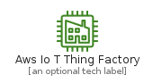
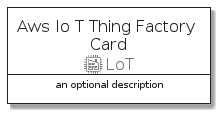
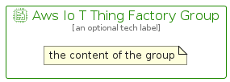

# AwsIoTThingFactory


```text
aws-q1-2022/Resource/LoT/AwsIoTThingFactory
```

```text
include('aws-q1-2022/Resource/LoT/AwsIoTThingFactory')
```


| Illustration | AwsIoTThingFactory | AwsIoTThingFactoryCard | AwsIoTThingFactoryGroup |
| :---: | :---: | :---: | :---: |
|  |  |  |  |


## AwsIoTThingFactory

### Load remotely
```plantuml
@startuml
' configures the library
!global $LIB_BASE_LOCATION="https://raw.githubusercontent.com/tmorin/plantuml-libs/master/distribution"

' loads the library's bootstrap
!include $LIB_BASE_LOCATION/bootstrap.puml

' loads the package bootstrap
include('aws-q1-2022/bootstrap')

' loads the Item which embeds the element AwsIoTThingFactory
include('aws-q1-2022/Resource/LoT/AwsIoTThingFactory')

' renders the element
AwsIoTThingFactory('AwsIoTThingFactory', 'Aws Io T Thing Factory', 'an optional tech label')
@enduml
```

### Load locally
```plantuml
@startuml
' configures the library
!global $INCLUSION_MODE="local"
!global $LIB_BASE_LOCATION="../../.."

' loads the library's bootstrap
!include $LIB_BASE_LOCATION/bootstrap.puml

' loads the package bootstrap
include('aws-q1-2022/bootstrap')

' loads the Item which embeds the element AwsIoTThingFactory
include('aws-q1-2022/Resource/LoT/AwsIoTThingFactory')

' renders the element
AwsIoTThingFactory('AwsIoTThingFactory', 'Aws Io T Thing Factory', 'an optional tech label')
@enduml
```

## AwsIoTThingFactoryCard

### Load remotely
```plantuml
@startuml
' configures the library
!global $LIB_BASE_LOCATION="https://raw.githubusercontent.com/tmorin/plantuml-libs/master/distribution"

' loads the library's bootstrap
!include $LIB_BASE_LOCATION/bootstrap.puml

' loads the package bootstrap
include('aws-q1-2022/bootstrap')

' loads the Item which embeds the element AwsIoTThingFactoryCard
include('aws-q1-2022/Resource/LoT/AwsIoTThingFactory')

' renders the element
AwsIoTThingFactoryCard('AwsIoTThingFactoryCard', 'Aws Io T Thing Factory Card', 'an optional description')
@enduml
```

### Load locally
```plantuml
@startuml
' configures the library
!global $INCLUSION_MODE="local"
!global $LIB_BASE_LOCATION="../../.."

' loads the library's bootstrap
!include $LIB_BASE_LOCATION/bootstrap.puml

' loads the package bootstrap
include('aws-q1-2022/bootstrap')

' loads the Item which embeds the element AwsIoTThingFactoryCard
include('aws-q1-2022/Resource/LoT/AwsIoTThingFactory')

' renders the element
AwsIoTThingFactoryCard('AwsIoTThingFactoryCard', 'Aws Io T Thing Factory Card', 'an optional description')
@enduml
```

## AwsIoTThingFactoryGroup

### Load remotely
```plantuml
@startuml
' configures the library
!global $LIB_BASE_LOCATION="https://raw.githubusercontent.com/tmorin/plantuml-libs/master/distribution"

' loads the library's bootstrap
!include $LIB_BASE_LOCATION/bootstrap.puml

' loads the package bootstrap
include('aws-q1-2022/bootstrap')

' loads the Item which embeds the element AwsIoTThingFactoryGroup
include('aws-q1-2022/Resource/LoT/AwsIoTThingFactory')

' renders the element
AwsIoTThingFactoryGroup('AwsIoTThingFactoryGroup', 'Aws Io T Thing Factory Group', 'an optional tech label') {
    note as note
        the content of the group
    end note
}
@enduml
```

### Load locally
```plantuml
@startuml
' configures the library
!global $INCLUSION_MODE="local"
!global $LIB_BASE_LOCATION="../../.."

' loads the library's bootstrap
!include $LIB_BASE_LOCATION/bootstrap.puml

' loads the package bootstrap
include('aws-q1-2022/bootstrap')

' loads the Item which embeds the element AwsIoTThingFactoryGroup
include('aws-q1-2022/Resource/LoT/AwsIoTThingFactory')

' renders the element
AwsIoTThingFactoryGroup('AwsIoTThingFactoryGroup', 'Aws Io T Thing Factory Group', 'an optional tech label') {
    note as note
        the content of the group
    end note
}
@enduml
```

