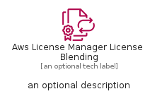
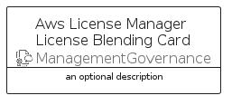

# AwsLicenseManagerLicenseBlending


```text
aws-q1-2022/Resource/ManagementGovernance/AwsLicenseManagerLicenseBlending
```

```text
include('aws-q1-2022/Resource/ManagementGovernance/AwsLicenseManagerLicenseBlending')
```


| Illustration | AwsLicenseManagerLicenseBlending | AwsLicenseManagerLicenseBlendingCard | AwsLicenseManagerLicenseBlendingGroup |
| :---: | :---: | :---: | :---: |
|  |  |  |  |


## AwsLicenseManagerLicenseBlending

### Load remotely
```plantuml
@startuml
' configures the library
!global $LIB_BASE_LOCATION="https://raw.githubusercontent.com/tmorin/plantuml-libs/master/distribution"

' loads the library's bootstrap
!include $LIB_BASE_LOCATION/bootstrap.puml

' loads the package bootstrap
include('aws-q1-2022/bootstrap')

' loads the Item which embeds the element AwsLicenseManagerLicenseBlending
include('aws-q1-2022/Resource/ManagementGovernance/AwsLicenseManagerLicenseBlending')

' renders the element
AwsLicenseManagerLicenseBlending('AwsLicenseManagerLicenseBlending', 'Aws License Manager License Blending', 'an optional tech label', 'an optional description')
@enduml
```

### Load locally
```plantuml
@startuml
' configures the library
!global $INCLUSION_MODE="local"
!global $LIB_BASE_LOCATION="../../.."

' loads the library's bootstrap
!include $LIB_BASE_LOCATION/bootstrap.puml

' loads the package bootstrap
include('aws-q1-2022/bootstrap')

' loads the Item which embeds the element AwsLicenseManagerLicenseBlending
include('aws-q1-2022/Resource/ManagementGovernance/AwsLicenseManagerLicenseBlending')

' renders the element
AwsLicenseManagerLicenseBlending('AwsLicenseManagerLicenseBlending', 'Aws License Manager License Blending', 'an optional tech label', 'an optional description')
@enduml
```

## AwsLicenseManagerLicenseBlendingCard

### Load remotely
```plantuml
@startuml
' configures the library
!global $LIB_BASE_LOCATION="https://raw.githubusercontent.com/tmorin/plantuml-libs/master/distribution"

' loads the library's bootstrap
!include $LIB_BASE_LOCATION/bootstrap.puml

' loads the package bootstrap
include('aws-q1-2022/bootstrap')

' loads the Item which embeds the element AwsLicenseManagerLicenseBlendingCard
include('aws-q1-2022/Resource/ManagementGovernance/AwsLicenseManagerLicenseBlending')

' renders the element
AwsLicenseManagerLicenseBlendingCard('AwsLicenseManagerLicenseBlendingCard', 'Aws License Manager License Blending Card', 'an optional description')
@enduml
```

### Load locally
```plantuml
@startuml
' configures the library
!global $INCLUSION_MODE="local"
!global $LIB_BASE_LOCATION="../../.."

' loads the library's bootstrap
!include $LIB_BASE_LOCATION/bootstrap.puml

' loads the package bootstrap
include('aws-q1-2022/bootstrap')

' loads the Item which embeds the element AwsLicenseManagerLicenseBlendingCard
include('aws-q1-2022/Resource/ManagementGovernance/AwsLicenseManagerLicenseBlending')

' renders the element
AwsLicenseManagerLicenseBlendingCard('AwsLicenseManagerLicenseBlendingCard', 'Aws License Manager License Blending Card', 'an optional description')
@enduml
```

## AwsLicenseManagerLicenseBlendingGroup

### Load remotely
```plantuml
@startuml
' configures the library
!global $LIB_BASE_LOCATION="https://raw.githubusercontent.com/tmorin/plantuml-libs/master/distribution"

' loads the library's bootstrap
!include $LIB_BASE_LOCATION/bootstrap.puml

' loads the package bootstrap
include('aws-q1-2022/bootstrap')

' loads the Item which embeds the element AwsLicenseManagerLicenseBlendingGroup
include('aws-q1-2022/Resource/ManagementGovernance/AwsLicenseManagerLicenseBlending')

' renders the element
AwsLicenseManagerLicenseBlendingGroup('AwsLicenseManagerLicenseBlendingGroup', 'Aws License Manager License Blending Group', 'an optional tech label') {
    note as note
        the content of the group
    end note
}
@enduml
```

### Load locally
```plantuml
@startuml
' configures the library
!global $INCLUSION_MODE="local"
!global $LIB_BASE_LOCATION="../../.."

' loads the library's bootstrap
!include $LIB_BASE_LOCATION/bootstrap.puml

' loads the package bootstrap
include('aws-q1-2022/bootstrap')

' loads the Item which embeds the element AwsLicenseManagerLicenseBlendingGroup
include('aws-q1-2022/Resource/ManagementGovernance/AwsLicenseManagerLicenseBlending')

' renders the element
AwsLicenseManagerLicenseBlendingGroup('AwsLicenseManagerLicenseBlendingGroup', 'Aws License Manager License Blending Group', 'an optional tech label') {
    note as note
        the content of the group
    end note
}
@enduml
```

