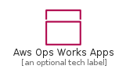
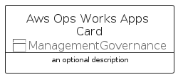
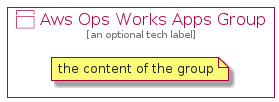

# AwsOpsWorksApps


```text
aws-q1-2022/Resource/ManagementGovernance/AwsOpsWorksApps
```

```text
include('aws-q1-2022/Resource/ManagementGovernance/AwsOpsWorksApps')
```


| Illustration | AwsOpsWorksApps | AwsOpsWorksAppsCard | AwsOpsWorksAppsGroup |
| :---: | :---: | :---: | :---: |
|  |  |  |  |


## AwsOpsWorksApps

### Load remotely
```plantuml
@startuml
' configures the library
!global $LIB_BASE_LOCATION="https://raw.githubusercontent.com/tmorin/plantuml-libs/master/distribution"

' loads the library's bootstrap
!include $LIB_BASE_LOCATION/bootstrap.puml

' loads the package bootstrap
include('aws-q1-2022/bootstrap')

' loads the Item which embeds the element AwsOpsWorksApps
include('aws-q1-2022/Resource/ManagementGovernance/AwsOpsWorksApps')

' renders the element
AwsOpsWorksApps('AwsOpsWorksApps', 'Aws Ops Works Apps', 'an optional tech label')
@enduml
```

### Load locally
```plantuml
@startuml
' configures the library
!global $INCLUSION_MODE="local"
!global $LIB_BASE_LOCATION="../../.."

' loads the library's bootstrap
!include $LIB_BASE_LOCATION/bootstrap.puml

' loads the package bootstrap
include('aws-q1-2022/bootstrap')

' loads the Item which embeds the element AwsOpsWorksApps
include('aws-q1-2022/Resource/ManagementGovernance/AwsOpsWorksApps')

' renders the element
AwsOpsWorksApps('AwsOpsWorksApps', 'Aws Ops Works Apps', 'an optional tech label')
@enduml
```

## AwsOpsWorksAppsCard

### Load remotely
```plantuml
@startuml
' configures the library
!global $LIB_BASE_LOCATION="https://raw.githubusercontent.com/tmorin/plantuml-libs/master/distribution"

' loads the library's bootstrap
!include $LIB_BASE_LOCATION/bootstrap.puml

' loads the package bootstrap
include('aws-q1-2022/bootstrap')

' loads the Item which embeds the element AwsOpsWorksAppsCard
include('aws-q1-2022/Resource/ManagementGovernance/AwsOpsWorksApps')

' renders the element
AwsOpsWorksAppsCard('AwsOpsWorksAppsCard', 'Aws Ops Works Apps Card', 'an optional description')
@enduml
```

### Load locally
```plantuml
@startuml
' configures the library
!global $INCLUSION_MODE="local"
!global $LIB_BASE_LOCATION="../../.."

' loads the library's bootstrap
!include $LIB_BASE_LOCATION/bootstrap.puml

' loads the package bootstrap
include('aws-q1-2022/bootstrap')

' loads the Item which embeds the element AwsOpsWorksAppsCard
include('aws-q1-2022/Resource/ManagementGovernance/AwsOpsWorksApps')

' renders the element
AwsOpsWorksAppsCard('AwsOpsWorksAppsCard', 'Aws Ops Works Apps Card', 'an optional description')
@enduml
```

## AwsOpsWorksAppsGroup

### Load remotely
```plantuml
@startuml
' configures the library
!global $LIB_BASE_LOCATION="https://raw.githubusercontent.com/tmorin/plantuml-libs/master/distribution"

' loads the library's bootstrap
!include $LIB_BASE_LOCATION/bootstrap.puml

' loads the package bootstrap
include('aws-q1-2022/bootstrap')

' loads the Item which embeds the element AwsOpsWorksAppsGroup
include('aws-q1-2022/Resource/ManagementGovernance/AwsOpsWorksApps')

' renders the element
AwsOpsWorksAppsGroup('AwsOpsWorksAppsGroup', 'Aws Ops Works Apps Group', 'an optional tech label') {
    note as note
        the content of the group
    end note
}
@enduml
```

### Load locally
```plantuml
@startuml
' configures the library
!global $INCLUSION_MODE="local"
!global $LIB_BASE_LOCATION="../../.."

' loads the library's bootstrap
!include $LIB_BASE_LOCATION/bootstrap.puml

' loads the package bootstrap
include('aws-q1-2022/bootstrap')

' loads the Item which embeds the element AwsOpsWorksAppsGroup
include('aws-q1-2022/Resource/ManagementGovernance/AwsOpsWorksApps')

' renders the element
AwsOpsWorksAppsGroup('AwsOpsWorksAppsGroup', 'Aws Ops Works Apps Group', 'an optional tech label') {
    note as note
        the content of the group
    end note
}
@enduml
```

