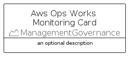
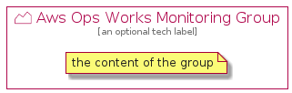

# AwsOpsWorksMonitoring


```text
aws-q1-2022/Resource/ManagementGovernance/AwsOpsWorksMonitoring
```

```text
include('aws-q1-2022/Resource/ManagementGovernance/AwsOpsWorksMonitoring')
```


| Illustration | AwsOpsWorksMonitoring | AwsOpsWorksMonitoringCard | AwsOpsWorksMonitoringGroup |
| :---: | :---: | :---: | :---: |
|  |  |  |  |


## AwsOpsWorksMonitoring

### Load remotely
```plantuml
@startuml
' configures the library
!global $LIB_BASE_LOCATION="https://raw.githubusercontent.com/tmorin/plantuml-libs/master/distribution"

' loads the library's bootstrap
!include $LIB_BASE_LOCATION/bootstrap.puml

' loads the package bootstrap
include('aws-q1-2022/bootstrap')

' loads the Item which embeds the element AwsOpsWorksMonitoring
include('aws-q1-2022/Resource/ManagementGovernance/AwsOpsWorksMonitoring')

' renders the element
AwsOpsWorksMonitoring('AwsOpsWorksMonitoring', 'Aws Ops Works Monitoring', 'an optional tech label', 'an optional description')
@enduml
```

### Load locally
```plantuml
@startuml
' configures the library
!global $INCLUSION_MODE="local"
!global $LIB_BASE_LOCATION="../../.."

' loads the library's bootstrap
!include $LIB_BASE_LOCATION/bootstrap.puml

' loads the package bootstrap
include('aws-q1-2022/bootstrap')

' loads the Item which embeds the element AwsOpsWorksMonitoring
include('aws-q1-2022/Resource/ManagementGovernance/AwsOpsWorksMonitoring')

' renders the element
AwsOpsWorksMonitoring('AwsOpsWorksMonitoring', 'Aws Ops Works Monitoring', 'an optional tech label', 'an optional description')
@enduml
```

## AwsOpsWorksMonitoringCard

### Load remotely
```plantuml
@startuml
' configures the library
!global $LIB_BASE_LOCATION="https://raw.githubusercontent.com/tmorin/plantuml-libs/master/distribution"

' loads the library's bootstrap
!include $LIB_BASE_LOCATION/bootstrap.puml

' loads the package bootstrap
include('aws-q1-2022/bootstrap')

' loads the Item which embeds the element AwsOpsWorksMonitoringCard
include('aws-q1-2022/Resource/ManagementGovernance/AwsOpsWorksMonitoring')

' renders the element
AwsOpsWorksMonitoringCard('AwsOpsWorksMonitoringCard', 'Aws Ops Works Monitoring Card', 'an optional description')
@enduml
```

### Load locally
```plantuml
@startuml
' configures the library
!global $INCLUSION_MODE="local"
!global $LIB_BASE_LOCATION="../../.."

' loads the library's bootstrap
!include $LIB_BASE_LOCATION/bootstrap.puml

' loads the package bootstrap
include('aws-q1-2022/bootstrap')

' loads the Item which embeds the element AwsOpsWorksMonitoringCard
include('aws-q1-2022/Resource/ManagementGovernance/AwsOpsWorksMonitoring')

' renders the element
AwsOpsWorksMonitoringCard('AwsOpsWorksMonitoringCard', 'Aws Ops Works Monitoring Card', 'an optional description')
@enduml
```

## AwsOpsWorksMonitoringGroup

### Load remotely
```plantuml
@startuml
' configures the library
!global $LIB_BASE_LOCATION="https://raw.githubusercontent.com/tmorin/plantuml-libs/master/distribution"

' loads the library's bootstrap
!include $LIB_BASE_LOCATION/bootstrap.puml

' loads the package bootstrap
include('aws-q1-2022/bootstrap')

' loads the Item which embeds the element AwsOpsWorksMonitoringGroup
include('aws-q1-2022/Resource/ManagementGovernance/AwsOpsWorksMonitoring')

' renders the element
AwsOpsWorksMonitoringGroup('AwsOpsWorksMonitoringGroup', 'Aws Ops Works Monitoring Group', 'an optional tech label') {
    note as note
        the content of the group
    end note
}
@enduml
```

### Load locally
```plantuml
@startuml
' configures the library
!global $INCLUSION_MODE="local"
!global $LIB_BASE_LOCATION="../../.."

' loads the library's bootstrap
!include $LIB_BASE_LOCATION/bootstrap.puml

' loads the package bootstrap
include('aws-q1-2022/bootstrap')

' loads the Item which embeds the element AwsOpsWorksMonitoringGroup
include('aws-q1-2022/Resource/ManagementGovernance/AwsOpsWorksMonitoring')

' renders the element
AwsOpsWorksMonitoringGroup('AwsOpsWorksMonitoringGroup', 'Aws Ops Works Monitoring Group', 'an optional tech label') {
    note as note
        the content of the group
    end note
}
@enduml
```

