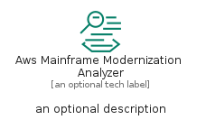
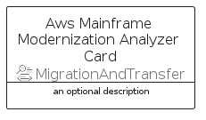
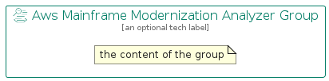

# AwsMainframeModernizationAnalyzer


```text
aws-q1-2022/Resource/MigrationAndTransfer/AwsMainframeModernizationAnalyzer
```

```text
include('aws-q1-2022/Resource/MigrationAndTransfer/AwsMainframeModernizationAnalyzer')
```


| Illustration | AwsMainframeModernizationAnalyzer | AwsMainframeModernizationAnalyzerCard | AwsMainframeModernizationAnalyzerGroup |
| :---: | :---: | :---: | :---: |
|  |  |  |  |


## AwsMainframeModernizationAnalyzer

### Load remotely
```plantuml
@startuml
' configures the library
!global $LIB_BASE_LOCATION="https://raw.githubusercontent.com/tmorin/plantuml-libs/master/distribution"

' loads the library's bootstrap
!include $LIB_BASE_LOCATION/bootstrap.puml

' loads the package bootstrap
include('aws-q1-2022/bootstrap')

' loads the Item which embeds the element AwsMainframeModernizationAnalyzer
include('aws-q1-2022/Resource/MigrationAndTransfer/AwsMainframeModernizationAnalyzer')

' renders the element
AwsMainframeModernizationAnalyzer('AwsMainframeModernizationAnalyzer', 'Aws Mainframe Modernization Analyzer', 'an optional tech label', 'an optional description')
@enduml
```

### Load locally
```plantuml
@startuml
' configures the library
!global $INCLUSION_MODE="local"
!global $LIB_BASE_LOCATION="../../.."

' loads the library's bootstrap
!include $LIB_BASE_LOCATION/bootstrap.puml

' loads the package bootstrap
include('aws-q1-2022/bootstrap')

' loads the Item which embeds the element AwsMainframeModernizationAnalyzer
include('aws-q1-2022/Resource/MigrationAndTransfer/AwsMainframeModernizationAnalyzer')

' renders the element
AwsMainframeModernizationAnalyzer('AwsMainframeModernizationAnalyzer', 'Aws Mainframe Modernization Analyzer', 'an optional tech label', 'an optional description')
@enduml
```

## AwsMainframeModernizationAnalyzerCard

### Load remotely
```plantuml
@startuml
' configures the library
!global $LIB_BASE_LOCATION="https://raw.githubusercontent.com/tmorin/plantuml-libs/master/distribution"

' loads the library's bootstrap
!include $LIB_BASE_LOCATION/bootstrap.puml

' loads the package bootstrap
include('aws-q1-2022/bootstrap')

' loads the Item which embeds the element AwsMainframeModernizationAnalyzerCard
include('aws-q1-2022/Resource/MigrationAndTransfer/AwsMainframeModernizationAnalyzer')

' renders the element
AwsMainframeModernizationAnalyzerCard('AwsMainframeModernizationAnalyzerCard', 'Aws Mainframe Modernization Analyzer Card', 'an optional description')
@enduml
```

### Load locally
```plantuml
@startuml
' configures the library
!global $INCLUSION_MODE="local"
!global $LIB_BASE_LOCATION="../../.."

' loads the library's bootstrap
!include $LIB_BASE_LOCATION/bootstrap.puml

' loads the package bootstrap
include('aws-q1-2022/bootstrap')

' loads the Item which embeds the element AwsMainframeModernizationAnalyzerCard
include('aws-q1-2022/Resource/MigrationAndTransfer/AwsMainframeModernizationAnalyzer')

' renders the element
AwsMainframeModernizationAnalyzerCard('AwsMainframeModernizationAnalyzerCard', 'Aws Mainframe Modernization Analyzer Card', 'an optional description')
@enduml
```

## AwsMainframeModernizationAnalyzerGroup

### Load remotely
```plantuml
@startuml
' configures the library
!global $LIB_BASE_LOCATION="https://raw.githubusercontent.com/tmorin/plantuml-libs/master/distribution"

' loads the library's bootstrap
!include $LIB_BASE_LOCATION/bootstrap.puml

' loads the package bootstrap
include('aws-q1-2022/bootstrap')

' loads the Item which embeds the element AwsMainframeModernizationAnalyzerGroup
include('aws-q1-2022/Resource/MigrationAndTransfer/AwsMainframeModernizationAnalyzer')

' renders the element
AwsMainframeModernizationAnalyzerGroup('AwsMainframeModernizationAnalyzerGroup', 'Aws Mainframe Modernization Analyzer Group', 'an optional tech label') {
    note as note
        the content of the group
    end note
}
@enduml
```

### Load locally
```plantuml
@startuml
' configures the library
!global $INCLUSION_MODE="local"
!global $LIB_BASE_LOCATION="../../.."

' loads the library's bootstrap
!include $LIB_BASE_LOCATION/bootstrap.puml

' loads the package bootstrap
include('aws-q1-2022/bootstrap')

' loads the Item which embeds the element AwsMainframeModernizationAnalyzerGroup
include('aws-q1-2022/Resource/MigrationAndTransfer/AwsMainframeModernizationAnalyzer')

' renders the element
AwsMainframeModernizationAnalyzerGroup('AwsMainframeModernizationAnalyzerGroup', 'Aws Mainframe Modernization Analyzer Group', 'an optional tech label') {
    note as note
        the content of the group
    end note
}
@enduml
```

