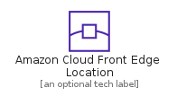
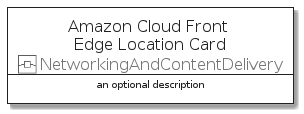

# AmazonCloudFrontEdgeLocation


```text
aws-q1-2022/Resource/NetworkingAndContentDelivery/AmazonCloudFrontEdgeLocation
```

```text
include('aws-q1-2022/Resource/NetworkingAndContentDelivery/AmazonCloudFrontEdgeLocation')
```


| Illustration | AmazonCloudFrontEdgeLocation | AmazonCloudFrontEdgeLocationCard | AmazonCloudFrontEdgeLocationGroup |
| :---: | :---: | :---: | :---: |
|  |  |  |  |


## AmazonCloudFrontEdgeLocation

### Load remotely
```plantuml
@startuml
' configures the library
!global $LIB_BASE_LOCATION="https://raw.githubusercontent.com/tmorin/plantuml-libs/master/distribution"

' loads the library's bootstrap
!include $LIB_BASE_LOCATION/bootstrap.puml

' loads the package bootstrap
include('aws-q1-2022/bootstrap')

' loads the Item which embeds the element AmazonCloudFrontEdgeLocation
include('aws-q1-2022/Resource/NetworkingAndContentDelivery/AmazonCloudFrontEdgeLocation')

' renders the element
AmazonCloudFrontEdgeLocation('AmazonCloudFrontEdgeLocation', 'Amazon Cloud Front Edge Location', 'an optional tech label', 'an optional description')
@enduml
```

### Load locally
```plantuml
@startuml
' configures the library
!global $INCLUSION_MODE="local"
!global $LIB_BASE_LOCATION="../../.."

' loads the library's bootstrap
!include $LIB_BASE_LOCATION/bootstrap.puml

' loads the package bootstrap
include('aws-q1-2022/bootstrap')

' loads the Item which embeds the element AmazonCloudFrontEdgeLocation
include('aws-q1-2022/Resource/NetworkingAndContentDelivery/AmazonCloudFrontEdgeLocation')

' renders the element
AmazonCloudFrontEdgeLocation('AmazonCloudFrontEdgeLocation', 'Amazon Cloud Front Edge Location', 'an optional tech label', 'an optional description')
@enduml
```

## AmazonCloudFrontEdgeLocationCard

### Load remotely
```plantuml
@startuml
' configures the library
!global $LIB_BASE_LOCATION="https://raw.githubusercontent.com/tmorin/plantuml-libs/master/distribution"

' loads the library's bootstrap
!include $LIB_BASE_LOCATION/bootstrap.puml

' loads the package bootstrap
include('aws-q1-2022/bootstrap')

' loads the Item which embeds the element AmazonCloudFrontEdgeLocationCard
include('aws-q1-2022/Resource/NetworkingAndContentDelivery/AmazonCloudFrontEdgeLocation')

' renders the element
AmazonCloudFrontEdgeLocationCard('AmazonCloudFrontEdgeLocationCard', 'Amazon Cloud Front Edge Location Card', 'an optional description')
@enduml
```

### Load locally
```plantuml
@startuml
' configures the library
!global $INCLUSION_MODE="local"
!global $LIB_BASE_LOCATION="../../.."

' loads the library's bootstrap
!include $LIB_BASE_LOCATION/bootstrap.puml

' loads the package bootstrap
include('aws-q1-2022/bootstrap')

' loads the Item which embeds the element AmazonCloudFrontEdgeLocationCard
include('aws-q1-2022/Resource/NetworkingAndContentDelivery/AmazonCloudFrontEdgeLocation')

' renders the element
AmazonCloudFrontEdgeLocationCard('AmazonCloudFrontEdgeLocationCard', 'Amazon Cloud Front Edge Location Card', 'an optional description')
@enduml
```

## AmazonCloudFrontEdgeLocationGroup

### Load remotely
```plantuml
@startuml
' configures the library
!global $LIB_BASE_LOCATION="https://raw.githubusercontent.com/tmorin/plantuml-libs/master/distribution"

' loads the library's bootstrap
!include $LIB_BASE_LOCATION/bootstrap.puml

' loads the package bootstrap
include('aws-q1-2022/bootstrap')

' loads the Item which embeds the element AmazonCloudFrontEdgeLocationGroup
include('aws-q1-2022/Resource/NetworkingAndContentDelivery/AmazonCloudFrontEdgeLocation')

' renders the element
AmazonCloudFrontEdgeLocationGroup('AmazonCloudFrontEdgeLocationGroup', 'Amazon Cloud Front Edge Location Group', 'an optional tech label') {
    note as note
        the content of the group
    end note
}
@enduml
```

### Load locally
```plantuml
@startuml
' configures the library
!global $INCLUSION_MODE="local"
!global $LIB_BASE_LOCATION="../../.."

' loads the library's bootstrap
!include $LIB_BASE_LOCATION/bootstrap.puml

' loads the package bootstrap
include('aws-q1-2022/bootstrap')

' loads the Item which embeds the element AmazonCloudFrontEdgeLocationGroup
include('aws-q1-2022/Resource/NetworkingAndContentDelivery/AmazonCloudFrontEdgeLocation')

' renders the element
AmazonCloudFrontEdgeLocationGroup('AmazonCloudFrontEdgeLocationGroup', 'Amazon Cloud Front Edge Location Group', 'an optional tech label') {
    note as note
        the content of the group
    end note
}
@enduml
```

