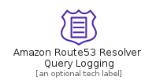
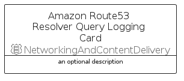

# AmazonRoute53ResolverQueryLogging


```text
aws-q1-2022/Resource/NetworkingAndContentDelivery/AmazonRoute53ResolverQueryLogging
```

```text
include('aws-q1-2022/Resource/NetworkingAndContentDelivery/AmazonRoute53ResolverQueryLogging')
```


| Illustration | AmazonRoute53ResolverQueryLogging | AmazonRoute53ResolverQueryLoggingCard | AmazonRoute53ResolverQueryLoggingGroup |
| :---: | :---: | :---: | :---: |
|  |  |  |  |


## AmazonRoute53ResolverQueryLogging

### Load remotely
```plantuml
@startuml
' configures the library
!global $LIB_BASE_LOCATION="https://raw.githubusercontent.com/tmorin/plantuml-libs/master/distribution"

' loads the library's bootstrap
!include $LIB_BASE_LOCATION/bootstrap.puml

' loads the package bootstrap
include('aws-q1-2022/bootstrap')

' loads the Item which embeds the element AmazonRoute53ResolverQueryLogging
include('aws-q1-2022/Resource/NetworkingAndContentDelivery/AmazonRoute53ResolverQueryLogging')

' renders the element
AmazonRoute53ResolverQueryLogging('AmazonRoute53ResolverQueryLogging', 'Amazon Route53 Resolver Query Logging', 'an optional tech label', 'an optional description')
@enduml
```

### Load locally
```plantuml
@startuml
' configures the library
!global $INCLUSION_MODE="local"
!global $LIB_BASE_LOCATION="../../.."

' loads the library's bootstrap
!include $LIB_BASE_LOCATION/bootstrap.puml

' loads the package bootstrap
include('aws-q1-2022/bootstrap')

' loads the Item which embeds the element AmazonRoute53ResolverQueryLogging
include('aws-q1-2022/Resource/NetworkingAndContentDelivery/AmazonRoute53ResolverQueryLogging')

' renders the element
AmazonRoute53ResolverQueryLogging('AmazonRoute53ResolverQueryLogging', 'Amazon Route53 Resolver Query Logging', 'an optional tech label', 'an optional description')
@enduml
```

## AmazonRoute53ResolverQueryLoggingCard

### Load remotely
```plantuml
@startuml
' configures the library
!global $LIB_BASE_LOCATION="https://raw.githubusercontent.com/tmorin/plantuml-libs/master/distribution"

' loads the library's bootstrap
!include $LIB_BASE_LOCATION/bootstrap.puml

' loads the package bootstrap
include('aws-q1-2022/bootstrap')

' loads the Item which embeds the element AmazonRoute53ResolverQueryLoggingCard
include('aws-q1-2022/Resource/NetworkingAndContentDelivery/AmazonRoute53ResolverQueryLogging')

' renders the element
AmazonRoute53ResolverQueryLoggingCard('AmazonRoute53ResolverQueryLoggingCard', 'Amazon Route53 Resolver Query Logging Card', 'an optional description')
@enduml
```

### Load locally
```plantuml
@startuml
' configures the library
!global $INCLUSION_MODE="local"
!global $LIB_BASE_LOCATION="../../.."

' loads the library's bootstrap
!include $LIB_BASE_LOCATION/bootstrap.puml

' loads the package bootstrap
include('aws-q1-2022/bootstrap')

' loads the Item which embeds the element AmazonRoute53ResolverQueryLoggingCard
include('aws-q1-2022/Resource/NetworkingAndContentDelivery/AmazonRoute53ResolverQueryLogging')

' renders the element
AmazonRoute53ResolverQueryLoggingCard('AmazonRoute53ResolverQueryLoggingCard', 'Amazon Route53 Resolver Query Logging Card', 'an optional description')
@enduml
```

## AmazonRoute53ResolverQueryLoggingGroup

### Load remotely
```plantuml
@startuml
' configures the library
!global $LIB_BASE_LOCATION="https://raw.githubusercontent.com/tmorin/plantuml-libs/master/distribution"

' loads the library's bootstrap
!include $LIB_BASE_LOCATION/bootstrap.puml

' loads the package bootstrap
include('aws-q1-2022/bootstrap')

' loads the Item which embeds the element AmazonRoute53ResolverQueryLoggingGroup
include('aws-q1-2022/Resource/NetworkingAndContentDelivery/AmazonRoute53ResolverQueryLogging')

' renders the element
AmazonRoute53ResolverQueryLoggingGroup('AmazonRoute53ResolverQueryLoggingGroup', 'Amazon Route53 Resolver Query Logging Group', 'an optional tech label') {
    note as note
        the content of the group
    end note
}
@enduml
```

### Load locally
```plantuml
@startuml
' configures the library
!global $INCLUSION_MODE="local"
!global $LIB_BASE_LOCATION="../../.."

' loads the library's bootstrap
!include $LIB_BASE_LOCATION/bootstrap.puml

' loads the package bootstrap
include('aws-q1-2022/bootstrap')

' loads the Item which embeds the element AmazonRoute53ResolverQueryLoggingGroup
include('aws-q1-2022/Resource/NetworkingAndContentDelivery/AmazonRoute53ResolverQueryLogging')

' renders the element
AmazonRoute53ResolverQueryLoggingGroup('AmazonRoute53ResolverQueryLoggingGroup', 'Amazon Route53 Resolver Query Logging Group', 'an optional tech label') {
    note as note
        the content of the group
    end note
}
@enduml
```

