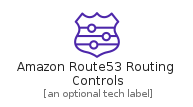
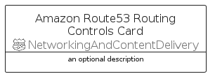

# AmazonRoute53RoutingControls


```text
aws-q1-2022/Resource/NetworkingAndContentDelivery/AmazonRoute53RoutingControls
```

```text
include('aws-q1-2022/Resource/NetworkingAndContentDelivery/AmazonRoute53RoutingControls')
```


| Illustration | AmazonRoute53RoutingControls | AmazonRoute53RoutingControlsCard | AmazonRoute53RoutingControlsGroup |
| :---: | :---: | :---: | :---: |
|  |  |  |  |


## AmazonRoute53RoutingControls

### Load remotely
```plantuml
@startuml
' configures the library
!global $LIB_BASE_LOCATION="https://raw.githubusercontent.com/tmorin/plantuml-libs/master/distribution"

' loads the library's bootstrap
!include $LIB_BASE_LOCATION/bootstrap.puml

' loads the package bootstrap
include('aws-q1-2022/bootstrap')

' loads the Item which embeds the element AmazonRoute53RoutingControls
include('aws-q1-2022/Resource/NetworkingAndContentDelivery/AmazonRoute53RoutingControls')

' renders the element
AmazonRoute53RoutingControls('AmazonRoute53RoutingControls', 'Amazon Route53 Routing Controls', 'an optional tech label', 'an optional description')
@enduml
```

### Load locally
```plantuml
@startuml
' configures the library
!global $INCLUSION_MODE="local"
!global $LIB_BASE_LOCATION="../../.."

' loads the library's bootstrap
!include $LIB_BASE_LOCATION/bootstrap.puml

' loads the package bootstrap
include('aws-q1-2022/bootstrap')

' loads the Item which embeds the element AmazonRoute53RoutingControls
include('aws-q1-2022/Resource/NetworkingAndContentDelivery/AmazonRoute53RoutingControls')

' renders the element
AmazonRoute53RoutingControls('AmazonRoute53RoutingControls', 'Amazon Route53 Routing Controls', 'an optional tech label', 'an optional description')
@enduml
```

## AmazonRoute53RoutingControlsCard

### Load remotely
```plantuml
@startuml
' configures the library
!global $LIB_BASE_LOCATION="https://raw.githubusercontent.com/tmorin/plantuml-libs/master/distribution"

' loads the library's bootstrap
!include $LIB_BASE_LOCATION/bootstrap.puml

' loads the package bootstrap
include('aws-q1-2022/bootstrap')

' loads the Item which embeds the element AmazonRoute53RoutingControlsCard
include('aws-q1-2022/Resource/NetworkingAndContentDelivery/AmazonRoute53RoutingControls')

' renders the element
AmazonRoute53RoutingControlsCard('AmazonRoute53RoutingControlsCard', 'Amazon Route53 Routing Controls Card', 'an optional description')
@enduml
```

### Load locally
```plantuml
@startuml
' configures the library
!global $INCLUSION_MODE="local"
!global $LIB_BASE_LOCATION="../../.."

' loads the library's bootstrap
!include $LIB_BASE_LOCATION/bootstrap.puml

' loads the package bootstrap
include('aws-q1-2022/bootstrap')

' loads the Item which embeds the element AmazonRoute53RoutingControlsCard
include('aws-q1-2022/Resource/NetworkingAndContentDelivery/AmazonRoute53RoutingControls')

' renders the element
AmazonRoute53RoutingControlsCard('AmazonRoute53RoutingControlsCard', 'Amazon Route53 Routing Controls Card', 'an optional description')
@enduml
```

## AmazonRoute53RoutingControlsGroup

### Load remotely
```plantuml
@startuml
' configures the library
!global $LIB_BASE_LOCATION="https://raw.githubusercontent.com/tmorin/plantuml-libs/master/distribution"

' loads the library's bootstrap
!include $LIB_BASE_LOCATION/bootstrap.puml

' loads the package bootstrap
include('aws-q1-2022/bootstrap')

' loads the Item which embeds the element AmazonRoute53RoutingControlsGroup
include('aws-q1-2022/Resource/NetworkingAndContentDelivery/AmazonRoute53RoutingControls')

' renders the element
AmazonRoute53RoutingControlsGroup('AmazonRoute53RoutingControlsGroup', 'Amazon Route53 Routing Controls Group', 'an optional tech label') {
    note as note
        the content of the group
    end note
}
@enduml
```

### Load locally
```plantuml
@startuml
' configures the library
!global $INCLUSION_MODE="local"
!global $LIB_BASE_LOCATION="../../.."

' loads the library's bootstrap
!include $LIB_BASE_LOCATION/bootstrap.puml

' loads the package bootstrap
include('aws-q1-2022/bootstrap')

' loads the Item which embeds the element AmazonRoute53RoutingControlsGroup
include('aws-q1-2022/Resource/NetworkingAndContentDelivery/AmazonRoute53RoutingControls')

' renders the element
AmazonRoute53RoutingControlsGroup('AmazonRoute53RoutingControlsGroup', 'Amazon Route53 Routing Controls Group', 'an optional tech label') {
    note as note
        the content of the group
    end note
}
@enduml
```

