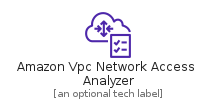
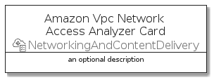

# AmazonVpcNetworkAccessAnalyzer


```text
aws-q1-2022/Resource/NetworkingAndContentDelivery/AmazonVpcNetworkAccessAnalyzer
```

```text
include('aws-q1-2022/Resource/NetworkingAndContentDelivery/AmazonVpcNetworkAccessAnalyzer')
```


| Illustration | AmazonVpcNetworkAccessAnalyzer | AmazonVpcNetworkAccessAnalyzerCard | AmazonVpcNetworkAccessAnalyzerGroup |
| :---: | :---: | :---: | :---: |
|  |  |  |  |


## AmazonVpcNetworkAccessAnalyzer

### Load remotely
```plantuml
@startuml
' configures the library
!global $LIB_BASE_LOCATION="https://raw.githubusercontent.com/tmorin/plantuml-libs/master/distribution"

' loads the library's bootstrap
!include $LIB_BASE_LOCATION/bootstrap.puml

' loads the package bootstrap
include('aws-q1-2022/bootstrap')

' loads the Item which embeds the element AmazonVpcNetworkAccessAnalyzer
include('aws-q1-2022/Resource/NetworkingAndContentDelivery/AmazonVpcNetworkAccessAnalyzer')

' renders the element
AmazonVpcNetworkAccessAnalyzer('AmazonVpcNetworkAccessAnalyzer', 'Amazon Vpc Network Access Analyzer', 'an optional tech label')
@enduml
```

### Load locally
```plantuml
@startuml
' configures the library
!global $INCLUSION_MODE="local"
!global $LIB_BASE_LOCATION="../../.."

' loads the library's bootstrap
!include $LIB_BASE_LOCATION/bootstrap.puml

' loads the package bootstrap
include('aws-q1-2022/bootstrap')

' loads the Item which embeds the element AmazonVpcNetworkAccessAnalyzer
include('aws-q1-2022/Resource/NetworkingAndContentDelivery/AmazonVpcNetworkAccessAnalyzer')

' renders the element
AmazonVpcNetworkAccessAnalyzer('AmazonVpcNetworkAccessAnalyzer', 'Amazon Vpc Network Access Analyzer', 'an optional tech label')
@enduml
```

## AmazonVpcNetworkAccessAnalyzerCard

### Load remotely
```plantuml
@startuml
' configures the library
!global $LIB_BASE_LOCATION="https://raw.githubusercontent.com/tmorin/plantuml-libs/master/distribution"

' loads the library's bootstrap
!include $LIB_BASE_LOCATION/bootstrap.puml

' loads the package bootstrap
include('aws-q1-2022/bootstrap')

' loads the Item which embeds the element AmazonVpcNetworkAccessAnalyzerCard
include('aws-q1-2022/Resource/NetworkingAndContentDelivery/AmazonVpcNetworkAccessAnalyzer')

' renders the element
AmazonVpcNetworkAccessAnalyzerCard('AmazonVpcNetworkAccessAnalyzerCard', 'Amazon Vpc Network Access Analyzer Card', 'an optional description')
@enduml
```

### Load locally
```plantuml
@startuml
' configures the library
!global $INCLUSION_MODE="local"
!global $LIB_BASE_LOCATION="../../.."

' loads the library's bootstrap
!include $LIB_BASE_LOCATION/bootstrap.puml

' loads the package bootstrap
include('aws-q1-2022/bootstrap')

' loads the Item which embeds the element AmazonVpcNetworkAccessAnalyzerCard
include('aws-q1-2022/Resource/NetworkingAndContentDelivery/AmazonVpcNetworkAccessAnalyzer')

' renders the element
AmazonVpcNetworkAccessAnalyzerCard('AmazonVpcNetworkAccessAnalyzerCard', 'Amazon Vpc Network Access Analyzer Card', 'an optional description')
@enduml
```

## AmazonVpcNetworkAccessAnalyzerGroup

### Load remotely
```plantuml
@startuml
' configures the library
!global $LIB_BASE_LOCATION="https://raw.githubusercontent.com/tmorin/plantuml-libs/master/distribution"

' loads the library's bootstrap
!include $LIB_BASE_LOCATION/bootstrap.puml

' loads the package bootstrap
include('aws-q1-2022/bootstrap')

' loads the Item which embeds the element AmazonVpcNetworkAccessAnalyzerGroup
include('aws-q1-2022/Resource/NetworkingAndContentDelivery/AmazonVpcNetworkAccessAnalyzer')

' renders the element
AmazonVpcNetworkAccessAnalyzerGroup('AmazonVpcNetworkAccessAnalyzerGroup', 'Amazon Vpc Network Access Analyzer Group', 'an optional tech label') {
    note as note
        the content of the group
    end note
}
@enduml
```

### Load locally
```plantuml
@startuml
' configures the library
!global $INCLUSION_MODE="local"
!global $LIB_BASE_LOCATION="../../.."

' loads the library's bootstrap
!include $LIB_BASE_LOCATION/bootstrap.puml

' loads the package bootstrap
include('aws-q1-2022/bootstrap')

' loads the Item which embeds the element AmazonVpcNetworkAccessAnalyzerGroup
include('aws-q1-2022/Resource/NetworkingAndContentDelivery/AmazonVpcNetworkAccessAnalyzer')

' renders the element
AmazonVpcNetworkAccessAnalyzerGroup('AmazonVpcNetworkAccessAnalyzerGroup', 'Amazon Vpc Network Access Analyzer Group', 'an optional tech label') {
    note as note
        the content of the group
    end note
}
@enduml
```

