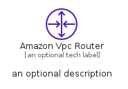
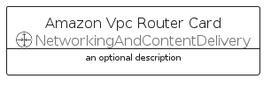
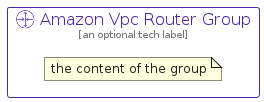

# AmazonVpcRouter


```text
aws-q1-2022/Resource/NetworkingAndContentDelivery/AmazonVpcRouter
```

```text
include('aws-q1-2022/Resource/NetworkingAndContentDelivery/AmazonVpcRouter')
```


| Illustration | AmazonVpcRouter | AmazonVpcRouterCard | AmazonVpcRouterGroup |
| :---: | :---: | :---: | :---: |
|  |  |  |  |


## AmazonVpcRouter

### Load remotely
```plantuml
@startuml
' configures the library
!global $LIB_BASE_LOCATION="https://raw.githubusercontent.com/tmorin/plantuml-libs/master/distribution"

' loads the library's bootstrap
!include $LIB_BASE_LOCATION/bootstrap.puml

' loads the package bootstrap
include('aws-q1-2022/bootstrap')

' loads the Item which embeds the element AmazonVpcRouter
include('aws-q1-2022/Resource/NetworkingAndContentDelivery/AmazonVpcRouter')

' renders the element
AmazonVpcRouter('AmazonVpcRouter', 'Amazon Vpc Router', 'an optional tech label', 'an optional description')
@enduml
```

### Load locally
```plantuml
@startuml
' configures the library
!global $INCLUSION_MODE="local"
!global $LIB_BASE_LOCATION="../../.."

' loads the library's bootstrap
!include $LIB_BASE_LOCATION/bootstrap.puml

' loads the package bootstrap
include('aws-q1-2022/bootstrap')

' loads the Item which embeds the element AmazonVpcRouter
include('aws-q1-2022/Resource/NetworkingAndContentDelivery/AmazonVpcRouter')

' renders the element
AmazonVpcRouter('AmazonVpcRouter', 'Amazon Vpc Router', 'an optional tech label', 'an optional description')
@enduml
```

## AmazonVpcRouterCard

### Load remotely
```plantuml
@startuml
' configures the library
!global $LIB_BASE_LOCATION="https://raw.githubusercontent.com/tmorin/plantuml-libs/master/distribution"

' loads the library's bootstrap
!include $LIB_BASE_LOCATION/bootstrap.puml

' loads the package bootstrap
include('aws-q1-2022/bootstrap')

' loads the Item which embeds the element AmazonVpcRouterCard
include('aws-q1-2022/Resource/NetworkingAndContentDelivery/AmazonVpcRouter')

' renders the element
AmazonVpcRouterCard('AmazonVpcRouterCard', 'Amazon Vpc Router Card', 'an optional description')
@enduml
```

### Load locally
```plantuml
@startuml
' configures the library
!global $INCLUSION_MODE="local"
!global $LIB_BASE_LOCATION="../../.."

' loads the library's bootstrap
!include $LIB_BASE_LOCATION/bootstrap.puml

' loads the package bootstrap
include('aws-q1-2022/bootstrap')

' loads the Item which embeds the element AmazonVpcRouterCard
include('aws-q1-2022/Resource/NetworkingAndContentDelivery/AmazonVpcRouter')

' renders the element
AmazonVpcRouterCard('AmazonVpcRouterCard', 'Amazon Vpc Router Card', 'an optional description')
@enduml
```

## AmazonVpcRouterGroup

### Load remotely
```plantuml
@startuml
' configures the library
!global $LIB_BASE_LOCATION="https://raw.githubusercontent.com/tmorin/plantuml-libs/master/distribution"

' loads the library's bootstrap
!include $LIB_BASE_LOCATION/bootstrap.puml

' loads the package bootstrap
include('aws-q1-2022/bootstrap')

' loads the Item which embeds the element AmazonVpcRouterGroup
include('aws-q1-2022/Resource/NetworkingAndContentDelivery/AmazonVpcRouter')

' renders the element
AmazonVpcRouterGroup('AmazonVpcRouterGroup', 'Amazon Vpc Router Group', 'an optional tech label') {
    note as note
        the content of the group
    end note
}
@enduml
```

### Load locally
```plantuml
@startuml
' configures the library
!global $INCLUSION_MODE="local"
!global $LIB_BASE_LOCATION="../../.."

' loads the library's bootstrap
!include $LIB_BASE_LOCATION/bootstrap.puml

' loads the package bootstrap
include('aws-q1-2022/bootstrap')

' loads the Item which embeds the element AmazonVpcRouterGroup
include('aws-q1-2022/Resource/NetworkingAndContentDelivery/AmazonVpcRouter')

' renders the element
AmazonVpcRouterGroup('AmazonVpcRouterGroup', 'Amazon Vpc Router Group', 'an optional tech label') {
    note as note
        the content of the group
    end note
}
@enduml
```

