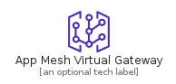
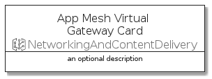
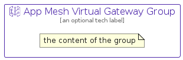

# AppMeshVirtualGateway


```text
aws-q1-2022/Resource/NetworkingAndContentDelivery/AppMeshVirtualGateway
```

```text
include('aws-q1-2022/Resource/NetworkingAndContentDelivery/AppMeshVirtualGateway')
```


| Illustration | AppMeshVirtualGateway | AppMeshVirtualGatewayCard | AppMeshVirtualGatewayGroup |
| :---: | :---: | :---: | :---: |
|  |  |  |  |


## AppMeshVirtualGateway

### Load remotely
```plantuml
@startuml
' configures the library
!global $LIB_BASE_LOCATION="https://raw.githubusercontent.com/tmorin/plantuml-libs/master/distribution"

' loads the library's bootstrap
!include $LIB_BASE_LOCATION/bootstrap.puml

' loads the package bootstrap
include('aws-q1-2022/bootstrap')

' loads the Item which embeds the element AppMeshVirtualGateway
include('aws-q1-2022/Resource/NetworkingAndContentDelivery/AppMeshVirtualGateway')

' renders the element
AppMeshVirtualGateway('AppMeshVirtualGateway', 'App Mesh Virtual Gateway', 'an optional tech label', 'an optional description')
@enduml
```

### Load locally
```plantuml
@startuml
' configures the library
!global $INCLUSION_MODE="local"
!global $LIB_BASE_LOCATION="../../.."

' loads the library's bootstrap
!include $LIB_BASE_LOCATION/bootstrap.puml

' loads the package bootstrap
include('aws-q1-2022/bootstrap')

' loads the Item which embeds the element AppMeshVirtualGateway
include('aws-q1-2022/Resource/NetworkingAndContentDelivery/AppMeshVirtualGateway')

' renders the element
AppMeshVirtualGateway('AppMeshVirtualGateway', 'App Mesh Virtual Gateway', 'an optional tech label', 'an optional description')
@enduml
```

## AppMeshVirtualGatewayCard

### Load remotely
```plantuml
@startuml
' configures the library
!global $LIB_BASE_LOCATION="https://raw.githubusercontent.com/tmorin/plantuml-libs/master/distribution"

' loads the library's bootstrap
!include $LIB_BASE_LOCATION/bootstrap.puml

' loads the package bootstrap
include('aws-q1-2022/bootstrap')

' loads the Item which embeds the element AppMeshVirtualGatewayCard
include('aws-q1-2022/Resource/NetworkingAndContentDelivery/AppMeshVirtualGateway')

' renders the element
AppMeshVirtualGatewayCard('AppMeshVirtualGatewayCard', 'App Mesh Virtual Gateway Card', 'an optional description')
@enduml
```

### Load locally
```plantuml
@startuml
' configures the library
!global $INCLUSION_MODE="local"
!global $LIB_BASE_LOCATION="../../.."

' loads the library's bootstrap
!include $LIB_BASE_LOCATION/bootstrap.puml

' loads the package bootstrap
include('aws-q1-2022/bootstrap')

' loads the Item which embeds the element AppMeshVirtualGatewayCard
include('aws-q1-2022/Resource/NetworkingAndContentDelivery/AppMeshVirtualGateway')

' renders the element
AppMeshVirtualGatewayCard('AppMeshVirtualGatewayCard', 'App Mesh Virtual Gateway Card', 'an optional description')
@enduml
```

## AppMeshVirtualGatewayGroup

### Load remotely
```plantuml
@startuml
' configures the library
!global $LIB_BASE_LOCATION="https://raw.githubusercontent.com/tmorin/plantuml-libs/master/distribution"

' loads the library's bootstrap
!include $LIB_BASE_LOCATION/bootstrap.puml

' loads the package bootstrap
include('aws-q1-2022/bootstrap')

' loads the Item which embeds the element AppMeshVirtualGatewayGroup
include('aws-q1-2022/Resource/NetworkingAndContentDelivery/AppMeshVirtualGateway')

' renders the element
AppMeshVirtualGatewayGroup('AppMeshVirtualGatewayGroup', 'App Mesh Virtual Gateway Group', 'an optional tech label') {
    note as note
        the content of the group
    end note
}
@enduml
```

### Load locally
```plantuml
@startuml
' configures the library
!global $INCLUSION_MODE="local"
!global $LIB_BASE_LOCATION="../../.."

' loads the library's bootstrap
!include $LIB_BASE_LOCATION/bootstrap.puml

' loads the package bootstrap
include('aws-q1-2022/bootstrap')

' loads the Item which embeds the element AppMeshVirtualGatewayGroup
include('aws-q1-2022/Resource/NetworkingAndContentDelivery/AppMeshVirtualGateway')

' renders the element
AppMeshVirtualGatewayGroup('AppMeshVirtualGatewayGroup', 'App Mesh Virtual Gateway Group', 'an optional tech label') {
    note as note
        the content of the group
    end note
}
@enduml
```

