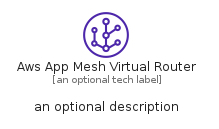
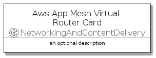
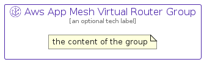

# AwsAppMeshVirtualRouter


```text
aws-q1-2022/Resource/NetworkingAndContentDelivery/AwsAppMeshVirtualRouter
```

```text
include('aws-q1-2022/Resource/NetworkingAndContentDelivery/AwsAppMeshVirtualRouter')
```


| Illustration | AwsAppMeshVirtualRouter | AwsAppMeshVirtualRouterCard | AwsAppMeshVirtualRouterGroup |
| :---: | :---: | :---: | :---: |
|  |  |  |  |


## AwsAppMeshVirtualRouter

### Load remotely
```plantuml
@startuml
' configures the library
!global $LIB_BASE_LOCATION="https://raw.githubusercontent.com/tmorin/plantuml-libs/master/distribution"

' loads the library's bootstrap
!include $LIB_BASE_LOCATION/bootstrap.puml

' loads the package bootstrap
include('aws-q1-2022/bootstrap')

' loads the Item which embeds the element AwsAppMeshVirtualRouter
include('aws-q1-2022/Resource/NetworkingAndContentDelivery/AwsAppMeshVirtualRouter')

' renders the element
AwsAppMeshVirtualRouter('AwsAppMeshVirtualRouter', 'Aws App Mesh Virtual Router', 'an optional tech label', 'an optional description')
@enduml
```

### Load locally
```plantuml
@startuml
' configures the library
!global $INCLUSION_MODE="local"
!global $LIB_BASE_LOCATION="../../.."

' loads the library's bootstrap
!include $LIB_BASE_LOCATION/bootstrap.puml

' loads the package bootstrap
include('aws-q1-2022/bootstrap')

' loads the Item which embeds the element AwsAppMeshVirtualRouter
include('aws-q1-2022/Resource/NetworkingAndContentDelivery/AwsAppMeshVirtualRouter')

' renders the element
AwsAppMeshVirtualRouter('AwsAppMeshVirtualRouter', 'Aws App Mesh Virtual Router', 'an optional tech label', 'an optional description')
@enduml
```

## AwsAppMeshVirtualRouterCard

### Load remotely
```plantuml
@startuml
' configures the library
!global $LIB_BASE_LOCATION="https://raw.githubusercontent.com/tmorin/plantuml-libs/master/distribution"

' loads the library's bootstrap
!include $LIB_BASE_LOCATION/bootstrap.puml

' loads the package bootstrap
include('aws-q1-2022/bootstrap')

' loads the Item which embeds the element AwsAppMeshVirtualRouterCard
include('aws-q1-2022/Resource/NetworkingAndContentDelivery/AwsAppMeshVirtualRouter')

' renders the element
AwsAppMeshVirtualRouterCard('AwsAppMeshVirtualRouterCard', 'Aws App Mesh Virtual Router Card', 'an optional description')
@enduml
```

### Load locally
```plantuml
@startuml
' configures the library
!global $INCLUSION_MODE="local"
!global $LIB_BASE_LOCATION="../../.."

' loads the library's bootstrap
!include $LIB_BASE_LOCATION/bootstrap.puml

' loads the package bootstrap
include('aws-q1-2022/bootstrap')

' loads the Item which embeds the element AwsAppMeshVirtualRouterCard
include('aws-q1-2022/Resource/NetworkingAndContentDelivery/AwsAppMeshVirtualRouter')

' renders the element
AwsAppMeshVirtualRouterCard('AwsAppMeshVirtualRouterCard', 'Aws App Mesh Virtual Router Card', 'an optional description')
@enduml
```

## AwsAppMeshVirtualRouterGroup

### Load remotely
```plantuml
@startuml
' configures the library
!global $LIB_BASE_LOCATION="https://raw.githubusercontent.com/tmorin/plantuml-libs/master/distribution"

' loads the library's bootstrap
!include $LIB_BASE_LOCATION/bootstrap.puml

' loads the package bootstrap
include('aws-q1-2022/bootstrap')

' loads the Item which embeds the element AwsAppMeshVirtualRouterGroup
include('aws-q1-2022/Resource/NetworkingAndContentDelivery/AwsAppMeshVirtualRouter')

' renders the element
AwsAppMeshVirtualRouterGroup('AwsAppMeshVirtualRouterGroup', 'Aws App Mesh Virtual Router Group', 'an optional tech label') {
    note as note
        the content of the group
    end note
}
@enduml
```

### Load locally
```plantuml
@startuml
' configures the library
!global $INCLUSION_MODE="local"
!global $LIB_BASE_LOCATION="../../.."

' loads the library's bootstrap
!include $LIB_BASE_LOCATION/bootstrap.puml

' loads the package bootstrap
include('aws-q1-2022/bootstrap')

' loads the Item which embeds the element AwsAppMeshVirtualRouterGroup
include('aws-q1-2022/Resource/NetworkingAndContentDelivery/AwsAppMeshVirtualRouter')

' renders the element
AwsAppMeshVirtualRouterGroup('AwsAppMeshVirtualRouterGroup', 'Aws App Mesh Virtual Router Group', 'an optional tech label') {
    note as note
        the content of the group
    end note
}
@enduml
```

