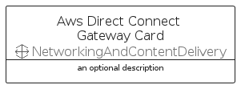

# AwsDirectConnectGateway


```text
aws-q1-2022/Resource/NetworkingAndContentDelivery/AwsDirectConnectGateway
```

```text
include('aws-q1-2022/Resource/NetworkingAndContentDelivery/AwsDirectConnectGateway')
```


| Illustration | AwsDirectConnectGateway | AwsDirectConnectGatewayCard | AwsDirectConnectGatewayGroup |
| :---: | :---: | :---: | :---: |
|  |  |  |  |


## AwsDirectConnectGateway

### Load remotely
```plantuml
@startuml
' configures the library
!global $LIB_BASE_LOCATION="https://raw.githubusercontent.com/tmorin/plantuml-libs/master/distribution"

' loads the library's bootstrap
!include $LIB_BASE_LOCATION/bootstrap.puml

' loads the package bootstrap
include('aws-q1-2022/bootstrap')

' loads the Item which embeds the element AwsDirectConnectGateway
include('aws-q1-2022/Resource/NetworkingAndContentDelivery/AwsDirectConnectGateway')

' renders the element
AwsDirectConnectGateway('AwsDirectConnectGateway', 'Aws Direct Connect Gateway', 'an optional tech label')
@enduml
```

### Load locally
```plantuml
@startuml
' configures the library
!global $INCLUSION_MODE="local"
!global $LIB_BASE_LOCATION="../../.."

' loads the library's bootstrap
!include $LIB_BASE_LOCATION/bootstrap.puml

' loads the package bootstrap
include('aws-q1-2022/bootstrap')

' loads the Item which embeds the element AwsDirectConnectGateway
include('aws-q1-2022/Resource/NetworkingAndContentDelivery/AwsDirectConnectGateway')

' renders the element
AwsDirectConnectGateway('AwsDirectConnectGateway', 'Aws Direct Connect Gateway', 'an optional tech label')
@enduml
```

## AwsDirectConnectGatewayCard

### Load remotely
```plantuml
@startuml
' configures the library
!global $LIB_BASE_LOCATION="https://raw.githubusercontent.com/tmorin/plantuml-libs/master/distribution"

' loads the library's bootstrap
!include $LIB_BASE_LOCATION/bootstrap.puml

' loads the package bootstrap
include('aws-q1-2022/bootstrap')

' loads the Item which embeds the element AwsDirectConnectGatewayCard
include('aws-q1-2022/Resource/NetworkingAndContentDelivery/AwsDirectConnectGateway')

' renders the element
AwsDirectConnectGatewayCard('AwsDirectConnectGatewayCard', 'Aws Direct Connect Gateway Card', 'an optional description')
@enduml
```

### Load locally
```plantuml
@startuml
' configures the library
!global $INCLUSION_MODE="local"
!global $LIB_BASE_LOCATION="../../.."

' loads the library's bootstrap
!include $LIB_BASE_LOCATION/bootstrap.puml

' loads the package bootstrap
include('aws-q1-2022/bootstrap')

' loads the Item which embeds the element AwsDirectConnectGatewayCard
include('aws-q1-2022/Resource/NetworkingAndContentDelivery/AwsDirectConnectGateway')

' renders the element
AwsDirectConnectGatewayCard('AwsDirectConnectGatewayCard', 'Aws Direct Connect Gateway Card', 'an optional description')
@enduml
```

## AwsDirectConnectGatewayGroup

### Load remotely
```plantuml
@startuml
' configures the library
!global $LIB_BASE_LOCATION="https://raw.githubusercontent.com/tmorin/plantuml-libs/master/distribution"

' loads the library's bootstrap
!include $LIB_BASE_LOCATION/bootstrap.puml

' loads the package bootstrap
include('aws-q1-2022/bootstrap')

' loads the Item which embeds the element AwsDirectConnectGatewayGroup
include('aws-q1-2022/Resource/NetworkingAndContentDelivery/AwsDirectConnectGateway')

' renders the element
AwsDirectConnectGatewayGroup('AwsDirectConnectGatewayGroup', 'Aws Direct Connect Gateway Group', 'an optional tech label') {
    note as note
        the content of the group
    end note
}
@enduml
```

### Load locally
```plantuml
@startuml
' configures the library
!global $INCLUSION_MODE="local"
!global $LIB_BASE_LOCATION="../../.."

' loads the library's bootstrap
!include $LIB_BASE_LOCATION/bootstrap.puml

' loads the package bootstrap
include('aws-q1-2022/bootstrap')

' loads the Item which embeds the element AwsDirectConnectGatewayGroup
include('aws-q1-2022/Resource/NetworkingAndContentDelivery/AwsDirectConnectGateway')

' renders the element
AwsDirectConnectGatewayGroup('AwsDirectConnectGatewayGroup', 'Aws Direct Connect Gateway Group', 'an optional tech label') {
    note as note
        the content of the group
    end note
}
@enduml
```

