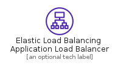
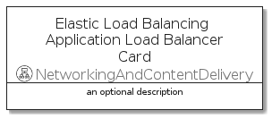

# ElasticLoadBalancingApplicationLoadBalancer


```text
aws-q1-2022/Resource/NetworkingAndContentDelivery/ElasticLoadBalancingApplicationLoadBalancer
```

```text
include('aws-q1-2022/Resource/NetworkingAndContentDelivery/ElasticLoadBalancingApplicationLoadBalancer')
```


| Illustration | ElasticLoadBalancingApplicationLoadBalancer | ElasticLoadBalancingApplicationLoadBalancerCard | ElasticLoadBalancingApplicationLoadBalancerGroup |
| :---: | :---: | :---: | :---: |
|  |  |  |  |


## ElasticLoadBalancingApplicationLoadBalancer

### Load remotely
```plantuml
@startuml
' configures the library
!global $LIB_BASE_LOCATION="https://raw.githubusercontent.com/tmorin/plantuml-libs/master/distribution"

' loads the library's bootstrap
!include $LIB_BASE_LOCATION/bootstrap.puml

' loads the package bootstrap
include('aws-q1-2022/bootstrap')

' loads the Item which embeds the element ElasticLoadBalancingApplicationLoadBalancer
include('aws-q1-2022/Resource/NetworkingAndContentDelivery/ElasticLoadBalancingApplicationLoadBalancer')

' renders the element
ElasticLoadBalancingApplicationLoadBalancer('ElasticLoadBalancingApplicationLoadBalancer', 'Elastic Load Balancing Application Load Balancer', 'an optional tech label', 'an optional description')
@enduml
```

### Load locally
```plantuml
@startuml
' configures the library
!global $INCLUSION_MODE="local"
!global $LIB_BASE_LOCATION="../../.."

' loads the library's bootstrap
!include $LIB_BASE_LOCATION/bootstrap.puml

' loads the package bootstrap
include('aws-q1-2022/bootstrap')

' loads the Item which embeds the element ElasticLoadBalancingApplicationLoadBalancer
include('aws-q1-2022/Resource/NetworkingAndContentDelivery/ElasticLoadBalancingApplicationLoadBalancer')

' renders the element
ElasticLoadBalancingApplicationLoadBalancer('ElasticLoadBalancingApplicationLoadBalancer', 'Elastic Load Balancing Application Load Balancer', 'an optional tech label', 'an optional description')
@enduml
```

## ElasticLoadBalancingApplicationLoadBalancerCard

### Load remotely
```plantuml
@startuml
' configures the library
!global $LIB_BASE_LOCATION="https://raw.githubusercontent.com/tmorin/plantuml-libs/master/distribution"

' loads the library's bootstrap
!include $LIB_BASE_LOCATION/bootstrap.puml

' loads the package bootstrap
include('aws-q1-2022/bootstrap')

' loads the Item which embeds the element ElasticLoadBalancingApplicationLoadBalancerCard
include('aws-q1-2022/Resource/NetworkingAndContentDelivery/ElasticLoadBalancingApplicationLoadBalancer')

' renders the element
ElasticLoadBalancingApplicationLoadBalancerCard('ElasticLoadBalancingApplicationLoadBalancerCard', 'Elastic Load Balancing Application Load Balancer Card', 'an optional description')
@enduml
```

### Load locally
```plantuml
@startuml
' configures the library
!global $INCLUSION_MODE="local"
!global $LIB_BASE_LOCATION="../../.."

' loads the library's bootstrap
!include $LIB_BASE_LOCATION/bootstrap.puml

' loads the package bootstrap
include('aws-q1-2022/bootstrap')

' loads the Item which embeds the element ElasticLoadBalancingApplicationLoadBalancerCard
include('aws-q1-2022/Resource/NetworkingAndContentDelivery/ElasticLoadBalancingApplicationLoadBalancer')

' renders the element
ElasticLoadBalancingApplicationLoadBalancerCard('ElasticLoadBalancingApplicationLoadBalancerCard', 'Elastic Load Balancing Application Load Balancer Card', 'an optional description')
@enduml
```

## ElasticLoadBalancingApplicationLoadBalancerGroup

### Load remotely
```plantuml
@startuml
' configures the library
!global $LIB_BASE_LOCATION="https://raw.githubusercontent.com/tmorin/plantuml-libs/master/distribution"

' loads the library's bootstrap
!include $LIB_BASE_LOCATION/bootstrap.puml

' loads the package bootstrap
include('aws-q1-2022/bootstrap')

' loads the Item which embeds the element ElasticLoadBalancingApplicationLoadBalancerGroup
include('aws-q1-2022/Resource/NetworkingAndContentDelivery/ElasticLoadBalancingApplicationLoadBalancer')

' renders the element
ElasticLoadBalancingApplicationLoadBalancerGroup('ElasticLoadBalancingApplicationLoadBalancerGroup', 'Elastic Load Balancing Application Load Balancer Group', 'an optional tech label') {
    note as note
        the content of the group
    end note
}
@enduml
```

### Load locally
```plantuml
@startuml
' configures the library
!global $INCLUSION_MODE="local"
!global $LIB_BASE_LOCATION="../../.."

' loads the library's bootstrap
!include $LIB_BASE_LOCATION/bootstrap.puml

' loads the package bootstrap
include('aws-q1-2022/bootstrap')

' loads the Item which embeds the element ElasticLoadBalancingApplicationLoadBalancerGroup
include('aws-q1-2022/Resource/NetworkingAndContentDelivery/ElasticLoadBalancingApplicationLoadBalancer')

' renders the element
ElasticLoadBalancingApplicationLoadBalancerGroup('ElasticLoadBalancingApplicationLoadBalancerGroup', 'Elastic Load Balancing Application Load Balancer Group', 'an optional tech label') {
    note as note
        the content of the group
    end note
}
@enduml
```

