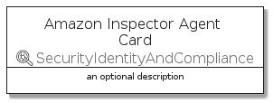
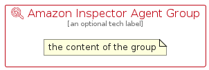

# AmazonInspectorAgent


```text
aws-q1-2022/Resource/SecurityIdentityAndCompliance/AmazonInspectorAgent
```

```text
include('aws-q1-2022/Resource/SecurityIdentityAndCompliance/AmazonInspectorAgent')
```


| Illustration | AmazonInspectorAgent | AmazonInspectorAgentCard | AmazonInspectorAgentGroup |
| :---: | :---: | :---: | :---: |
|  |  |  |  |


## AmazonInspectorAgent

### Load remotely
```plantuml
@startuml
' configures the library
!global $LIB_BASE_LOCATION="https://raw.githubusercontent.com/tmorin/plantuml-libs/master/distribution"

' loads the library's bootstrap
!include $LIB_BASE_LOCATION/bootstrap.puml

' loads the package bootstrap
include('aws-q1-2022/bootstrap')

' loads the Item which embeds the element AmazonInspectorAgent
include('aws-q1-2022/Resource/SecurityIdentityAndCompliance/AmazonInspectorAgent')

' renders the element
AmazonInspectorAgent('AmazonInspectorAgent', 'Amazon Inspector Agent', 'an optional tech label')
@enduml
```

### Load locally
```plantuml
@startuml
' configures the library
!global $INCLUSION_MODE="local"
!global $LIB_BASE_LOCATION="../../.."

' loads the library's bootstrap
!include $LIB_BASE_LOCATION/bootstrap.puml

' loads the package bootstrap
include('aws-q1-2022/bootstrap')

' loads the Item which embeds the element AmazonInspectorAgent
include('aws-q1-2022/Resource/SecurityIdentityAndCompliance/AmazonInspectorAgent')

' renders the element
AmazonInspectorAgent('AmazonInspectorAgent', 'Amazon Inspector Agent', 'an optional tech label')
@enduml
```

## AmazonInspectorAgentCard

### Load remotely
```plantuml
@startuml
' configures the library
!global $LIB_BASE_LOCATION="https://raw.githubusercontent.com/tmorin/plantuml-libs/master/distribution"

' loads the library's bootstrap
!include $LIB_BASE_LOCATION/bootstrap.puml

' loads the package bootstrap
include('aws-q1-2022/bootstrap')

' loads the Item which embeds the element AmazonInspectorAgentCard
include('aws-q1-2022/Resource/SecurityIdentityAndCompliance/AmazonInspectorAgent')

' renders the element
AmazonInspectorAgentCard('AmazonInspectorAgentCard', 'Amazon Inspector Agent Card', 'an optional description')
@enduml
```

### Load locally
```plantuml
@startuml
' configures the library
!global $INCLUSION_MODE="local"
!global $LIB_BASE_LOCATION="../../.."

' loads the library's bootstrap
!include $LIB_BASE_LOCATION/bootstrap.puml

' loads the package bootstrap
include('aws-q1-2022/bootstrap')

' loads the Item which embeds the element AmazonInspectorAgentCard
include('aws-q1-2022/Resource/SecurityIdentityAndCompliance/AmazonInspectorAgent')

' renders the element
AmazonInspectorAgentCard('AmazonInspectorAgentCard', 'Amazon Inspector Agent Card', 'an optional description')
@enduml
```

## AmazonInspectorAgentGroup

### Load remotely
```plantuml
@startuml
' configures the library
!global $LIB_BASE_LOCATION="https://raw.githubusercontent.com/tmorin/plantuml-libs/master/distribution"

' loads the library's bootstrap
!include $LIB_BASE_LOCATION/bootstrap.puml

' loads the package bootstrap
include('aws-q1-2022/bootstrap')

' loads the Item which embeds the element AmazonInspectorAgentGroup
include('aws-q1-2022/Resource/SecurityIdentityAndCompliance/AmazonInspectorAgent')

' renders the element
AmazonInspectorAgentGroup('AmazonInspectorAgentGroup', 'Amazon Inspector Agent Group', 'an optional tech label') {
    note as note
        the content of the group
    end note
}
@enduml
```

### Load locally
```plantuml
@startuml
' configures the library
!global $INCLUSION_MODE="local"
!global $LIB_BASE_LOCATION="../../.."

' loads the library's bootstrap
!include $LIB_BASE_LOCATION/bootstrap.puml

' loads the package bootstrap
include('aws-q1-2022/bootstrap')

' loads the Item which embeds the element AmazonInspectorAgentGroup
include('aws-q1-2022/Resource/SecurityIdentityAndCompliance/AmazonInspectorAgent')

' renders the element
AmazonInspectorAgentGroup('AmazonInspectorAgentGroup', 'Amazon Inspector Agent Group', 'an optional tech label') {
    note as note
        the content of the group
    end note
}
@enduml
```

