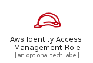
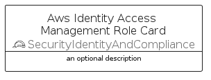
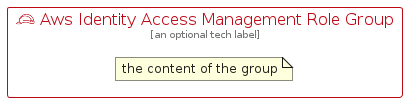

# AwsIdentityAccessManagementRole


```text
aws-q1-2022/Resource/SecurityIdentityAndCompliance/AwsIdentityAccessManagementRole
```

```text
include('aws-q1-2022/Resource/SecurityIdentityAndCompliance/AwsIdentityAccessManagementRole')
```


| Illustration | AwsIdentityAccessManagementRole | AwsIdentityAccessManagementRoleCard | AwsIdentityAccessManagementRoleGroup |
| :---: | :---: | :---: | :---: |
|  |  |  |  |


## AwsIdentityAccessManagementRole

### Load remotely
```plantuml
@startuml
' configures the library
!global $LIB_BASE_LOCATION="https://raw.githubusercontent.com/tmorin/plantuml-libs/master/distribution"

' loads the library's bootstrap
!include $LIB_BASE_LOCATION/bootstrap.puml

' loads the package bootstrap
include('aws-q1-2022/bootstrap')

' loads the Item which embeds the element AwsIdentityAccessManagementRole
include('aws-q1-2022/Resource/SecurityIdentityAndCompliance/AwsIdentityAccessManagementRole')

' renders the element
AwsIdentityAccessManagementRole('AwsIdentityAccessManagementRole', 'Aws Identity Access Management Role', 'an optional tech label', 'an optional description')
@enduml
```

### Load locally
```plantuml
@startuml
' configures the library
!global $INCLUSION_MODE="local"
!global $LIB_BASE_LOCATION="../../.."

' loads the library's bootstrap
!include $LIB_BASE_LOCATION/bootstrap.puml

' loads the package bootstrap
include('aws-q1-2022/bootstrap')

' loads the Item which embeds the element AwsIdentityAccessManagementRole
include('aws-q1-2022/Resource/SecurityIdentityAndCompliance/AwsIdentityAccessManagementRole')

' renders the element
AwsIdentityAccessManagementRole('AwsIdentityAccessManagementRole', 'Aws Identity Access Management Role', 'an optional tech label', 'an optional description')
@enduml
```

## AwsIdentityAccessManagementRoleCard

### Load remotely
```plantuml
@startuml
' configures the library
!global $LIB_BASE_LOCATION="https://raw.githubusercontent.com/tmorin/plantuml-libs/master/distribution"

' loads the library's bootstrap
!include $LIB_BASE_LOCATION/bootstrap.puml

' loads the package bootstrap
include('aws-q1-2022/bootstrap')

' loads the Item which embeds the element AwsIdentityAccessManagementRoleCard
include('aws-q1-2022/Resource/SecurityIdentityAndCompliance/AwsIdentityAccessManagementRole')

' renders the element
AwsIdentityAccessManagementRoleCard('AwsIdentityAccessManagementRoleCard', 'Aws Identity Access Management Role Card', 'an optional description')
@enduml
```

### Load locally
```plantuml
@startuml
' configures the library
!global $INCLUSION_MODE="local"
!global $LIB_BASE_LOCATION="../../.."

' loads the library's bootstrap
!include $LIB_BASE_LOCATION/bootstrap.puml

' loads the package bootstrap
include('aws-q1-2022/bootstrap')

' loads the Item which embeds the element AwsIdentityAccessManagementRoleCard
include('aws-q1-2022/Resource/SecurityIdentityAndCompliance/AwsIdentityAccessManagementRole')

' renders the element
AwsIdentityAccessManagementRoleCard('AwsIdentityAccessManagementRoleCard', 'Aws Identity Access Management Role Card', 'an optional description')
@enduml
```

## AwsIdentityAccessManagementRoleGroup

### Load remotely
```plantuml
@startuml
' configures the library
!global $LIB_BASE_LOCATION="https://raw.githubusercontent.com/tmorin/plantuml-libs/master/distribution"

' loads the library's bootstrap
!include $LIB_BASE_LOCATION/bootstrap.puml

' loads the package bootstrap
include('aws-q1-2022/bootstrap')

' loads the Item which embeds the element AwsIdentityAccessManagementRoleGroup
include('aws-q1-2022/Resource/SecurityIdentityAndCompliance/AwsIdentityAccessManagementRole')

' renders the element
AwsIdentityAccessManagementRoleGroup('AwsIdentityAccessManagementRoleGroup', 'Aws Identity Access Management Role Group', 'an optional tech label') {
    note as note
        the content of the group
    end note
}
@enduml
```

### Load locally
```plantuml
@startuml
' configures the library
!global $INCLUSION_MODE="local"
!global $LIB_BASE_LOCATION="../../.."

' loads the library's bootstrap
!include $LIB_BASE_LOCATION/bootstrap.puml

' loads the package bootstrap
include('aws-q1-2022/bootstrap')

' loads the Item which embeds the element AwsIdentityAccessManagementRoleGroup
include('aws-q1-2022/Resource/SecurityIdentityAndCompliance/AwsIdentityAccessManagementRole')

' renders the element
AwsIdentityAccessManagementRoleGroup('AwsIdentityAccessManagementRoleGroup', 'Aws Identity Access Management Role Group', 'an optional tech label') {
    note as note
        the content of the group
    end note
}
@enduml
```

