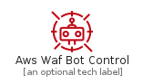
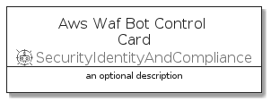

# AwsWafBotControl


```text
aws-q1-2022/Resource/SecurityIdentityAndCompliance/AwsWafBotControl
```

```text
include('aws-q1-2022/Resource/SecurityIdentityAndCompliance/AwsWafBotControl')
```


| Illustration | AwsWafBotControl | AwsWafBotControlCard | AwsWafBotControlGroup |
| :---: | :---: | :---: | :---: |
|  |  |  |  |


## AwsWafBotControl

### Load remotely
```plantuml
@startuml
' configures the library
!global $LIB_BASE_LOCATION="https://raw.githubusercontent.com/tmorin/plantuml-libs/master/distribution"

' loads the library's bootstrap
!include $LIB_BASE_LOCATION/bootstrap.puml

' loads the package bootstrap
include('aws-q1-2022/bootstrap')

' loads the Item which embeds the element AwsWafBotControl
include('aws-q1-2022/Resource/SecurityIdentityAndCompliance/AwsWafBotControl')

' renders the element
AwsWafBotControl('AwsWafBotControl', 'Aws Waf Bot Control', 'an optional tech label')
@enduml
```

### Load locally
```plantuml
@startuml
' configures the library
!global $INCLUSION_MODE="local"
!global $LIB_BASE_LOCATION="../../.."

' loads the library's bootstrap
!include $LIB_BASE_LOCATION/bootstrap.puml

' loads the package bootstrap
include('aws-q1-2022/bootstrap')

' loads the Item which embeds the element AwsWafBotControl
include('aws-q1-2022/Resource/SecurityIdentityAndCompliance/AwsWafBotControl')

' renders the element
AwsWafBotControl('AwsWafBotControl', 'Aws Waf Bot Control', 'an optional tech label')
@enduml
```

## AwsWafBotControlCard

### Load remotely
```plantuml
@startuml
' configures the library
!global $LIB_BASE_LOCATION="https://raw.githubusercontent.com/tmorin/plantuml-libs/master/distribution"

' loads the library's bootstrap
!include $LIB_BASE_LOCATION/bootstrap.puml

' loads the package bootstrap
include('aws-q1-2022/bootstrap')

' loads the Item which embeds the element AwsWafBotControlCard
include('aws-q1-2022/Resource/SecurityIdentityAndCompliance/AwsWafBotControl')

' renders the element
AwsWafBotControlCard('AwsWafBotControlCard', 'Aws Waf Bot Control Card', 'an optional description')
@enduml
```

### Load locally
```plantuml
@startuml
' configures the library
!global $INCLUSION_MODE="local"
!global $LIB_BASE_LOCATION="../../.."

' loads the library's bootstrap
!include $LIB_BASE_LOCATION/bootstrap.puml

' loads the package bootstrap
include('aws-q1-2022/bootstrap')

' loads the Item which embeds the element AwsWafBotControlCard
include('aws-q1-2022/Resource/SecurityIdentityAndCompliance/AwsWafBotControl')

' renders the element
AwsWafBotControlCard('AwsWafBotControlCard', 'Aws Waf Bot Control Card', 'an optional description')
@enduml
```

## AwsWafBotControlGroup

### Load remotely
```plantuml
@startuml
' configures the library
!global $LIB_BASE_LOCATION="https://raw.githubusercontent.com/tmorin/plantuml-libs/master/distribution"

' loads the library's bootstrap
!include $LIB_BASE_LOCATION/bootstrap.puml

' loads the package bootstrap
include('aws-q1-2022/bootstrap')

' loads the Item which embeds the element AwsWafBotControlGroup
include('aws-q1-2022/Resource/SecurityIdentityAndCompliance/AwsWafBotControl')

' renders the element
AwsWafBotControlGroup('AwsWafBotControlGroup', 'Aws Waf Bot Control Group', 'an optional tech label') {
    note as note
        the content of the group
    end note
}
@enduml
```

### Load locally
```plantuml
@startuml
' configures the library
!global $INCLUSION_MODE="local"
!global $LIB_BASE_LOCATION="../../.."

' loads the library's bootstrap
!include $LIB_BASE_LOCATION/bootstrap.puml

' loads the package bootstrap
include('aws-q1-2022/bootstrap')

' loads the Item which embeds the element AwsWafBotControlGroup
include('aws-q1-2022/Resource/SecurityIdentityAndCompliance/AwsWafBotControl')

' renders the element
AwsWafBotControlGroup('AwsWafBotControlGroup', 'Aws Waf Bot Control Group', 'an optional tech label') {
    note as note
        the content of the group
    end note
}
@enduml
```

