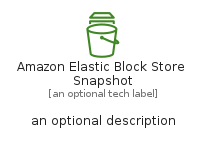
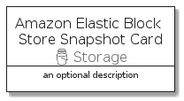

# AmazonElasticBlockStoreSnapshot


```text
aws-q1-2022/Resource/Storage/AmazonElasticBlockStoreSnapshot
```

```text
include('aws-q1-2022/Resource/Storage/AmazonElasticBlockStoreSnapshot')
```


| Illustration | AmazonElasticBlockStoreSnapshot | AmazonElasticBlockStoreSnapshotCard | AmazonElasticBlockStoreSnapshotGroup |
| :---: | :---: | :---: | :---: |
|  |  |  |  |


## AmazonElasticBlockStoreSnapshot

### Load remotely
```plantuml
@startuml
' configures the library
!global $LIB_BASE_LOCATION="https://raw.githubusercontent.com/tmorin/plantuml-libs/master/distribution"

' loads the library's bootstrap
!include $LIB_BASE_LOCATION/bootstrap.puml

' loads the package bootstrap
include('aws-q1-2022/bootstrap')

' loads the Item which embeds the element AmazonElasticBlockStoreSnapshot
include('aws-q1-2022/Resource/Storage/AmazonElasticBlockStoreSnapshot')

' renders the element
AmazonElasticBlockStoreSnapshot('AmazonElasticBlockStoreSnapshot', 'Amazon Elastic Block Store Snapshot', 'an optional tech label')
@enduml
```

### Load locally
```plantuml
@startuml
' configures the library
!global $INCLUSION_MODE="local"
!global $LIB_BASE_LOCATION="../../.."

' loads the library's bootstrap
!include $LIB_BASE_LOCATION/bootstrap.puml

' loads the package bootstrap
include('aws-q1-2022/bootstrap')

' loads the Item which embeds the element AmazonElasticBlockStoreSnapshot
include('aws-q1-2022/Resource/Storage/AmazonElasticBlockStoreSnapshot')

' renders the element
AmazonElasticBlockStoreSnapshot('AmazonElasticBlockStoreSnapshot', 'Amazon Elastic Block Store Snapshot', 'an optional tech label')
@enduml
```

## AmazonElasticBlockStoreSnapshotCard

### Load remotely
```plantuml
@startuml
' configures the library
!global $LIB_BASE_LOCATION="https://raw.githubusercontent.com/tmorin/plantuml-libs/master/distribution"

' loads the library's bootstrap
!include $LIB_BASE_LOCATION/bootstrap.puml

' loads the package bootstrap
include('aws-q1-2022/bootstrap')

' loads the Item which embeds the element AmazonElasticBlockStoreSnapshotCard
include('aws-q1-2022/Resource/Storage/AmazonElasticBlockStoreSnapshot')

' renders the element
AmazonElasticBlockStoreSnapshotCard('AmazonElasticBlockStoreSnapshotCard', 'Amazon Elastic Block Store Snapshot Card', 'an optional description')
@enduml
```

### Load locally
```plantuml
@startuml
' configures the library
!global $INCLUSION_MODE="local"
!global $LIB_BASE_LOCATION="../../.."

' loads the library's bootstrap
!include $LIB_BASE_LOCATION/bootstrap.puml

' loads the package bootstrap
include('aws-q1-2022/bootstrap')

' loads the Item which embeds the element AmazonElasticBlockStoreSnapshotCard
include('aws-q1-2022/Resource/Storage/AmazonElasticBlockStoreSnapshot')

' renders the element
AmazonElasticBlockStoreSnapshotCard('AmazonElasticBlockStoreSnapshotCard', 'Amazon Elastic Block Store Snapshot Card', 'an optional description')
@enduml
```

## AmazonElasticBlockStoreSnapshotGroup

### Load remotely
```plantuml
@startuml
' configures the library
!global $LIB_BASE_LOCATION="https://raw.githubusercontent.com/tmorin/plantuml-libs/master/distribution"

' loads the library's bootstrap
!include $LIB_BASE_LOCATION/bootstrap.puml

' loads the package bootstrap
include('aws-q1-2022/bootstrap')

' loads the Item which embeds the element AmazonElasticBlockStoreSnapshotGroup
include('aws-q1-2022/Resource/Storage/AmazonElasticBlockStoreSnapshot')

' renders the element
AmazonElasticBlockStoreSnapshotGroup('AmazonElasticBlockStoreSnapshotGroup', 'Amazon Elastic Block Store Snapshot Group', 'an optional tech label') {
    note as note
        the content of the group
    end note
}
@enduml
```

### Load locally
```plantuml
@startuml
' configures the library
!global $INCLUSION_MODE="local"
!global $LIB_BASE_LOCATION="../../.."

' loads the library's bootstrap
!include $LIB_BASE_LOCATION/bootstrap.puml

' loads the package bootstrap
include('aws-q1-2022/bootstrap')

' loads the Item which embeds the element AmazonElasticBlockStoreSnapshotGroup
include('aws-q1-2022/Resource/Storage/AmazonElasticBlockStoreSnapshot')

' renders the element
AmazonElasticBlockStoreSnapshotGroup('AmazonElasticBlockStoreSnapshotGroup', 'Amazon Elastic Block Store Snapshot Group', 'an optional tech label') {
    note as note
        the content of the group
    end note
}
@enduml
```

