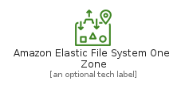
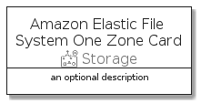

# AmazonElasticFileSystemOneZone


```text
aws-q1-2022/Resource/Storage/AmazonElasticFileSystemOneZone
```

```text
include('aws-q1-2022/Resource/Storage/AmazonElasticFileSystemOneZone')
```


| Illustration | AmazonElasticFileSystemOneZone | AmazonElasticFileSystemOneZoneCard | AmazonElasticFileSystemOneZoneGroup |
| :---: | :---: | :---: | :---: |
|  |  |  |  |


## AmazonElasticFileSystemOneZone

### Load remotely
```plantuml
@startuml
' configures the library
!global $LIB_BASE_LOCATION="https://raw.githubusercontent.com/tmorin/plantuml-libs/master/distribution"

' loads the library's bootstrap
!include $LIB_BASE_LOCATION/bootstrap.puml

' loads the package bootstrap
include('aws-q1-2022/bootstrap')

' loads the Item which embeds the element AmazonElasticFileSystemOneZone
include('aws-q1-2022/Resource/Storage/AmazonElasticFileSystemOneZone')

' renders the element
AmazonElasticFileSystemOneZone('AmazonElasticFileSystemOneZone', 'Amazon Elastic File System One Zone', 'an optional tech label')
@enduml
```

### Load locally
```plantuml
@startuml
' configures the library
!global $INCLUSION_MODE="local"
!global $LIB_BASE_LOCATION="../../.."

' loads the library's bootstrap
!include $LIB_BASE_LOCATION/bootstrap.puml

' loads the package bootstrap
include('aws-q1-2022/bootstrap')

' loads the Item which embeds the element AmazonElasticFileSystemOneZone
include('aws-q1-2022/Resource/Storage/AmazonElasticFileSystemOneZone')

' renders the element
AmazonElasticFileSystemOneZone('AmazonElasticFileSystemOneZone', 'Amazon Elastic File System One Zone', 'an optional tech label')
@enduml
```

## AmazonElasticFileSystemOneZoneCard

### Load remotely
```plantuml
@startuml
' configures the library
!global $LIB_BASE_LOCATION="https://raw.githubusercontent.com/tmorin/plantuml-libs/master/distribution"

' loads the library's bootstrap
!include $LIB_BASE_LOCATION/bootstrap.puml

' loads the package bootstrap
include('aws-q1-2022/bootstrap')

' loads the Item which embeds the element AmazonElasticFileSystemOneZoneCard
include('aws-q1-2022/Resource/Storage/AmazonElasticFileSystemOneZone')

' renders the element
AmazonElasticFileSystemOneZoneCard('AmazonElasticFileSystemOneZoneCard', 'Amazon Elastic File System One Zone Card', 'an optional description')
@enduml
```

### Load locally
```plantuml
@startuml
' configures the library
!global $INCLUSION_MODE="local"
!global $LIB_BASE_LOCATION="../../.."

' loads the library's bootstrap
!include $LIB_BASE_LOCATION/bootstrap.puml

' loads the package bootstrap
include('aws-q1-2022/bootstrap')

' loads the Item which embeds the element AmazonElasticFileSystemOneZoneCard
include('aws-q1-2022/Resource/Storage/AmazonElasticFileSystemOneZone')

' renders the element
AmazonElasticFileSystemOneZoneCard('AmazonElasticFileSystemOneZoneCard', 'Amazon Elastic File System One Zone Card', 'an optional description')
@enduml
```

## AmazonElasticFileSystemOneZoneGroup

### Load remotely
```plantuml
@startuml
' configures the library
!global $LIB_BASE_LOCATION="https://raw.githubusercontent.com/tmorin/plantuml-libs/master/distribution"

' loads the library's bootstrap
!include $LIB_BASE_LOCATION/bootstrap.puml

' loads the package bootstrap
include('aws-q1-2022/bootstrap')

' loads the Item which embeds the element AmazonElasticFileSystemOneZoneGroup
include('aws-q1-2022/Resource/Storage/AmazonElasticFileSystemOneZone')

' renders the element
AmazonElasticFileSystemOneZoneGroup('AmazonElasticFileSystemOneZoneGroup', 'Amazon Elastic File System One Zone Group', 'an optional tech label') {
    note as note
        the content of the group
    end note
}
@enduml
```

### Load locally
```plantuml
@startuml
' configures the library
!global $INCLUSION_MODE="local"
!global $LIB_BASE_LOCATION="../../.."

' loads the library's bootstrap
!include $LIB_BASE_LOCATION/bootstrap.puml

' loads the package bootstrap
include('aws-q1-2022/bootstrap')

' loads the Item which embeds the element AmazonElasticFileSystemOneZoneGroup
include('aws-q1-2022/Resource/Storage/AmazonElasticFileSystemOneZone')

' renders the element
AmazonElasticFileSystemOneZoneGroup('AmazonElasticFileSystemOneZoneGroup', 'Amazon Elastic File System One Zone Group', 'an optional tech label') {
    note as note
        the content of the group
    end note
}
@enduml
```

