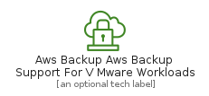
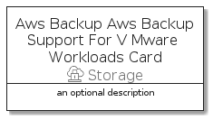

# AwsBackupAwsBackupSupportForVMwareWorkloads


```text
aws-q1-2022/Resource/Storage/AwsBackupAwsBackupSupportForVMwareWorkloads
```

```text
include('aws-q1-2022/Resource/Storage/AwsBackupAwsBackupSupportForVMwareWorkloads')
```


| Illustration | AwsBackupAwsBackupSupportForVMwareWorkloads | AwsBackupAwsBackupSupportForVMwareWorkloadsCard | AwsBackupAwsBackupSupportForVMwareWorkloadsGroup |
| :---: | :---: | :---: | :---: |
|  |  |  |  |


## AwsBackupAwsBackupSupportForVMwareWorkloads

### Load remotely
```plantuml
@startuml
' configures the library
!global $LIB_BASE_LOCATION="https://raw.githubusercontent.com/tmorin/plantuml-libs/master/distribution"

' loads the library's bootstrap
!include $LIB_BASE_LOCATION/bootstrap.puml

' loads the package bootstrap
include('aws-q1-2022/bootstrap')

' loads the Item which embeds the element AwsBackupAwsBackupSupportForVMwareWorkloads
include('aws-q1-2022/Resource/Storage/AwsBackupAwsBackupSupportForVMwareWorkloads')

' renders the element
AwsBackupAwsBackupSupportForVMwareWorkloads('AwsBackupAwsBackupSupportForVMwareWorkloads', 'Aws Backup Aws Backup Support For V Mware Workloads', 'an optional tech label')
@enduml
```

### Load locally
```plantuml
@startuml
' configures the library
!global $INCLUSION_MODE="local"
!global $LIB_BASE_LOCATION="../../.."

' loads the library's bootstrap
!include $LIB_BASE_LOCATION/bootstrap.puml

' loads the package bootstrap
include('aws-q1-2022/bootstrap')

' loads the Item which embeds the element AwsBackupAwsBackupSupportForVMwareWorkloads
include('aws-q1-2022/Resource/Storage/AwsBackupAwsBackupSupportForVMwareWorkloads')

' renders the element
AwsBackupAwsBackupSupportForVMwareWorkloads('AwsBackupAwsBackupSupportForVMwareWorkloads', 'Aws Backup Aws Backup Support For V Mware Workloads', 'an optional tech label')
@enduml
```

## AwsBackupAwsBackupSupportForVMwareWorkloadsCard

### Load remotely
```plantuml
@startuml
' configures the library
!global $LIB_BASE_LOCATION="https://raw.githubusercontent.com/tmorin/plantuml-libs/master/distribution"

' loads the library's bootstrap
!include $LIB_BASE_LOCATION/bootstrap.puml

' loads the package bootstrap
include('aws-q1-2022/bootstrap')

' loads the Item which embeds the element AwsBackupAwsBackupSupportForVMwareWorkloadsCard
include('aws-q1-2022/Resource/Storage/AwsBackupAwsBackupSupportForVMwareWorkloads')

' renders the element
AwsBackupAwsBackupSupportForVMwareWorkloadsCard('AwsBackupAwsBackupSupportForVMwareWorkloadsCard', 'Aws Backup Aws Backup Support For V Mware Workloads Card', 'an optional description')
@enduml
```

### Load locally
```plantuml
@startuml
' configures the library
!global $INCLUSION_MODE="local"
!global $LIB_BASE_LOCATION="../../.."

' loads the library's bootstrap
!include $LIB_BASE_LOCATION/bootstrap.puml

' loads the package bootstrap
include('aws-q1-2022/bootstrap')

' loads the Item which embeds the element AwsBackupAwsBackupSupportForVMwareWorkloadsCard
include('aws-q1-2022/Resource/Storage/AwsBackupAwsBackupSupportForVMwareWorkloads')

' renders the element
AwsBackupAwsBackupSupportForVMwareWorkloadsCard('AwsBackupAwsBackupSupportForVMwareWorkloadsCard', 'Aws Backup Aws Backup Support For V Mware Workloads Card', 'an optional description')
@enduml
```

## AwsBackupAwsBackupSupportForVMwareWorkloadsGroup

### Load remotely
```plantuml
@startuml
' configures the library
!global $LIB_BASE_LOCATION="https://raw.githubusercontent.com/tmorin/plantuml-libs/master/distribution"

' loads the library's bootstrap
!include $LIB_BASE_LOCATION/bootstrap.puml

' loads the package bootstrap
include('aws-q1-2022/bootstrap')

' loads the Item which embeds the element AwsBackupAwsBackupSupportForVMwareWorkloadsGroup
include('aws-q1-2022/Resource/Storage/AwsBackupAwsBackupSupportForVMwareWorkloads')

' renders the element
AwsBackupAwsBackupSupportForVMwareWorkloadsGroup('AwsBackupAwsBackupSupportForVMwareWorkloadsGroup', 'Aws Backup Aws Backup Support For V Mware Workloads Group', 'an optional tech label') {
    note as note
        the content of the group
    end note
}
@enduml
```

### Load locally
```plantuml
@startuml
' configures the library
!global $INCLUSION_MODE="local"
!global $LIB_BASE_LOCATION="../../.."

' loads the library's bootstrap
!include $LIB_BASE_LOCATION/bootstrap.puml

' loads the package bootstrap
include('aws-q1-2022/bootstrap')

' loads the Item which embeds the element AwsBackupAwsBackupSupportForVMwareWorkloadsGroup
include('aws-q1-2022/Resource/Storage/AwsBackupAwsBackupSupportForVMwareWorkloads')

' renders the element
AwsBackupAwsBackupSupportForVMwareWorkloadsGroup('AwsBackupAwsBackupSupportForVMwareWorkloadsGroup', 'Aws Backup Aws Backup Support For V Mware Workloads Group', 'an optional tech label') {
    note as note
        the content of the group
    end note
}
@enduml
```

