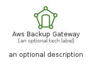
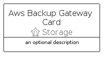
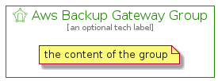

# AwsBackupGateway


```text
aws-q1-2022/Resource/Storage/AwsBackupGateway
```

```text
include('aws-q1-2022/Resource/Storage/AwsBackupGateway')
```


| Illustration | AwsBackupGateway | AwsBackupGatewayCard | AwsBackupGatewayGroup |
| :---: | :---: | :---: | :---: |
|  |  |  |  |


## AwsBackupGateway

### Load remotely
```plantuml
@startuml
' configures the library
!global $LIB_BASE_LOCATION="https://raw.githubusercontent.com/tmorin/plantuml-libs/master/distribution"

' loads the library's bootstrap
!include $LIB_BASE_LOCATION/bootstrap.puml

' loads the package bootstrap
include('aws-q1-2022/bootstrap')

' loads the Item which embeds the element AwsBackupGateway
include('aws-q1-2022/Resource/Storage/AwsBackupGateway')

' renders the element
AwsBackupGateway('AwsBackupGateway', 'Aws Backup Gateway', 'an optional tech label')
@enduml
```

### Load locally
```plantuml
@startuml
' configures the library
!global $INCLUSION_MODE="local"
!global $LIB_BASE_LOCATION="../../.."

' loads the library's bootstrap
!include $LIB_BASE_LOCATION/bootstrap.puml

' loads the package bootstrap
include('aws-q1-2022/bootstrap')

' loads the Item which embeds the element AwsBackupGateway
include('aws-q1-2022/Resource/Storage/AwsBackupGateway')

' renders the element
AwsBackupGateway('AwsBackupGateway', 'Aws Backup Gateway', 'an optional tech label')
@enduml
```

## AwsBackupGatewayCard

### Load remotely
```plantuml
@startuml
' configures the library
!global $LIB_BASE_LOCATION="https://raw.githubusercontent.com/tmorin/plantuml-libs/master/distribution"

' loads the library's bootstrap
!include $LIB_BASE_LOCATION/bootstrap.puml

' loads the package bootstrap
include('aws-q1-2022/bootstrap')

' loads the Item which embeds the element AwsBackupGatewayCard
include('aws-q1-2022/Resource/Storage/AwsBackupGateway')

' renders the element
AwsBackupGatewayCard('AwsBackupGatewayCard', 'Aws Backup Gateway Card', 'an optional description')
@enduml
```

### Load locally
```plantuml
@startuml
' configures the library
!global $INCLUSION_MODE="local"
!global $LIB_BASE_LOCATION="../../.."

' loads the library's bootstrap
!include $LIB_BASE_LOCATION/bootstrap.puml

' loads the package bootstrap
include('aws-q1-2022/bootstrap')

' loads the Item which embeds the element AwsBackupGatewayCard
include('aws-q1-2022/Resource/Storage/AwsBackupGateway')

' renders the element
AwsBackupGatewayCard('AwsBackupGatewayCard', 'Aws Backup Gateway Card', 'an optional description')
@enduml
```

## AwsBackupGatewayGroup

### Load remotely
```plantuml
@startuml
' configures the library
!global $LIB_BASE_LOCATION="https://raw.githubusercontent.com/tmorin/plantuml-libs/master/distribution"

' loads the library's bootstrap
!include $LIB_BASE_LOCATION/bootstrap.puml

' loads the package bootstrap
include('aws-q1-2022/bootstrap')

' loads the Item which embeds the element AwsBackupGatewayGroup
include('aws-q1-2022/Resource/Storage/AwsBackupGateway')

' renders the element
AwsBackupGatewayGroup('AwsBackupGatewayGroup', 'Aws Backup Gateway Group', 'an optional tech label') {
    note as note
        the content of the group
    end note
}
@enduml
```

### Load locally
```plantuml
@startuml
' configures the library
!global $INCLUSION_MODE="local"
!global $LIB_BASE_LOCATION="../../.."

' loads the library's bootstrap
!include $LIB_BASE_LOCATION/bootstrap.puml

' loads the package bootstrap
include('aws-q1-2022/bootstrap')

' loads the Item which embeds the element AwsBackupGatewayGroup
include('aws-q1-2022/Resource/Storage/AwsBackupGateway')

' renders the element
AwsBackupGatewayGroup('AwsBackupGatewayGroup', 'Aws Backup Gateway Group', 'an optional tech label') {
    note as note
        the content of the group
    end note
}
@enduml
```

