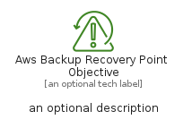
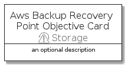

# AwsBackupRecoveryPointObjective


```text
aws-q1-2022/Resource/Storage/AwsBackupRecoveryPointObjective
```

```text
include('aws-q1-2022/Resource/Storage/AwsBackupRecoveryPointObjective')
```


| Illustration | AwsBackupRecoveryPointObjective | AwsBackupRecoveryPointObjectiveCard | AwsBackupRecoveryPointObjectiveGroup |
| :---: | :---: | :---: | :---: |
|  |  |  |  |


## AwsBackupRecoveryPointObjective

### Load remotely
```plantuml
@startuml
' configures the library
!global $LIB_BASE_LOCATION="https://raw.githubusercontent.com/tmorin/plantuml-libs/master/distribution"

' loads the library's bootstrap
!include $LIB_BASE_LOCATION/bootstrap.puml

' loads the package bootstrap
include('aws-q1-2022/bootstrap')

' loads the Item which embeds the element AwsBackupRecoveryPointObjective
include('aws-q1-2022/Resource/Storage/AwsBackupRecoveryPointObjective')

' renders the element
AwsBackupRecoveryPointObjective('AwsBackupRecoveryPointObjective', 'Aws Backup Recovery Point Objective', 'an optional tech label')
@enduml
```

### Load locally
```plantuml
@startuml
' configures the library
!global $INCLUSION_MODE="local"
!global $LIB_BASE_LOCATION="../../.."

' loads the library's bootstrap
!include $LIB_BASE_LOCATION/bootstrap.puml

' loads the package bootstrap
include('aws-q1-2022/bootstrap')

' loads the Item which embeds the element AwsBackupRecoveryPointObjective
include('aws-q1-2022/Resource/Storage/AwsBackupRecoveryPointObjective')

' renders the element
AwsBackupRecoveryPointObjective('AwsBackupRecoveryPointObjective', 'Aws Backup Recovery Point Objective', 'an optional tech label')
@enduml
```

## AwsBackupRecoveryPointObjectiveCard

### Load remotely
```plantuml
@startuml
' configures the library
!global $LIB_BASE_LOCATION="https://raw.githubusercontent.com/tmorin/plantuml-libs/master/distribution"

' loads the library's bootstrap
!include $LIB_BASE_LOCATION/bootstrap.puml

' loads the package bootstrap
include('aws-q1-2022/bootstrap')

' loads the Item which embeds the element AwsBackupRecoveryPointObjectiveCard
include('aws-q1-2022/Resource/Storage/AwsBackupRecoveryPointObjective')

' renders the element
AwsBackupRecoveryPointObjectiveCard('AwsBackupRecoveryPointObjectiveCard', 'Aws Backup Recovery Point Objective Card', 'an optional description')
@enduml
```

### Load locally
```plantuml
@startuml
' configures the library
!global $INCLUSION_MODE="local"
!global $LIB_BASE_LOCATION="../../.."

' loads the library's bootstrap
!include $LIB_BASE_LOCATION/bootstrap.puml

' loads the package bootstrap
include('aws-q1-2022/bootstrap')

' loads the Item which embeds the element AwsBackupRecoveryPointObjectiveCard
include('aws-q1-2022/Resource/Storage/AwsBackupRecoveryPointObjective')

' renders the element
AwsBackupRecoveryPointObjectiveCard('AwsBackupRecoveryPointObjectiveCard', 'Aws Backup Recovery Point Objective Card', 'an optional description')
@enduml
```

## AwsBackupRecoveryPointObjectiveGroup

### Load remotely
```plantuml
@startuml
' configures the library
!global $LIB_BASE_LOCATION="https://raw.githubusercontent.com/tmorin/plantuml-libs/master/distribution"

' loads the library's bootstrap
!include $LIB_BASE_LOCATION/bootstrap.puml

' loads the package bootstrap
include('aws-q1-2022/bootstrap')

' loads the Item which embeds the element AwsBackupRecoveryPointObjectiveGroup
include('aws-q1-2022/Resource/Storage/AwsBackupRecoveryPointObjective')

' renders the element
AwsBackupRecoveryPointObjectiveGroup('AwsBackupRecoveryPointObjectiveGroup', 'Aws Backup Recovery Point Objective Group', 'an optional tech label') {
    note as note
        the content of the group
    end note
}
@enduml
```

### Load locally
```plantuml
@startuml
' configures the library
!global $INCLUSION_MODE="local"
!global $LIB_BASE_LOCATION="../../.."

' loads the library's bootstrap
!include $LIB_BASE_LOCATION/bootstrap.puml

' loads the package bootstrap
include('aws-q1-2022/bootstrap')

' loads the Item which embeds the element AwsBackupRecoveryPointObjectiveGroup
include('aws-q1-2022/Resource/Storage/AwsBackupRecoveryPointObjective')

' renders the element
AwsBackupRecoveryPointObjectiveGroup('AwsBackupRecoveryPointObjectiveGroup', 'Aws Backup Recovery Point Objective Group', 'an optional tech label') {
    note as note
        the content of the group
    end note
}
@enduml
```

