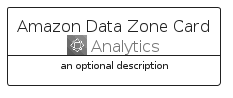

# AmazonDataZone


```text
aws-q1-2023/Architecture/Analytics/AmazonDataZone
```

```text
include('aws-q1-2023/Architecture/Analytics/AmazonDataZone')
```


| Illustration | AmazonDataZone | AmazonDataZoneCard | AmazonDataZoneGroup |
| :---: | :---: | :---: | :---: |
|  |  |  |  |


## AmazonDataZone

### Load remotely
```plantuml
@startuml
' configures the library
!global $LIB_BASE_LOCATION="https://raw.githubusercontent.com/tmorin/plantuml-libs/master/distribution"

' loads the library's bootstrap
!include $LIB_BASE_LOCATION/bootstrap.puml

' loads the package bootstrap
include('aws-q1-2023/bootstrap')

' loads the Item which embeds the element AmazonDataZone
include('aws-q1-2023/Architecture/Analytics/AmazonDataZone')

' renders the element
AmazonDataZone('AmazonDataZone', 'Amazon Data Zone', 'an optional tech label', 'an optional description')
@enduml
```

### Load locally
```plantuml
@startuml
' configures the library
!global $INCLUSION_MODE="local"
!global $LIB_BASE_LOCATION="../../.."

' loads the library's bootstrap
!include $LIB_BASE_LOCATION/bootstrap.puml

' loads the package bootstrap
include('aws-q1-2023/bootstrap')

' loads the Item which embeds the element AmazonDataZone
include('aws-q1-2023/Architecture/Analytics/AmazonDataZone')

' renders the element
AmazonDataZone('AmazonDataZone', 'Amazon Data Zone', 'an optional tech label', 'an optional description')
@enduml
```

## AmazonDataZoneCard

### Load remotely
```plantuml
@startuml
' configures the library
!global $LIB_BASE_LOCATION="https://raw.githubusercontent.com/tmorin/plantuml-libs/master/distribution"

' loads the library's bootstrap
!include $LIB_BASE_LOCATION/bootstrap.puml

' loads the package bootstrap
include('aws-q1-2023/bootstrap')

' loads the Item which embeds the element AmazonDataZoneCard
include('aws-q1-2023/Architecture/Analytics/AmazonDataZone')

' renders the element
AmazonDataZoneCard('AmazonDataZoneCard', 'Amazon Data Zone Card', 'an optional description')
@enduml
```

### Load locally
```plantuml
@startuml
' configures the library
!global $INCLUSION_MODE="local"
!global $LIB_BASE_LOCATION="../../.."

' loads the library's bootstrap
!include $LIB_BASE_LOCATION/bootstrap.puml

' loads the package bootstrap
include('aws-q1-2023/bootstrap')

' loads the Item which embeds the element AmazonDataZoneCard
include('aws-q1-2023/Architecture/Analytics/AmazonDataZone')

' renders the element
AmazonDataZoneCard('AmazonDataZoneCard', 'Amazon Data Zone Card', 'an optional description')
@enduml
```

## AmazonDataZoneGroup

### Load remotely
```plantuml
@startuml
' configures the library
!global $LIB_BASE_LOCATION="https://raw.githubusercontent.com/tmorin/plantuml-libs/master/distribution"

' loads the library's bootstrap
!include $LIB_BASE_LOCATION/bootstrap.puml

' loads the package bootstrap
include('aws-q1-2023/bootstrap')

' loads the Item which embeds the element AmazonDataZoneGroup
include('aws-q1-2023/Architecture/Analytics/AmazonDataZone')

' renders the element
AmazonDataZoneGroup('AmazonDataZoneGroup', 'Amazon Data Zone Group', 'an optional tech label') {
    note as note
        the content of the group
    end note
}
@enduml
```

### Load locally
```plantuml
@startuml
' configures the library
!global $INCLUSION_MODE="local"
!global $LIB_BASE_LOCATION="../../.."

' loads the library's bootstrap
!include $LIB_BASE_LOCATION/bootstrap.puml

' loads the package bootstrap
include('aws-q1-2023/bootstrap')

' loads the Item which embeds the element AmazonDataZoneGroup
include('aws-q1-2023/Architecture/Analytics/AmazonDataZone')

' renders the element
AmazonDataZoneGroup('AmazonDataZoneGroup', 'Amazon Data Zone Group', 'an optional tech label') {
    note as note
        the content of the group
    end note
}
@enduml
```

