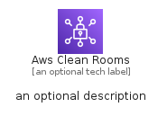
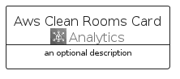
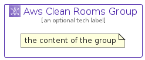

# AwsCleanRooms


```text
aws-q1-2023/Architecture/Analytics/AwsCleanRooms
```

```text
include('aws-q1-2023/Architecture/Analytics/AwsCleanRooms')
```


| Illustration | AwsCleanRooms | AwsCleanRoomsCard | AwsCleanRoomsGroup |
| :---: | :---: | :---: | :---: |
|  |  |  |  |


## Sprites
The item provides the following sriptes:

- `<$AwsCleanRoomsXs>`
- `<$AwsCleanRoomsSm>`
- `<$AwsCleanRoomsMd>`
- `<$AwsCleanRoomsLg>`


## AwsCleanRooms

### Load remotely
```plantuml
@startuml
' configures the library
!global $LIB_BASE_LOCATION="https://raw.githubusercontent.com/tmorin/plantuml-libs/master/distribution"

' loads the library's bootstrap
!include $LIB_BASE_LOCATION/bootstrap.puml

' loads the package bootstrap
include('aws-q1-2023/bootstrap')

' loads the Item which embeds the element AwsCleanRooms
include('aws-q1-2023/Architecture/Analytics/AwsCleanRooms')

' renders the element
AwsCleanRooms('AwsCleanRooms', 'Aws Clean Rooms', 'an optional tech label', 'an optional description')
@enduml
```

### Load locally
```plantuml
@startuml
' configures the library
!global $INCLUSION_MODE="local"
!global $LIB_BASE_LOCATION="../../.."

' loads the library's bootstrap
!include $LIB_BASE_LOCATION/bootstrap.puml

' loads the package bootstrap
include('aws-q1-2023/bootstrap')

' loads the Item which embeds the element AwsCleanRooms
include('aws-q1-2023/Architecture/Analytics/AwsCleanRooms')

' renders the element
AwsCleanRooms('AwsCleanRooms', 'Aws Clean Rooms', 'an optional tech label', 'an optional description')
@enduml
```

## AwsCleanRoomsCard

### Load remotely
```plantuml
@startuml
' configures the library
!global $LIB_BASE_LOCATION="https://raw.githubusercontent.com/tmorin/plantuml-libs/master/distribution"

' loads the library's bootstrap
!include $LIB_BASE_LOCATION/bootstrap.puml

' loads the package bootstrap
include('aws-q1-2023/bootstrap')

' loads the Item which embeds the element AwsCleanRoomsCard
include('aws-q1-2023/Architecture/Analytics/AwsCleanRooms')

' renders the element
AwsCleanRoomsCard('AwsCleanRoomsCard', 'Aws Clean Rooms Card', 'an optional description')
@enduml
```

### Load locally
```plantuml
@startuml
' configures the library
!global $INCLUSION_MODE="local"
!global $LIB_BASE_LOCATION="../../.."

' loads the library's bootstrap
!include $LIB_BASE_LOCATION/bootstrap.puml

' loads the package bootstrap
include('aws-q1-2023/bootstrap')

' loads the Item which embeds the element AwsCleanRoomsCard
include('aws-q1-2023/Architecture/Analytics/AwsCleanRooms')

' renders the element
AwsCleanRoomsCard('AwsCleanRoomsCard', 'Aws Clean Rooms Card', 'an optional description')
@enduml
```

## AwsCleanRoomsGroup

### Load remotely
```plantuml
@startuml
' configures the library
!global $LIB_BASE_LOCATION="https://raw.githubusercontent.com/tmorin/plantuml-libs/master/distribution"

' loads the library's bootstrap
!include $LIB_BASE_LOCATION/bootstrap.puml

' loads the package bootstrap
include('aws-q1-2023/bootstrap')

' loads the Item which embeds the element AwsCleanRoomsGroup
include('aws-q1-2023/Architecture/Analytics/AwsCleanRooms')

' renders the element
AwsCleanRoomsGroup('AwsCleanRoomsGroup', 'Aws Clean Rooms Group', 'an optional tech label') {
    note as note
        the content of the group
    end note
}
@enduml
```

### Load locally
```plantuml
@startuml
' configures the library
!global $INCLUSION_MODE="local"
!global $LIB_BASE_LOCATION="../../.."

' loads the library's bootstrap
!include $LIB_BASE_LOCATION/bootstrap.puml

' loads the package bootstrap
include('aws-q1-2023/bootstrap')

' loads the Item which embeds the element AwsCleanRoomsGroup
include('aws-q1-2023/Architecture/Analytics/AwsCleanRooms')

' renders the element
AwsCleanRoomsGroup('AwsCleanRoomsGroup', 'Aws Clean Rooms Group', 'an optional tech label') {
    note as note
        the content of the group
    end note
}
@enduml
```

