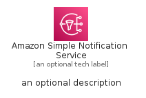

# AmazonSimpleNotificationService


```text
aws-q1-2023/Architecture/AppIntegration/AmazonSimpleNotificationService
```

```text
include('aws-q1-2023/Architecture/AppIntegration/AmazonSimpleNotificationService')
```


| Illustration | AmazonSimpleNotificationService | AmazonSimpleNotificationServiceCard | AmazonSimpleNotificationServiceGroup |
| :---: | :---: | :---: | :---: |
|  |  |  |  |


## AmazonSimpleNotificationService

### Load remotely
```plantuml
@startuml
' configures the library
!global $LIB_BASE_LOCATION="https://raw.githubusercontent.com/tmorin/plantuml-libs/master/distribution"

' loads the library's bootstrap
!include $LIB_BASE_LOCATION/bootstrap.puml

' loads the package bootstrap
include('aws-q1-2023/bootstrap')

' loads the Item which embeds the element AmazonSimpleNotificationService
include('aws-q1-2023/Architecture/AppIntegration/AmazonSimpleNotificationService')

' renders the element
AmazonSimpleNotificationService('AmazonSimpleNotificationService', 'Amazon Simple Notification Service', 'an optional tech label', 'an optional description')
@enduml
```

### Load locally
```plantuml
@startuml
' configures the library
!global $INCLUSION_MODE="local"
!global $LIB_BASE_LOCATION="../../.."

' loads the library's bootstrap
!include $LIB_BASE_LOCATION/bootstrap.puml

' loads the package bootstrap
include('aws-q1-2023/bootstrap')

' loads the Item which embeds the element AmazonSimpleNotificationService
include('aws-q1-2023/Architecture/AppIntegration/AmazonSimpleNotificationService')

' renders the element
AmazonSimpleNotificationService('AmazonSimpleNotificationService', 'Amazon Simple Notification Service', 'an optional tech label', 'an optional description')
@enduml
```

## AmazonSimpleNotificationServiceCard

### Load remotely
```plantuml
@startuml
' configures the library
!global $LIB_BASE_LOCATION="https://raw.githubusercontent.com/tmorin/plantuml-libs/master/distribution"

' loads the library's bootstrap
!include $LIB_BASE_LOCATION/bootstrap.puml

' loads the package bootstrap
include('aws-q1-2023/bootstrap')

' loads the Item which embeds the element AmazonSimpleNotificationServiceCard
include('aws-q1-2023/Architecture/AppIntegration/AmazonSimpleNotificationService')

' renders the element
AmazonSimpleNotificationServiceCard('AmazonSimpleNotificationServiceCard', 'Amazon Simple Notification Service Card', 'an optional description')
@enduml
```

### Load locally
```plantuml
@startuml
' configures the library
!global $INCLUSION_MODE="local"
!global $LIB_BASE_LOCATION="../../.."

' loads the library's bootstrap
!include $LIB_BASE_LOCATION/bootstrap.puml

' loads the package bootstrap
include('aws-q1-2023/bootstrap')

' loads the Item which embeds the element AmazonSimpleNotificationServiceCard
include('aws-q1-2023/Architecture/AppIntegration/AmazonSimpleNotificationService')

' renders the element
AmazonSimpleNotificationServiceCard('AmazonSimpleNotificationServiceCard', 'Amazon Simple Notification Service Card', 'an optional description')
@enduml
```

## AmazonSimpleNotificationServiceGroup

### Load remotely
```plantuml
@startuml
' configures the library
!global $LIB_BASE_LOCATION="https://raw.githubusercontent.com/tmorin/plantuml-libs/master/distribution"

' loads the library's bootstrap
!include $LIB_BASE_LOCATION/bootstrap.puml

' loads the package bootstrap
include('aws-q1-2023/bootstrap')

' loads the Item which embeds the element AmazonSimpleNotificationServiceGroup
include('aws-q1-2023/Architecture/AppIntegration/AmazonSimpleNotificationService')

' renders the element
AmazonSimpleNotificationServiceGroup('AmazonSimpleNotificationServiceGroup', 'Amazon Simple Notification Service Group', 'an optional tech label') {
    note as note
        the content of the group
    end note
}
@enduml
```

### Load locally
```plantuml
@startuml
' configures the library
!global $INCLUSION_MODE="local"
!global $LIB_BASE_LOCATION="../../.."

' loads the library's bootstrap
!include $LIB_BASE_LOCATION/bootstrap.puml

' loads the package bootstrap
include('aws-q1-2023/bootstrap')

' loads the Item which embeds the element AmazonSimpleNotificationServiceGroup
include('aws-q1-2023/Architecture/AppIntegration/AmazonSimpleNotificationService')

' renders the element
AmazonSimpleNotificationServiceGroup('AmazonSimpleNotificationServiceGroup', 'Amazon Simple Notification Service Group', 'an optional tech label') {
    note as note
        the content of the group
    end note
}
@enduml
```

