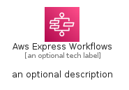
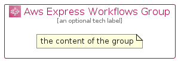

# AwsExpressWorkflows


```text
aws-q1-2023/Architecture/AppIntegration/AwsExpressWorkflows
```

```text
include('aws-q1-2023/Architecture/AppIntegration/AwsExpressWorkflows')
```


| Illustration | AwsExpressWorkflows | AwsExpressWorkflowsCard | AwsExpressWorkflowsGroup |
| :---: | :---: | :---: | :---: |
|  |  |  |  |


## AwsExpressWorkflows

### Load remotely
```plantuml
@startuml
' configures the library
!global $LIB_BASE_LOCATION="https://raw.githubusercontent.com/tmorin/plantuml-libs/master/distribution"

' loads the library's bootstrap
!include $LIB_BASE_LOCATION/bootstrap.puml

' loads the package bootstrap
include('aws-q1-2023/bootstrap')

' loads the Item which embeds the element AwsExpressWorkflows
include('aws-q1-2023/Architecture/AppIntegration/AwsExpressWorkflows')

' renders the element
AwsExpressWorkflows('AwsExpressWorkflows', 'Aws Express Workflows', 'an optional tech label', 'an optional description')
@enduml
```

### Load locally
```plantuml
@startuml
' configures the library
!global $INCLUSION_MODE="local"
!global $LIB_BASE_LOCATION="../../.."

' loads the library's bootstrap
!include $LIB_BASE_LOCATION/bootstrap.puml

' loads the package bootstrap
include('aws-q1-2023/bootstrap')

' loads the Item which embeds the element AwsExpressWorkflows
include('aws-q1-2023/Architecture/AppIntegration/AwsExpressWorkflows')

' renders the element
AwsExpressWorkflows('AwsExpressWorkflows', 'Aws Express Workflows', 'an optional tech label', 'an optional description')
@enduml
```

## AwsExpressWorkflowsCard

### Load remotely
```plantuml
@startuml
' configures the library
!global $LIB_BASE_LOCATION="https://raw.githubusercontent.com/tmorin/plantuml-libs/master/distribution"

' loads the library's bootstrap
!include $LIB_BASE_LOCATION/bootstrap.puml

' loads the package bootstrap
include('aws-q1-2023/bootstrap')

' loads the Item which embeds the element AwsExpressWorkflowsCard
include('aws-q1-2023/Architecture/AppIntegration/AwsExpressWorkflows')

' renders the element
AwsExpressWorkflowsCard('AwsExpressWorkflowsCard', 'Aws Express Workflows Card', 'an optional description')
@enduml
```

### Load locally
```plantuml
@startuml
' configures the library
!global $INCLUSION_MODE="local"
!global $LIB_BASE_LOCATION="../../.."

' loads the library's bootstrap
!include $LIB_BASE_LOCATION/bootstrap.puml

' loads the package bootstrap
include('aws-q1-2023/bootstrap')

' loads the Item which embeds the element AwsExpressWorkflowsCard
include('aws-q1-2023/Architecture/AppIntegration/AwsExpressWorkflows')

' renders the element
AwsExpressWorkflowsCard('AwsExpressWorkflowsCard', 'Aws Express Workflows Card', 'an optional description')
@enduml
```

## AwsExpressWorkflowsGroup

### Load remotely
```plantuml
@startuml
' configures the library
!global $LIB_BASE_LOCATION="https://raw.githubusercontent.com/tmorin/plantuml-libs/master/distribution"

' loads the library's bootstrap
!include $LIB_BASE_LOCATION/bootstrap.puml

' loads the package bootstrap
include('aws-q1-2023/bootstrap')

' loads the Item which embeds the element AwsExpressWorkflowsGroup
include('aws-q1-2023/Architecture/AppIntegration/AwsExpressWorkflows')

' renders the element
AwsExpressWorkflowsGroup('AwsExpressWorkflowsGroup', 'Aws Express Workflows Group', 'an optional tech label') {
    note as note
        the content of the group
    end note
}
@enduml
```

### Load locally
```plantuml
@startuml
' configures the library
!global $INCLUSION_MODE="local"
!global $LIB_BASE_LOCATION="../../.."

' loads the library's bootstrap
!include $LIB_BASE_LOCATION/bootstrap.puml

' loads the package bootstrap
include('aws-q1-2023/bootstrap')

' loads the Item which embeds the element AwsExpressWorkflowsGroup
include('aws-q1-2023/Architecture/AppIntegration/AwsExpressWorkflows')

' renders the element
AwsExpressWorkflowsGroup('AwsExpressWorkflowsGroup', 'Aws Express Workflows Group', 'an optional tech label') {
    note as note
        the content of the group
    end note
}
@enduml
```

