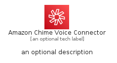
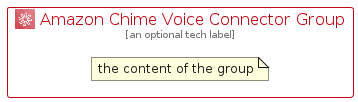

# AmazonChimeVoiceConnector


```text
aws-q1-2023/Architecture/BusinessApplications/AmazonChimeVoiceConnector
```

```text
include('aws-q1-2023/Architecture/BusinessApplications/AmazonChimeVoiceConnector')
```


| Illustration | AmazonChimeVoiceConnector | AmazonChimeVoiceConnectorCard | AmazonChimeVoiceConnectorGroup |
| :---: | :---: | :---: | :---: |
|  |  |  |  |


## AmazonChimeVoiceConnector

### Load remotely
```plantuml
@startuml
' configures the library
!global $LIB_BASE_LOCATION="https://raw.githubusercontent.com/tmorin/plantuml-libs/master/distribution"

' loads the library's bootstrap
!include $LIB_BASE_LOCATION/bootstrap.puml

' loads the package bootstrap
include('aws-q1-2023/bootstrap')

' loads the Item which embeds the element AmazonChimeVoiceConnector
include('aws-q1-2023/Architecture/BusinessApplications/AmazonChimeVoiceConnector')

' renders the element
AmazonChimeVoiceConnector('AmazonChimeVoiceConnector', 'Amazon Chime Voice Connector', 'an optional tech label', 'an optional description')
@enduml
```

### Load locally
```plantuml
@startuml
' configures the library
!global $INCLUSION_MODE="local"
!global $LIB_BASE_LOCATION="../../.."

' loads the library's bootstrap
!include $LIB_BASE_LOCATION/bootstrap.puml

' loads the package bootstrap
include('aws-q1-2023/bootstrap')

' loads the Item which embeds the element AmazonChimeVoiceConnector
include('aws-q1-2023/Architecture/BusinessApplications/AmazonChimeVoiceConnector')

' renders the element
AmazonChimeVoiceConnector('AmazonChimeVoiceConnector', 'Amazon Chime Voice Connector', 'an optional tech label', 'an optional description')
@enduml
```

## AmazonChimeVoiceConnectorCard

### Load remotely
```plantuml
@startuml
' configures the library
!global $LIB_BASE_LOCATION="https://raw.githubusercontent.com/tmorin/plantuml-libs/master/distribution"

' loads the library's bootstrap
!include $LIB_BASE_LOCATION/bootstrap.puml

' loads the package bootstrap
include('aws-q1-2023/bootstrap')

' loads the Item which embeds the element AmazonChimeVoiceConnectorCard
include('aws-q1-2023/Architecture/BusinessApplications/AmazonChimeVoiceConnector')

' renders the element
AmazonChimeVoiceConnectorCard('AmazonChimeVoiceConnectorCard', 'Amazon Chime Voice Connector Card', 'an optional description')
@enduml
```

### Load locally
```plantuml
@startuml
' configures the library
!global $INCLUSION_MODE="local"
!global $LIB_BASE_LOCATION="../../.."

' loads the library's bootstrap
!include $LIB_BASE_LOCATION/bootstrap.puml

' loads the package bootstrap
include('aws-q1-2023/bootstrap')

' loads the Item which embeds the element AmazonChimeVoiceConnectorCard
include('aws-q1-2023/Architecture/BusinessApplications/AmazonChimeVoiceConnector')

' renders the element
AmazonChimeVoiceConnectorCard('AmazonChimeVoiceConnectorCard', 'Amazon Chime Voice Connector Card', 'an optional description')
@enduml
```

## AmazonChimeVoiceConnectorGroup

### Load remotely
```plantuml
@startuml
' configures the library
!global $LIB_BASE_LOCATION="https://raw.githubusercontent.com/tmorin/plantuml-libs/master/distribution"

' loads the library's bootstrap
!include $LIB_BASE_LOCATION/bootstrap.puml

' loads the package bootstrap
include('aws-q1-2023/bootstrap')

' loads the Item which embeds the element AmazonChimeVoiceConnectorGroup
include('aws-q1-2023/Architecture/BusinessApplications/AmazonChimeVoiceConnector')

' renders the element
AmazonChimeVoiceConnectorGroup('AmazonChimeVoiceConnectorGroup', 'Amazon Chime Voice Connector Group', 'an optional tech label') {
    note as note
        the content of the group
    end note
}
@enduml
```

### Load locally
```plantuml
@startuml
' configures the library
!global $INCLUSION_MODE="local"
!global $LIB_BASE_LOCATION="../../.."

' loads the library's bootstrap
!include $LIB_BASE_LOCATION/bootstrap.puml

' loads the package bootstrap
include('aws-q1-2023/bootstrap')

' loads the Item which embeds the element AmazonChimeVoiceConnectorGroup
include('aws-q1-2023/Architecture/BusinessApplications/AmazonChimeVoiceConnector')

' renders the element
AmazonChimeVoiceConnectorGroup('AmazonChimeVoiceConnectorGroup', 'Amazon Chime Voice Connector Group', 'an optional tech label') {
    note as note
        the content of the group
    end note
}
@enduml
```

