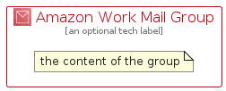

# AmazonWorkMail


```text
aws-q1-2023/Architecture/BusinessApplications/AmazonWorkMail
```

```text
include('aws-q1-2023/Architecture/BusinessApplications/AmazonWorkMail')
```


| Illustration | AmazonWorkMail | AmazonWorkMailCard | AmazonWorkMailGroup |
| :---: | :---: | :---: | :---: |
|  |  |  |  |


## Sprites
The item provides the following sriptes:

- `<$AmazonWorkMailXs>`
- `<$AmazonWorkMailSm>`
- `<$AmazonWorkMailMd>`
- `<$AmazonWorkMailLg>`


## AmazonWorkMail

### Load remotely
```plantuml
@startuml
' configures the library
!global $LIB_BASE_LOCATION="https://raw.githubusercontent.com/tmorin/plantuml-libs/master/distribution"

' loads the library's bootstrap
!include $LIB_BASE_LOCATION/bootstrap.puml

' loads the package bootstrap
include('aws-q1-2023/bootstrap')

' loads the Item which embeds the element AmazonWorkMail
include('aws-q1-2023/Architecture/BusinessApplications/AmazonWorkMail')

' renders the element
AmazonWorkMail('AmazonWorkMail', 'Amazon Work Mail', 'an optional tech label', 'an optional description')
@enduml
```

### Load locally
```plantuml
@startuml
' configures the library
!global $INCLUSION_MODE="local"
!global $LIB_BASE_LOCATION="../../.."

' loads the library's bootstrap
!include $LIB_BASE_LOCATION/bootstrap.puml

' loads the package bootstrap
include('aws-q1-2023/bootstrap')

' loads the Item which embeds the element AmazonWorkMail
include('aws-q1-2023/Architecture/BusinessApplications/AmazonWorkMail')

' renders the element
AmazonWorkMail('AmazonWorkMail', 'Amazon Work Mail', 'an optional tech label', 'an optional description')
@enduml
```

## AmazonWorkMailCard

### Load remotely
```plantuml
@startuml
' configures the library
!global $LIB_BASE_LOCATION="https://raw.githubusercontent.com/tmorin/plantuml-libs/master/distribution"

' loads the library's bootstrap
!include $LIB_BASE_LOCATION/bootstrap.puml

' loads the package bootstrap
include('aws-q1-2023/bootstrap')

' loads the Item which embeds the element AmazonWorkMailCard
include('aws-q1-2023/Architecture/BusinessApplications/AmazonWorkMail')

' renders the element
AmazonWorkMailCard('AmazonWorkMailCard', 'Amazon Work Mail Card', 'an optional description')
@enduml
```

### Load locally
```plantuml
@startuml
' configures the library
!global $INCLUSION_MODE="local"
!global $LIB_BASE_LOCATION="../../.."

' loads the library's bootstrap
!include $LIB_BASE_LOCATION/bootstrap.puml

' loads the package bootstrap
include('aws-q1-2023/bootstrap')

' loads the Item which embeds the element AmazonWorkMailCard
include('aws-q1-2023/Architecture/BusinessApplications/AmazonWorkMail')

' renders the element
AmazonWorkMailCard('AmazonWorkMailCard', 'Amazon Work Mail Card', 'an optional description')
@enduml
```

## AmazonWorkMailGroup

### Load remotely
```plantuml
@startuml
' configures the library
!global $LIB_BASE_LOCATION="https://raw.githubusercontent.com/tmorin/plantuml-libs/master/distribution"

' loads the library's bootstrap
!include $LIB_BASE_LOCATION/bootstrap.puml

' loads the package bootstrap
include('aws-q1-2023/bootstrap')

' loads the Item which embeds the element AmazonWorkMailGroup
include('aws-q1-2023/Architecture/BusinessApplications/AmazonWorkMail')

' renders the element
AmazonWorkMailGroup('AmazonWorkMailGroup', 'Amazon Work Mail Group', 'an optional tech label') {
    note as note
        the content of the group
    end note
}
@enduml
```

### Load locally
```plantuml
@startuml
' configures the library
!global $INCLUSION_MODE="local"
!global $LIB_BASE_LOCATION="../../.."

' loads the library's bootstrap
!include $LIB_BASE_LOCATION/bootstrap.puml

' loads the package bootstrap
include('aws-q1-2023/bootstrap')

' loads the Item which embeds the element AmazonWorkMailGroup
include('aws-q1-2023/Architecture/BusinessApplications/AmazonWorkMail')

' renders the element
AmazonWorkMailGroup('AmazonWorkMailGroup', 'Amazon Work Mail Group', 'an optional tech label') {
    note as note
        the content of the group
    end note
}
@enduml
```

