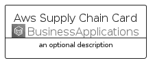
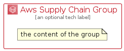

# AwsSupplyChain


```text
aws-q1-2023/Architecture/BusinessApplications/AwsSupplyChain
```

```text
include('aws-q1-2023/Architecture/BusinessApplications/AwsSupplyChain')
```


| Illustration | AwsSupplyChain | AwsSupplyChainCard | AwsSupplyChainGroup |
| :---: | :---: | :---: | :---: |
|  |  |  |  |


## AwsSupplyChain

### Load remotely
```plantuml
@startuml
' configures the library
!global $LIB_BASE_LOCATION="https://raw.githubusercontent.com/tmorin/plantuml-libs/master/distribution"

' loads the library's bootstrap
!include $LIB_BASE_LOCATION/bootstrap.puml

' loads the package bootstrap
include('aws-q1-2023/bootstrap')

' loads the Item which embeds the element AwsSupplyChain
include('aws-q1-2023/Architecture/BusinessApplications/AwsSupplyChain')

' renders the element
AwsSupplyChain('AwsSupplyChain', 'Aws Supply Chain', 'an optional tech label', 'an optional description')
@enduml
```

### Load locally
```plantuml
@startuml
' configures the library
!global $INCLUSION_MODE="local"
!global $LIB_BASE_LOCATION="../../.."

' loads the library's bootstrap
!include $LIB_BASE_LOCATION/bootstrap.puml

' loads the package bootstrap
include('aws-q1-2023/bootstrap')

' loads the Item which embeds the element AwsSupplyChain
include('aws-q1-2023/Architecture/BusinessApplications/AwsSupplyChain')

' renders the element
AwsSupplyChain('AwsSupplyChain', 'Aws Supply Chain', 'an optional tech label', 'an optional description')
@enduml
```

## AwsSupplyChainCard

### Load remotely
```plantuml
@startuml
' configures the library
!global $LIB_BASE_LOCATION="https://raw.githubusercontent.com/tmorin/plantuml-libs/master/distribution"

' loads the library's bootstrap
!include $LIB_BASE_LOCATION/bootstrap.puml

' loads the package bootstrap
include('aws-q1-2023/bootstrap')

' loads the Item which embeds the element AwsSupplyChainCard
include('aws-q1-2023/Architecture/BusinessApplications/AwsSupplyChain')

' renders the element
AwsSupplyChainCard('AwsSupplyChainCard', 'Aws Supply Chain Card', 'an optional description')
@enduml
```

### Load locally
```plantuml
@startuml
' configures the library
!global $INCLUSION_MODE="local"
!global $LIB_BASE_LOCATION="../../.."

' loads the library's bootstrap
!include $LIB_BASE_LOCATION/bootstrap.puml

' loads the package bootstrap
include('aws-q1-2023/bootstrap')

' loads the Item which embeds the element AwsSupplyChainCard
include('aws-q1-2023/Architecture/BusinessApplications/AwsSupplyChain')

' renders the element
AwsSupplyChainCard('AwsSupplyChainCard', 'Aws Supply Chain Card', 'an optional description')
@enduml
```

## AwsSupplyChainGroup

### Load remotely
```plantuml
@startuml
' configures the library
!global $LIB_BASE_LOCATION="https://raw.githubusercontent.com/tmorin/plantuml-libs/master/distribution"

' loads the library's bootstrap
!include $LIB_BASE_LOCATION/bootstrap.puml

' loads the package bootstrap
include('aws-q1-2023/bootstrap')

' loads the Item which embeds the element AwsSupplyChainGroup
include('aws-q1-2023/Architecture/BusinessApplications/AwsSupplyChain')

' renders the element
AwsSupplyChainGroup('AwsSupplyChainGroup', 'Aws Supply Chain Group', 'an optional tech label') {
    note as note
        the content of the group
    end note
}
@enduml
```

### Load locally
```plantuml
@startuml
' configures the library
!global $INCLUSION_MODE="local"
!global $LIB_BASE_LOCATION="../../.."

' loads the library's bootstrap
!include $LIB_BASE_LOCATION/bootstrap.puml

' loads the package bootstrap
include('aws-q1-2023/bootstrap')

' loads the Item which embeds the element AwsSupplyChainGroup
include('aws-q1-2023/Architecture/BusinessApplications/AwsSupplyChain')

' renders the element
AwsSupplyChainGroup('AwsSupplyChainGroup', 'Aws Supply Chain Group', 'an optional tech label') {
    note as note
        the content of the group
    end note
}
@enduml
```

