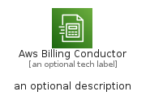

# AwsBillingConductor


```text
aws-q1-2023/Architecture/CloudFinancialManagement/AwsBillingConductor
```

```text
include('aws-q1-2023/Architecture/CloudFinancialManagement/AwsBillingConductor')
```


| Illustration | AwsBillingConductor | AwsBillingConductorCard | AwsBillingConductorGroup |
| :---: | :---: | :---: | :---: |
|  |  |  |  |


## AwsBillingConductor

### Load remotely
```plantuml
@startuml
' configures the library
!global $LIB_BASE_LOCATION="https://raw.githubusercontent.com/tmorin/plantuml-libs/master/distribution"

' loads the library's bootstrap
!include $LIB_BASE_LOCATION/bootstrap.puml

' loads the package bootstrap
include('aws-q1-2023/bootstrap')

' loads the Item which embeds the element AwsBillingConductor
include('aws-q1-2023/Architecture/CloudFinancialManagement/AwsBillingConductor')

' renders the element
AwsBillingConductor('AwsBillingConductor', 'Aws Billing Conductor', 'an optional tech label', 'an optional description')
@enduml
```

### Load locally
```plantuml
@startuml
' configures the library
!global $INCLUSION_MODE="local"
!global $LIB_BASE_LOCATION="../../.."

' loads the library's bootstrap
!include $LIB_BASE_LOCATION/bootstrap.puml

' loads the package bootstrap
include('aws-q1-2023/bootstrap')

' loads the Item which embeds the element AwsBillingConductor
include('aws-q1-2023/Architecture/CloudFinancialManagement/AwsBillingConductor')

' renders the element
AwsBillingConductor('AwsBillingConductor', 'Aws Billing Conductor', 'an optional tech label', 'an optional description')
@enduml
```

## AwsBillingConductorCard

### Load remotely
```plantuml
@startuml
' configures the library
!global $LIB_BASE_LOCATION="https://raw.githubusercontent.com/tmorin/plantuml-libs/master/distribution"

' loads the library's bootstrap
!include $LIB_BASE_LOCATION/bootstrap.puml

' loads the package bootstrap
include('aws-q1-2023/bootstrap')

' loads the Item which embeds the element AwsBillingConductorCard
include('aws-q1-2023/Architecture/CloudFinancialManagement/AwsBillingConductor')

' renders the element
AwsBillingConductorCard('AwsBillingConductorCard', 'Aws Billing Conductor Card', 'an optional description')
@enduml
```

### Load locally
```plantuml
@startuml
' configures the library
!global $INCLUSION_MODE="local"
!global $LIB_BASE_LOCATION="../../.."

' loads the library's bootstrap
!include $LIB_BASE_LOCATION/bootstrap.puml

' loads the package bootstrap
include('aws-q1-2023/bootstrap')

' loads the Item which embeds the element AwsBillingConductorCard
include('aws-q1-2023/Architecture/CloudFinancialManagement/AwsBillingConductor')

' renders the element
AwsBillingConductorCard('AwsBillingConductorCard', 'Aws Billing Conductor Card', 'an optional description')
@enduml
```

## AwsBillingConductorGroup

### Load remotely
```plantuml
@startuml
' configures the library
!global $LIB_BASE_LOCATION="https://raw.githubusercontent.com/tmorin/plantuml-libs/master/distribution"

' loads the library's bootstrap
!include $LIB_BASE_LOCATION/bootstrap.puml

' loads the package bootstrap
include('aws-q1-2023/bootstrap')

' loads the Item which embeds the element AwsBillingConductorGroup
include('aws-q1-2023/Architecture/CloudFinancialManagement/AwsBillingConductor')

' renders the element
AwsBillingConductorGroup('AwsBillingConductorGroup', 'Aws Billing Conductor Group', 'an optional tech label') {
    note as note
        the content of the group
    end note
}
@enduml
```

### Load locally
```plantuml
@startuml
' configures the library
!global $INCLUSION_MODE="local"
!global $LIB_BASE_LOCATION="../../.."

' loads the library's bootstrap
!include $LIB_BASE_LOCATION/bootstrap.puml

' loads the package bootstrap
include('aws-q1-2023/bootstrap')

' loads the Item which embeds the element AwsBillingConductorGroup
include('aws-q1-2023/Architecture/CloudFinancialManagement/AwsBillingConductor')

' renders the element
AwsBillingConductorGroup('AwsBillingConductorGroup', 'Aws Billing Conductor Group', 'an optional tech label') {
    note as note
        the content of the group
    end note
}
@enduml
```

